# Graphics View Framework

交互式 2D 图形的 Graphics View 框架概述。自 Qt4.2 中引入了 Graphics View，以取代其前身 QCanvas。Graphics View 提供了一个用于管理和交互大量的可定制的 2D 图形项与用于可视化这些项的 View 小部件的 surface（曲面），并提供缩放（zooming）和旋转（rotation）功能支持。

该框架包括事件传播体系结构（an event propagation architecture），该体系结构允许对场景中的项目进行精确的双精度交互功能。图元可以被如下操作处理：按键事件，鼠标按下，移动，释放和双击事件，它们还可以跟踪鼠标的移动。

Graphics View 使用 BSP（Binary Space Partitioning，二进制空间分区）树提供了非常快速的图元发现功能，因此，它可以实时可视化大型场景（甚至可以包含数百万个图元）。下面列出 Graphics View Framework 的常用模块：

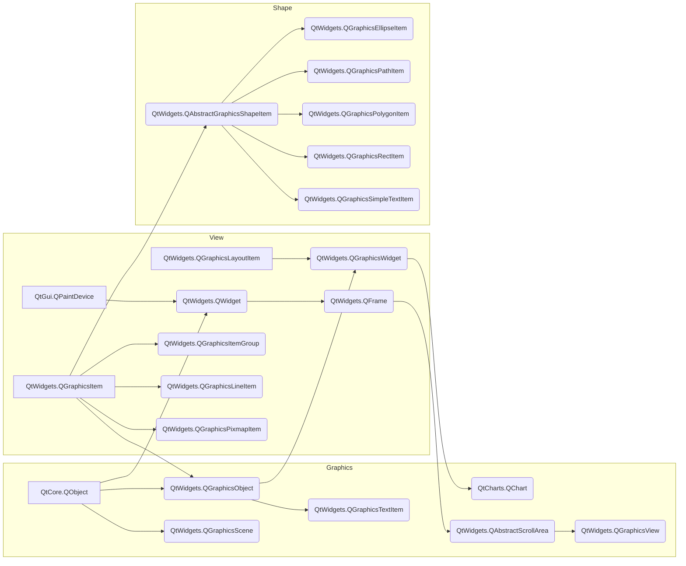

## 1 The Graphics View Architecture

Graphics View 提供了一种基于项目（item-based）的方法来进行模型-视图编程（model-view programming），非常类似于 InterView 的便利类 QTableView，QTreeView 和 QListView。多个视图可以观察单个场景，并且该场景包含各种几何形状的图元项目。

[QtWidgets.QGraphicsScene](https://doc.qt.io/qtforpython/PySide2/QtWidgets/QGraphicsScene.html#PySide2.QtWidgets.QGraphicsScene "PySide2.QtWidgets.QGraphicsScene") 场景用作 `QtWidgets.QGraphicsItem` 对象的容器。它与 `QtWidgets.QGraphicsView` 一起用于可视化 2D 曲面上（2D surface）的图形项目，例如线条，矩形，文本，甚至是自定义项目。

### 1.1 The Scene

[`QtWidgets.QGraphicsScene`](https://doc.qt.io/qtforpython/PySide2/QtWidgets/QGraphicsScene.html#PySide2.QtWidgets.QGraphicsScene "PySide2.QtWidgets.QGraphicsScene") 提供了 Graphics View 场景（一个用于管理大量 2D 图形项目的容器（surface））。

场景具有如下功能：

* 提供用于管理大量图元项目的快速界面
* 将事件传播到每个图元项目 
* 管理图元项目状态，例如选择和焦点处理
* 提供未被转换的渲染功能；主要用于印刷

请注意，QGraphicsScene 没有自己的视觉外观。它只管理图元项目。您需要创建一个 `QGraphicsView` 小部件用以可视化场景。

要将图元项目添加到场景，首先需要构造一个 `QGraphicsScene` 对象。然后，您有两个将图元项目添加到场景中的选择：通过调用 [addItem(item)](https://doc.qt.io/qtforpython/PySide2/QtWidgets/QGraphicsScene.html#PySide2.QtWidgets.PySide2.QtWidgets.QGraphicsScene.addItem "PySide2.QtWidgets.PySide2.QtWidgets.QGraphicsScene.addItem") 添加现有的 QGraphicsItem 对象，或者可以调用 `addEllipse()`，`addLine()`，`addPath()`，`addPixmap()`，`addPolygon()`，`addRect()` 或 `addText()` 等便捷函数，它们都返回一个指向新添加图元项目的指针。使用这些函数添加的图元的维度是相对于图元（item）的坐标系的，并且图元的位置在场景中被初始化为 $(0,0)$。

当场景发生变化时（例如，当某项移动或变换时），`QGraphicsScene` 发出 [changed(region)](https://doc.qt.io/qtforpython/PySide2/QtWidgets/QGraphicsScene.html#PySide2.QtWidgets.PySide2.QtWidgets.QGraphicsScene.changed "PySide2.QtWidgets.PySide2.QtWidgets.QGraphicsScene.changed") 信号。要删除项目，请调用 [removeItem(item)](https://doc.qt.io/qtforpython/PySide2/QtWidgets/QGraphicsScene.html#PySide2.QtWidgets.PySide2.QtWidgets.QGraphicsScene.removeItem "PySide2.QtWidgets.PySide2.QtWidgets.QGraphicsScene.removeItem")。

`QGraphicsScene` 使用索引算法来有效地管理图元项目的位置。默认情况下，使用 BSP（二进制空间分区）树；一种适用于大型场景的算法，其中大多数图元保持静止（即不要四处移动）。您可以选择通过调用 [setItemIndexMethod()](https://doc.qt.io/qtforpython/PySide2/QtWidgets/QGraphicsScene.html#PySide2.QtWidgets.PySide2.QtWidgets.QGraphicsScene.setItemIndexMethod "PySide2.QtWidgets.PySide2.QtWidgets.QGraphicsScene.setItemIndexMethod") 禁用此索引。

通过调用 [setSceneRect()](https://doc.qt.io/qtforpython/PySide2/QtWidgets/QGraphicsScene.html#id11 "PySide2.QtWidgets.PySide2.QtWidgets.QGraphicsScene.setSceneRect") 设置场景的边界矩形。可以将图元项目放置在场景中的任何位置，默认情况下，场景的大小不受限制。场景 rect 仅用于内部簿记，维护场景的图元项目索引。如果未设置场景矩形，则 `QGraphicsScene` 将使用 [itemsBoundingRect()](https://doc.qt.io/qtforpython/PySide2/QtWidgets/QGraphicsScene.html#PySide2.QtWidgets.PySide2.QtWidgets.QGraphicsScene.itemsBoundingRect "PySide2.QtWidgets.PySide2.QtWidgets.QGraphicsScene.itemsBoundingRect") 返回的所有项目的边界区域作为场景矩形。但是，`itemsBoundingRect()` 是一个相对耗时的函数，因为它通过收集场景中每个项目的位置信息进行操作。因此，在大型场景上操作时，应始终设置场景 rect。

QGraphicsScene 的最大优势之一就是能够有效确定图元的位置。即使场景中有数百万个项目，[items()](https://doc.qt.io/qtforpython/PySide2/QtWidgets/QGraphicsScene.html#id10 "PySide2.QtWidgets.PySide2.QtWidgets.QGraphicsScene.items") 函数也可以在几毫秒内确定项目的位置。`items()` 有多个重载：一个重载在某个位置查找图元项目，一个重载在多边形或矩形内部或与之相交，等等。返回的项目列表按堆叠顺序排序，最高的项目是列表中的第一项目。为了方便起见，还有一个 [itemAt()](https://doc.qt.io/qtforpython/PySide2/QtWidgets/QGraphicsScene.html#id5 "PySide2.QtWidgets.PySide2.QtWidgets.QGraphicsScene.itemAt") 函数可在给定位置返回最上面的项目。

QGraphicsScene 还管理某些图元项目的状态，例如图元项目的选择和焦点。要选择项目，请调用 [setSelectionArea()](https://doc.qt.io/qtforpython/PySide2/QtWidgets/QGraphicsScene.html#id13 "PySide2.QtWidgets.PySide2.QtWidgets.QGraphicsScene.setSelectionArea")（传递任意形状来选择场景中的项目），并要清除当前选择，请调用 [clearSelection()](https://doc.qt.io/qtforpython/PySide2/QtWidgets/QGraphicsScene.html#PySide2.QtWidgets.PySide2.QtWidgets.QGraphicsScene.clearSelection "PySide2.QtWidgets.PySide2.QtWidgets.QGraphicsScene.clearSelection")。

函数 `setSelectionArea()` 还用作 `QGraphicsView` 中橡皮筋选择的基础。调用 [selectedItems()](https://doc.qt.io/qtforpython/PySide2/QtWidgets/QGraphicsScene.html#PySide2.QtWidgets.PySide2.QtWidgets.QGraphicsScene.selectedItems "PySide2.QtWidgets.PySide2.QtWidgets.QGraphicsScene.selectedItems") 以获取所有选定项的列表。

场景的调用方法：

```python
QGraphicsScene(sceneRect[, parent=None])
QGraphicsScene(x, y, width, height[, parent=None])
```

`QGraphicsScene` 的另一个职责是传播来自 `QGraphicsView` 的事件。要将事件发送到场景，您可以构造一个继承 `QEvent` 的事件，然后使用 [sendEvent(item, event)](https://doc.qt.io/qtforpython/PySide2/QtWidgets/QGraphicsScene.html#PySide2.QtWidgets.PySide2.QtWidgets.QGraphicsScene.sendEvent "PySide2.QtWidgets.PySide2.QtWidgets.QGraphicsScene.sendEvent") 进行发送。`event()` 负责将事件调度到各个图元项目。一些常见事件由便利事件（convenience event handlers）处理程序处理。例如，按键事件由 `keyPressEvent()` 处理，鼠标按键事件由 `mousePressEvent()` 处理。

按键事件将传递到焦点图元项目（focus item）。要设置焦点图元项目，可以调用 `setFocusItem()`，传递接受焦点的图元项目，或者该项目本身可以调用 `setFocus()`。 调用 `focusItem()` 以获取当前的焦点项目。为了与小部件兼容，场景还保留其自己的焦点信息。默认情况下，场景没有焦点，并且所有按键事件都将被丢弃。如果调用 `setFocus()` 或场景中的某个项目获得焦点，则场景将自动获得焦点。如果场景具有焦点，则 `hasFocus()` 将返回 `true`，并将按键事件转发到焦点项（如果有）。如果场景失去焦点（例如，有人在某个项目具有焦点时调用 `clearFocus()`），则场景将保留其项目焦点信息，并且一旦场景重新获得焦点，它将确保最后一个焦点项目重新获得焦点。

对于鼠标悬停效果，`QGraphicsScene` 调度悬停事件。如果某个图元项目接受悬停事件（请参见`acceptHoverEvents()`），则当鼠标进入其区域时，它将收到 `GraphicsSceneHoverEnter` 事件。当鼠标继续在项目区域内移动时， `QGraphicsScene` 将向其发送 `GraphicsSceneHoverMove` 事件。当鼠标离开该项目的区域时，该项目将收到 `GraphicsSceneHoverLeave` 事件。

所有鼠标事件都会传递到当前的鼠标采集器项目。如果一个项目接受鼠标事件（请参见 [acceptedMouseButtons()](https://doc.qt.io/qtforpython/PySide2/QtWidgets/QGraphicsItem.html#PySide2.QtWidgets.PySide2.QtWidgets.QGraphicsItem.acceptedMouseButtons "PySide2.QtWidgets.PySide2.QtWidgets.QGraphicsItem.acceptedMouseButtons") 并且接受鼠标按下，则它将成为场景的鼠标捕获器。当没有其他鼠标按钮被按下时，它会一直停留在鼠标抓取器上，直到释放鼠标为止。您可以调用 [mouseGrabberItem()](https://doc.qt.io/qtforpython/PySide2/QtWidgets/QGraphicsScene.html#PySide2.QtWidgets.PySide2.QtWidgets.QGraphicsScene.mouseGrabberItem "PySide2.QtWidgets.PySide2.QtWidgets.QGraphicsScene.mouseGrabberItem") 来确定当前正在抓住鼠标的图元项目。

### 1.2 The View

`QGraphicsView` 类提供了一个用于显示 `QGraphicsScene` 的内容小部件。`QGraphicsView` 在可滚动视口（viewport）中可视化 `QGraphicsScene` 的内容。

`QGraphicsView` 提供了视图小部件，可将场景的内容可视化。您可以将多个视图附加到同一场景，以在同一数据集中提供多个视口。视图窗口小部件是一个滚动区域，并提供用于在大型场景中导航的滚动条。要启用 OpenGL 支持，可以通过调用 `setViewport()` 将 `QOpenGLWidget` 设置为视口。

视图从键盘和鼠标接收输入事件，然后将其转换为场景事件（在适当的情况下将其转换为场景坐标），然后再将事件发送到可视化场景。

使用其变换矩阵 `transform()`，视图可以变换场景的坐标系。这允许高级导航功能，例如缩放和旋转。为了方便起见，QGraphicsView 还提供了用于在视图和场景坐标之间进行转换的函数：`mapToScene()` 和 `mapFromScene()`。

`QtWidgets.QGraphicsView` 在可滚动 viewport 中可视化 `QtWidgets.QGraphicsScene` 的内容。

为了使场景可视化，首先要构造一个 `QtWidgets.QGraphicsView` 对象，然后将要可视化的场景的地址传递给 `QtWidgets.QGraphicsView` 的构造函数。另外，您可以调用 `setScene()` 在以后设置场景。调用 `show()` 后，默认情况下，视图将滚动到场景的中心并显示此时可见的所有图元项目。 例如：

```python
scene = QGraphicsScene()
scene.addText("Hello, world!")

# 等价于 QGraphicsView(scene)
view = QGraphicsView()
view.setScene(scene)
view.show()
```

您可以使用滚动条或调用 `centerOn()` 显式滚动到场景中的任何位置。通过将一个点传递给 `centerOn()`，QGraphicsView 将滚动其视口以确保该点在视图中居中。同时提供了用于滚动到 `QGraphicsItem` 的重载，在这种情况下，`QGraphicsView` 将看到项目的中心在视图中居中。如果只需要确保某个区域可见（但不必居中），则可以调用 `sureVisible()`。

QGraphicsView 可用于可视化整个场景或其中的一部分。默认情况下，第一次显示视图时，会自动检测到可视化区域（通过调用 `itemsBoundingRect()`）。要自己设置可视化区域矩形，可以调用 `setSceneRect()`。这将适当地调整滚动条的范围。请注意，尽管场景支持几乎不受限制的大小，但滚动条的范围永远不会超出整数 `(INT_MIN, INT_MAX)` 的范围。

`QGraphicsView` 通过调用 `render()` 可视化场景。默认情况下，使用常规 `QPainter` 并使用默认渲染提示将项目绘制到视口上。若要更改绘画项目时 `QGraphicsView` 传递给 `QPainter` 的默认渲染提示，可以调用`setRenderHints()`。

默认情况下，`QGraphicsView` 为视口窗口小部件提供常规 `QWidget`。您可以通过调用 `viewport()` 来访问此小部件，也可以通过调用 `setViewport()` 来替换它。

要使用 OpenGL 进行渲染，只需调用 `setViewport`（新的 QOpenGLWidget）。`QGraphicsView` 拥有视口小部件的所有权。

`QGraphicsView` 使用 `QTransform` 支持仿射变换。最常见的两种转换是 `scaling`，用于实现缩放(zooming)和旋转(rotation)。QGraphicsView 在转换过程中保持视图中心不变。由于场景对齐（`setAligment()`），平移视图将不会产生视觉影响。您可以将矩阵传递给 `setTransform()`，也可以调用便捷函数之一 `rotate()`，`scale()`，`translate()` 或 `shear()`。

您可以使用鼠标和键盘与场景中的项目进行交互。Q`GraphicsView` 将鼠标和键事件转换为场景事件（继承 `QGraphicsSceneEvent` 的事件），并将其转发到可视化场景。最后，处理事件并对事件做出反应的是独立项目。例如，如果单击一个可选择的项目，则该项目通常会让场景知道它已被选中，并且它还将重绘自身以显示选择矩形。类似地，如果您单击并拖动鼠标以移动可移动项，则它是处理鼠标移动并自行移动的项。默认情况下，图形项目互动处于启用状态，您可以触发调用。

您还可以通过创建 `QGraphicsView` 的子类并重新实现鼠标和键事件处理程序来提供自己的自定义场景交互。
为了简化您如何以编程方式与视图中的项目进行交互，`QGraphicsView` 提供了映射函数 `mapToScene()` 和 `mapFromScene()` 以及项目访问器 `items()` 和 `itemAt()`。这些功能允许您在视图坐标和场景坐标之间映射点，矩形，多边形和路径，并使用视图坐标在场景中查找项目。


`QtWidgets.QGraphicsView(scene[, parent=None])`：

- `parent`：QWidget
- `scene`：QGraphicsScene

### 1.3 The Item

`QGraphicsItem` 是场景中图形项的基类。Graphics View 为典型形状提供了几个标准项，例如矩形（`QGraphicsRectItem`），椭圆（`QGraphicsEllipseItem`）和文本项（`QGraphicsTextItem`），以及编写自定义图元项。除此之外，`QGraphicsItem` 支持以下功能：

- 鼠标按下，移动，释放和双击事件，以及鼠标悬停事件，滚轮事件和上下文菜单事件。
- 键盘输入焦点和按键事件
- 拖放
- 通过 parent-child 关系以及 QGraphicsItemGroup 进行分组
- 碰撞检测（Collision detection）

图元项目位于本地坐标系（local coordinate system）中，就像 `QGraphicsView` 一样，它还提供了许多功能，用于在项目与场景之间以及项目与项目之间映射坐标。而且，像 `QGraphicsView` 一样，它可以使用 `matrix:transform()` 变换其坐标系。这对于旋转和缩放单个项目很有用。

项可以包含其他项（子项）。父项的转换由其所有子项继承。不过，不管某项的累积转换如何，它的所有功能（例如，`contains()`, `boundingRect()`, `QGraphicsItem::collidesWith()`）都仍在本地坐标下运行。

QGraphicsItem 通过 `shape()` 函数和 `QGraphicsItem::collidesWith()` 这两个虚拟函数都支持冲突检测。通过从 `shape()` 返回项目的形状作为局部坐标 `QPainterPath`，`QGraphicsItem` 将为您处理所有碰撞检测。但是，如果要提供自己的冲突检测，则可以重新实现 `QGraphicsItem::collidesWith()`。

更多内容见：[QtWidgets.QGraphicsItem](https://doc.qt.io/qtforpython/PySide2/QtWidgets/QGraphicsItem.html#PySide2.QtWidgets.QGraphicsItem)。

`QtWidgets.QGraphicsItem` 类是 `QtWidgets.QGraphicsScene` 中所有图形项的基类。为了方便描述，将 `QtWidgets.QGraphicsItem` 实例命名为**图元**。`QtWidgets.QGraphicsItem` 为编写您自己的自定义图元项提供了一个轻量级的基础。它包括定义图元项的几何形状（geometry），碰撞检测（collision detection），且有绘画实现以及通过事件处理程序进行的图元项交互。

为方便起见，Qt 为最常见的形状提供了一组标准图形项：

* [`QGraphicsEllipseItem`](https://doc.qt.io/qtforpython/PySide2/QtWidgets/QGraphicsEllipseItem.html#PySide2.QtWidgets.QGraphicsEllipseItem "PySide2.QtWidgets.QGraphicsEllipseItem")：提供 ellipse item
* [`QGraphicsLineItem`](https://doc.qt.io/qtforpython/PySide2/QtWidgets/QGraphicsLineItem.html#PySide2.QtWidgets.QGraphicsLineItem "PySide2.QtWidgets.QGraphicsLineItem")：提供 line item
* [`QGraphicsPathItem`](https://doc.qt.io/qtforpython/PySide2/QtWidgets/QGraphicsPathItem.html#PySide2.QtWidgets.QGraphicsPathItem "PySide2.QtWidgets.QGraphicsPathItem")：提供任意 path item
* [`QGraphicsPixmapItem`](https://doc.qt.io/qtforpython/PySide2/QtWidgets/QGraphicsPixmapItem.html#PySide2.QtWidgets.QGraphicsPixmapItem "PySide2.QtWidgets.QGraphicsPixmapItem")：提供 pixmap item
* [`QGraphicsPolygonItem`](https://doc.qt.io/qtforpython/PySide2/QtWidgets/QGraphicsPolygonItem.html#PySide2.QtWidgets.QGraphicsPolygonItem "PySide2.QtWidgets.QGraphicsPolygonItem")：提供 polygon item
* [`QGraphicsRectItem`](https://doc.qt.io/qtforpython/PySide2/QtWidgets/QGraphicsRectItem.html#PySide2.QtWidgets.QGraphicsRectItem "PySide2.QtWidgets.QGraphicsRectItem")：提供 rectangular item
* [`QGraphicsSimpleTextItem`](https://doc.qt.io/qtforpython/PySide2/QtWidgets/QGraphicsSimpleTextItem.html#PySide2.QtWidgets.QGraphicsSimpleTextItem "PySide2.QtWidgets.QGraphicsSimpleTextItem")：提供简单 text label item
* [`QGraphicsTextItem`](https://doc.qt.io/qtforpython/PySide2/QtWidgets/QGraphicsTextItem.html#PySide2.QtWidgets.QGraphicsTextItem "PySide2.QtWidgets.QGraphicsTextItem")：提供高级 text browser item

图元项目的所有几何信息均基于其**本地坐标系**（Local Coordinate System）[^1]。该图元项的位置 `pos()` 是唯一在本地坐标中不起作用的函数，因为它在父坐标中返回一个位置。

[^1]: 本地坐标系是以物体自身位置作为原点，表示物体间相对位置和方向，并且会根据物体自身旋转而旋转。

您可以通过调用 `setVisible()` 设置图元项目是否应可见（即绘制和接受事件）。隐藏图元项目也会隐藏其子项。同样，您可以通过调用 `setEnabled()` 启用或禁用图元项目。

如果禁用某个图元项目，则其所有子项也将被禁用。默认情况下，图元项目既可见又启用。若要切换是否选择图元项目，请首先通过设置 `ItemIsSelectable` 标志启用选择，然后调用 `setSelected()`。通常，由于用户交互，场景（scene）会切换选择。

要编写自定义的图元项目，首先创建 `QGraphicsItem` 的子类，然后实现其两个纯虚拟公共函数：`boundingRect()` 返回该图元项目所绘制区域的估计值，`paint()` 实现实际绘图（the actual painting）。例如：

```python
class SimpleItem(QtWidgets.QGraphicsItem):
    def boundingRect(self):
        penWidth = 1.0
        return QtCore.QRectF(-10 - penWidth / 2, -10 - penWidth / 2,
                             20 + penWidth, 20 + penWidth)

    def paint(self, painter, option, widget):
        painter.drawRoundedRect(-10, -10, 20, 20, 5, 5)
```

`boundingRect()` 函数有许多不同的用途。`QtWidgets.QGraphicsScene` 的项目索引基于 `boundingRect()`，并且 `QtWidgets.QGraphicsView` 将其用于剔除不可见的项目以及确定绘制重叠项目时需要重新组合的区域。此外，`QtWidgets.QGraphicsItem` 的碰撞检测机制使用 `boundingRect()` 提供有效的截止点（cut-off）。`collidesWithItem()` 中的细粒度碰撞算法基于调用 `shape()` 的方法，该方法会返回图元形状的精确轮廓作为`QtGui.QPainterPath`。

`QtWidgets.QGraphicsScene` 期望所有图元项目的 `boundingRect()` 和 `shape()` 保持不变，除非得到通知。如果您想以任何方式更改图元的几何形状，则必须首先调用 `prepareGeometryChange()` 以允许 `QtWidgets.QGraphicsScene` 更新其簿记（bookkeeping）。

碰撞检测可以通过两种方式完成：

1. 重新实现 `shape()` 以为您的图元返回准确的形状，并依靠 `collidesWithItem()` 的默认实现进行形状与形状的交点（shape-shape intersection）。如果形状复杂，这可能代价会非常高。
2. 重新实现 `collidesWithItem()` 以提供您自己的自定义图元项目和形状碰撞算法。

可以调用 `contains()` 函数来确定图元项目是否包含一个点。该函数也可以通过图元项重新实现。`contains()` 的默认行为是基于调用 `shape()` 的。

图元项目可以包含其他图元项目，也可以被包含在其他图元项目中。所有图元项目都可以有一个父图元项目和一列子项目。除非该图元项目没有父对象，否则它的位置是父对象的坐标（即父对象的本地坐标）。父项将其位置及其变换传播给所有子项。

#### 1.3.1 [Transformations](https://doc.qt.io/qtforpython/PySide2/QtWidgets/QGraphicsItem.html#pyside2-qtwidgets-qgraphicsitem-transformations "Permalink to this headline")

`QtWidgets.QGraphicsItem` 除了提供其基本位置 `pos()` 外，还支持投影变换（projective transformations）。有几种更改图元项目变换的方法。对于简单转换，可以调用便捷函数 `setRotation()` 或`setScale()`，也可以将任何变换矩阵传递给 `setTransform()`。对于高级转换控制，您还可以通过调用 `setTransformations()` 来设置多个组合转换。

图元项变换从父项到子项累积，因此，如果父项和子项都旋转 90 度，则子项的总转换将为 180 度。同样，如果项目的父项缩放到其原始大小的 2 倍（2x），则其子项也将扩大两倍。图元项的变形不会影响其自身的局部几何关系（ local geometry）；所有几何函数（例如，`contains()`，`update()` 和所有映射函数）仍在局部坐标（local coordinates）下运行。为方便起见，`QtWidgets.QGraphicsItem` 提供了一个函数 `SceneTransform()`（它返回该项的总变换矩阵（包括其位置以及所有父项的位置和变换））和 `scenePos()`（该函数返回其在场景坐标中的位置）。 要重置图元的矩阵，请调用 `resetTransform()`。

某些转换操作根据其应用顺序产生不同的结果。例如，如果缩放转换然后旋转，则可能会得到与首先旋转转换不同的结果。但是，您在 `QtWidgets.QGraphicsItem` 上设置转换属性的顺序不会影响最终的转换。`QtWidgets.QGraphicsItem` 始终以固定的定义顺序应用属性：

>The item’s base transform is applied ( transform() )
The item’s transformations list is applied in order ( transformations() )
The item is rotated relative to its transform origin point ( rotation() , transformOriginPoint() )
The item is scaled relative to its transform origin point ( scale() , transformOriginPoint() )

#### 1.3.2 [Painting](https://doc.qt.io/qtforpython/PySide2/QtWidgets/QGraphicsItem.html#painting "Permalink to this headline")

`QtWidgets.QGraphicsView` 调用 `paint()` 函数来绘制图元项目的内容。该图元项目没有背景或没有默认填充值；该图元项目后面的任何内容都会在此功能中未明确绘制的所有区域中 shine。您可以调用 `update()` 安排重新绘制，可以选择传递需要重新绘制的矩形。根据图元项目是否在视图中可见，该项目可能会或可能不会重新粉刷（repaint）。`QtWidgets.QGraphicsItem` 中没有等效于 `repaint()` 的函数。

图元项目是按视图绘制的，从父项开始，然后是子项，按升序排列。您可以通过调用 `setZValue()` 设置图元的堆叠顺序，并通过调用 `zValue()` 对其进行测试，其中，在 z 值高的图元之前先绘制 z 值低的图元。堆叠顺序适用于同级图元；父项总是在子项前被绘制。

#### 1.3.3 [Sorting](https://doc.qt.io/qtforpython/PySide2/QtWidgets/QGraphicsItem.html#sorting "Permalink to this headline")

所有图元项目均按定义的稳定顺序绘制，并且此相同的顺序决定了当您单击场景时哪些项目将首先接收鼠标输入。通常，您不必担心排序，因为项目遵循“自然顺序”，遵循场景的逻辑结构。

某个图元项目的子项堆叠在父项的顶部，而同级项则按照插入顺序（即，它们被添加到场景或添加到同一父项的顺序）堆叠。如果您添加项目 A，然后添加 B，则 B 将位于 A 的顶部。如果您添加 C，则项目的堆叠顺序将是 A，然后是 B，然后是 C。

对于高级用户，有一些方法可以更改项目的排序方式：

- 您可以在一个图元项目上调用 `setZValue()`，以将其显式堆叠在其他同级项目之上或之下。项的默认 Z 值为 0。具有相同 Z 值的项按插入顺序堆叠。
- 您可以调用 `stackBefore()` 重新排序子级列表。这将直接修改插入顺序。
- 您可以设置 `ItemStacksBehindParent` 标志以将子项堆叠在其父项之后。

两个同级图元的堆叠顺序也计入每个图元的子代图元和后代图元。因此，如果一项在另一项之上，则其所有子项也将在另一项所有子项之上。

#### 1.3.4 [Events](https://doc.qt.io/qtforpython/PySide2/QtWidgets/QGraphicsItem.html#events "Permalink to this headline")

`QtWidgets.QGraphicsItem` 通过虚拟函数 `sceneEvent()` 从 `QtWidgets.QGraphicsScene` 接收事件。此函数将最常见的事件分配给一组便捷事件处理程序：

- `contextMenuEvent()` handles context menu events
- `focusInEvent()` and `focusOutEvent()` handle focus in and out events
- `hoverEnterEvent()` , `hoverMoveEvent()` , and `hoverLeaveEvent()` handles hover enter, move and leave events
- `inputMethodEvent()` handles input events, for accessibility support
- `keyPressEvent()` and `keyReleaseEvent()` handle key press and release events
- `mousePressEvent()` , `mouseMoveEvent()` , `mouseReleaseEvent()` , and `mouseDoubleClickEvent()` handles mouse press, move, release, click and doubleclick events

您可以通过安装事件过滤器（event filters）来过滤任何其他图元项目的事件。此功能与 Qt 的常规事件过滤器（请参阅 `installEventFilter()`）分开，后者仅适用于 QObject 的子类。在通过调用 `installSceneEventFilter()` 将项目安装为另一个项目的事件过滤器之后，虚拟函数 `sceneEventFilter()` 会接收到过滤后的事件。您可以通过调用 `removeSceneEventFilter()` 来删除项目事件过滤器。

#### 1.3.5 [Custom Data](https://doc.qt.io/qtforpython/PySide2/QtWidgets/QGraphicsItem.html#custom-data "Permalink to this headline")

有时，将自定义数据注册到某个图元项目（自定义图元项目或标准图元项目）很有用。您可以在任何图元项目上调用 `setData()`，以使用键值对（键为整数，并且值为 `QVariant`）将数据存储在其中。要从项目中获取自定义数据，请调用 `data()`。Qt 本身完全没有涉及此功能。

#### 1.3.6 `QtWidgets.QGraphicsItem` 的使用

`class QGraphicsItem([parent=None])` 使用给定的父项构造一个 `QtWidgets.QGraphicsItem`。它不会修改 `parent()` 返回的父对象。

如果 `parent` 是 `None`，你可以通过调用 [`addItem()`](https://doc.qt.io/qtforpython/PySide2/QtWidgets/QGraphicsScene.html#PySide2.QtWidgets.PySide2.QtWidgets.QGraphicsScene.addItem "PySide2.QtWidgets.PySide2.QtWidgets.QGraphicsScene.addItem") 将图元项目添加到场景中。该图元项目将成为顶级图元项目（top-level item）。

#### 1.3.7 QtWidgets.QGraphicsItem 中的枚举类

1. [`QtWidgets.QGraphicsItem.GraphicsItemFlag`](https://doc.qt.io/qtforpython/PySide2/QtWidgets/QGraphicsItem.html#PySide2.QtWidgets.PySide2.QtWidgets.QGraphicsItem.GraphicsItemFlag "Permalink to this definition")：枚举描述了可以在图元项目上设置的不同标志，以切换图元项目行为中的不同功能。

常量|描述
:-|:-
`QGraphicsItem.ItemIsMovable`|该项目支持使用鼠标进行交互式移动。通过单击该项目然后拖动，该项目将与鼠标光标一起移动。如果该项目有孩子，则所有孩子也将移动。如果项目是选择的一部分，则所有选择的项目也会移动。通过 `QtWidgets.QGraphicsItem` 的鼠标事件处理程序的基本实现，可以方便地提供此功能。
`QGraphicsItem.ItemIsSelectable`|该项目支持选择。启用此功能将使 `setSelected()` 可以切换图元项目的选择。通过调用 `setSelectionArea()`，单击某项或在 `QtWidgets.QGraphicsView` 中使用橡皮筋选择，它还将使该项自动被选择。
`QGraphicsItem.ItemIsFocusable`|该项目支持键盘输入焦点（即它是一个输入项目）。启用此标志将允许该项目接受焦点，这再次允许将键事件传递到 `keyPressEvent()` 和 `keyReleaseEvent()`。
`QGraphicsItem.ItemClipsToShape`|图元会剪裁成自己的形状。该项目无法在其形状之外绘制或接收鼠标，平板电脑，拖放或悬停事件。默认情况下禁用。此行为由 `drawItems()` 或 `drawItems()` 强制执行。这个标志是在 Qt 4.3 中引入的。
`QGraphicsItem.ItemClipsChildrenToShape`|该项将其所有后代的绘画剪裁成自己的形状。此项的直接或间接子项不能超出该项目的形状。默认情况下，此标志为禁用状态。孩子们可以在任何地方画画。此行为由 `drawItems()` 或 `drawItems()` 强制执行。 这个标志是在 Qt 4.3 中引入的。（This flag is similar to but in addition enforces the containment by clipping the children.）
`QGraphicsItem.ItemIgnoresTransformations`|该项会忽略继承的转换（即，其位置仍固定在其父项上，但忽略父项或视图的旋转，缩放或剪切转换）。该标志对于保持文本标签项目水平和不缩放很有用，因此，如果对视图进行了转换，它们仍将可读。设置后，该项目的视图几何和场景几何将分别维护。您必须调用 `deviceTransform()` 来映射坐标并检测视图中的碰撞。默认情况下，此标志是禁用的。这个标志是在 Qt 4.3 中引入的。（设置此标志后，您仍然可以缩放项目本身，并且缩放转换会影响项目的子级。）

更多 flags 见：[`QtWidgets.QGraphicsItem.GraphicsItemFlag`](https://doc.qt.io/qtforpython/PySide2/QtWidgets/QGraphicsItem.html#PySide2.QtWidgets.PySide2.QtWidgets.QGraphicsItem.GraphicsItemFlag "Permalink to this definition")。

2. [`PySide2.QtWidgets.QGraphicsItem.GraphicsItemChange`](https://doc.qt.io/qtforpython/PySide2/QtWidgets/QGraphicsItem.html#PySide2.QtWidgets.PySide2.QtWidgets.QGraphicsItem.GraphicsItemChange "Permalink to this definition")：枚举描述了由 `itemChange()` 通知的状态更改。通知是在状态更改时发送的，在某些情况下，可以进行调整。

注意：在 `itemChange()` 内的 QGraphicsItem 本身上调用函数时要小心，因为某些函数调用会导致不必要的递归。例如，您不能在通知的 `itemChange()` 中调用 `setPos()`，因为 `setPos()` 函数将再次调用 `itemChange()`。相反，您可以从 `itemChange()` 返回新的调整后的位置。

3. [`QtWidgets.QGraphicsItem.CacheMode`](https://doc.qt.io/qtforpython/PySide2/QtWidgets/QGraphicsItem.html#PySide2.QtWidgets.PySide2.QtWidgets.QGraphicsItem.CacheMode "Permalink to this definition")：枚举描述了 `QGraphicsItem` 的缓存模式。缓存用于通过分配和渲染到屏幕外（off-screen）像素缓冲区来加快渲染速度，当需要重新绘制项目时可以重复使用。对于某些绘画设备，缓存直接存储在图形内存中，这使得渲染非常快。
4. [`QtWidgets.QGraphicsItem.PanelModality`](https://doc.qt.io/qtforpython/PySide2/QtWidgets/QGraphicsItem.html#PySide2.QtWidgets.PySide2.QtWidgets.QGraphicsItem.PanelModality "Permalink to this definition")：枚举指定了模式面板（modal panel）的行为。模式面板是一种阻止输入其他面板的面板。请注意，不会阻止作为模式面板的子级的项。

#### 1.3.8 QtWidgets.QGraphicsItem.boundingRect()

返回 `QRectF`。这个纯虚拟函数将图元项目的外部边界定义为矩形；所有绘画都必须限制在图元项目的边界区域内。`QtWidgets.QGraphicsView` 使用它来确定该图元项目是否需要重绘。尽管图元项目的形状可以是任意的，但边界矩形始终为矩形，并且不受图元项目变换的影响。

如果要更改图元项目的边界矩形，必须首先调用 `prepareGeometryChange()`。这会通知场景即将发生的更改，以便可以更新其图元项目几何索引；否则，场景将不会意识到该图元的新几何形状，并且结果是不确定的（通常，渲染工件（ rendering artifacts）保留在视图（view）中）。

重新实现此功能，以使 `QtWidgets.QGraphicsView` 决定需要重绘窗口小部件的哪些部分（如果有）。注意：对于绘制轮廓/笔触的形状，重要的是在边界矩形中包括笔宽的一半。但是，没有必要补偿抗锯齿。

例子：

```python
def boundingRect(self):
    penWidth = 1.0
    return QtCore.QRectF(-radius - penWidth / 2, -radius - penWidth / 2,
                  diameter + penWidth, diameter + penWidth)
```

更多信息参考：[`boundingRegion()`](https://doc.qt.io/qtforpython/PySide2/QtWidgets/QGraphicsItem.html#PySide2.QtWidgets.PySide2.QtWidgets.QGraphicsItem.boundingRegion "PySide2.QtWidgets.PySide2.QtWidgets.QGraphicsItem.boundingRegion"), [`shape()`](https://doc.qt.io/qtforpython/PySide2/QtWidgets/QGraphicsItem.html#PySide2.QtWidgets.PySide2.QtWidgets.QGraphicsItem.shape "PySide2.QtWidgets.PySide2.QtWidgets.QGraphicsItem.shape"), [`contains()`](https://doc.qt.io/qtforpython/PySide2/QtWidgets/QGraphicsItem.html#PySide2.QtWidgets.PySide2.QtWidgets.QGraphicsItem.contains "PySide2.QtWidgets.PySide2.QtWidgets.QGraphicsItem.contains"), [The Graphics View Coordinate System](https://doc.qt.io/qtforpython/overviews/graphicsview.html#graphics-view-framework),   [`prepareGeometryChange()`](https://doc.qt.io/qtforpython/PySide2/QtWidgets/QGraphicsItem.html#PySide2.QtWidgets.PySide2.QtWidgets.QGraphicsItem.prepareGeometryChange "PySide2.QtWidgets.PySide2.QtWidgets.QGraphicsItem.prepareGeometryChange")

## 2 GraphicsView 坐标系统

Graphics View 基于笛卡尔坐标系；项在场景中的位置和几何形状由两个数字组成：x 坐标和 y 坐标。使用未变换的视图观察场景时，场景中的一个单元由屏幕上的一个像素表示。

Graphics View 中有三个有效的坐标系在起作用：图元项目坐标，场景坐标和视图坐标。为了简化实现，Graphics View 提供了方便的函数，使您可以在三个坐标系之间进行映射。

### 2.1 Item Coordinates

图元项目位于它们自己的本地坐标系（local coordinate system）中。它们的坐标通常以其中心点 $(0,0)$ 为中心，这也是所有变换的中心。图元项目坐标系中的几何图元通常称为点元（item points），线元（item lines）或矩形元（item rectangles）。

创建自定义商图元时，您只需要担心图元坐标；QGraphicsScene 和 QGraphicsView 将为您执行所有转换。这使得实现自定义项非常容易。例如，如果收到鼠标按下或拖动输入事件，则事件位置以项目坐标给出。`contains()` 虚拟函数，如果某个点位于您的图元内部，则返回 `true`；否则返回 `false`，它在图元坐标中采用 `point` 参数。同样，图元项目的边界矩形和形状都在项目坐标中。

在项目的位置是项目中心在其父级坐标系中的坐标；有时称为父坐标。从这个意义上说，场景被视为所有无父母图元的“父母”。顶级图元项目的位置在场景坐标中。

子坐标是相对于父坐标的。如果子对象未变形，则子坐标和父坐标之间的差异与父坐标中各项之间的距离相同。例如：如果未变换的子项正好位于其父项的中心点，则两个项的坐标系将相同。但是，如果孩子的位置是 $(10, 0)$，则孩子的 $(0, 10)$ 点将与其父级的 $(10, 10)$ 点相对应。

因为图元项目的位置和变换是相对于父项的，所以子项的坐标不受父项变换的影响，尽管父项的变换会隐式地变换子项。在上面的示例中，即使旋转父级和缩放父级，子级 $(0, 10)$ 的点仍将对应于父级 $(10, 10)$ 的点。但是，相对于场景，孩子将遵循父母的变换和位置。如果将父级缩放为 $(2\text{x}, 2\text{x})$，则子级的位置将位于场景坐标 $(20, 0)$，并且其 $(10, 0)$ 点将与场景上的点 $(40, 0)$ 相对应。

`pos()` 是为数不多的例外之一，QGraphicsItem 的函数在项目坐标中操作，而与项目或其父项的任何转换无关。例如，始终在图元坐标中给出图元的边界矩形（即 `boundingRect()`）。

如果调用 QGraphicsItem 类的 `paint()` 函数重绘图元时，则以图元坐标系为基准。

### 2.2 Scene Coordinates

场景代表所有项目的基本坐标系。场景坐标系描述了每个顶级项目的位置，并且还构成了从视图传递到场景的所有场景事件的基础。场景中的每个项目，除了其本地项目 `pos` 和边界矩形之外，还具有场景位置和边界矩形（`scenePos()`，`sceneBoundingRect()`）。场景位置描述了项目在场景坐标中的位置，其场景边界矩形构成了 QGraphicsScene 如何确定场景的哪些区域已更改的基础。场景中的更改通过 `changed(`) 信号进行通信，并且参数是场景矩形的列表。

### 2.3 View Coordinates

视图坐标是小部件的坐标。视图坐标中的每个单位对应一个像素。该坐标系的特殊之处在于它是相对于小部件或视口（viewport）的，并且不受所观察场景的影响。QGraphicsView 的视口的左上角始终为 $(0, 0)$，而其右下角始终为（视口宽度，视口高度）。所有鼠标事件和拖放事件最初都是作为视图坐标接收的，并且您需要将这些坐标映射到场景以便与项目进行交互。

## 3 Graphics View 基本图元

`QGraphicsScene` 场景是 `QGraphicsItem` 对象的容器，QGraphicsView 是视图窗口部件，使场景内容可视化，可以连接多个视图到一个场景，也可以为相同数据源的数据集提供不同的视图。QGraphicsView 是可滚动的窗口部件，可以提供滚动条来浏览大的场景。（在 [xinetzone](https://github.com/xinetzone) /  **[xinet](https://github.com/xinetzone/xinet)** 放置 [`qt5.py`](https://github.com/xinetzone/xinet/blob/master/xinet/Qt/qt5.py) 用于兼容 PyQt5 与 PySide2 代码）

下面先看看如何使用 Graphics View 的基本图元。

### 3.1 线元：QGraphicsLineItem

[QGraphicsLineItem](https://doc.qt.io/qtforpython/PySide2/QtWidgets/QGraphicsLineItem.html#qgraphicslineitem "Permalink to this headline") 类提供了可以添加到 QGraphicsScene 的**线元**项目。

```python
QGraphicsLineItem(line[, parent=None])
QGraphicsLineItem(x1, y1, x2, y2[, parent=None])
```

要设置线元，请将 `QLineF` 传递给 `QGraphicsLineItem` 的构造函数，或调用 `setLine()` 函数。`line()` 函数返回当前线元。默认情况下，该线元是黑色，宽度为 $0$，但是您可以通过调用 `setPen()` 来更改它。

```python
from xinet import QtWidgets, QtGui, QtCore
from xinet.run_qt import run


class MainWindow(QtWidgets.QGraphicsView):
    def __init__(self, *args, **kwargs):
        super().__init__(*args, **kwargs)
        # 设定视图尺寸
        self.resize(300, 300)
        # 创建场景
        self.scene = QtWidgets.QGraphicsScene()
        # x1, y1, x2, y2
        self.line = QtWidgets.QGraphicsLineItem(0, 0, 200, 200)
        self.scene.addItem(self.line)
        # 设定视图的场景
        self.setScene(self.scene)


if __name__ == '__main__':
    run(MainWindow)
```

其中 `self.line = QtWidgets.QGraphicsLineItem(0, 0, 200, 200)` 可以被替换为 `self.line = QtWidgets.QGraphicsLineItem(QtCore.QLine(0, 0, 200, 200))` 或者：

```python
self.line = QtWidgets.QGraphicsLineItem()
self.line.setLine(0, 0, 200, 200) 
# 或者 self.line.setLine(QtCore.QLine(0, 0, 200, 200))
```

可以定制线元的 shape：

```python
from xinet import QtWidgets, QtGui, QtCore
from xinet.run_qt import run


class MainWindow(QtWidgets.QGraphicsView):
    def __init__(self, *args, **kwargs):
        super().__init__(*args, **kwargs)
        # 设定视图尺寸
        self.resize(300, 300)
        # 创建场景
        self.scene = QtWidgets.QGraphicsScene()
        self.line = QtWidgets.QGraphicsLineItem(0, 0, 200, 200)
        pen = QtGui.QPen(QtCore.Qt.blue, 5, QtCore.Qt.DashLine)
        self.line.setPen(pen)
        self.scene.addItem(self.line)
        # 设定视图的场景
        self.setScene(self.scene)


if __name__ == '__main__':
    run(MainWindow)
```

效果图：

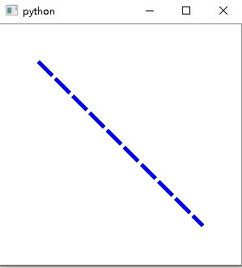

可以使用简化的函数 `QtWidgets.QGraphicsScene.addLine(x1, y1, x2, y2[, pen=QPen()])`，实现：

```python
class MainWindow(QtWidgets.QGraphicsView):
    def __init__(self, *args, **kwargs):
        super().__init__(*args, **kwargs)
        # 设定视图尺寸
        self.resize(300, 300)
        # 创建场景
        self.scene = QtWidgets.QGraphicsScene()
        pen = QtGui.QPen(QtCore.Qt.blue, 5, QtCore.Qt.DashLine)
        self.scene.addLine(0, 0, 200, 200, pen)
        # 设定视图的场景
        self.setScene(self.scene)
```

#### 3.1.1 自定义线元位置

由于 `QGraphicsLineItem` 继承自 `QGraphicsLineItem`，故而可以使用函数 `QtWidgets.QGraphicsItem.setPos(pos)` 设定图元的位置，以实现平移线元的效果：

```python
from xinet import QtWidgets, QtGui, QtCore
from xinet.run_qt import run


class MainWindow(QtWidgets.QGraphicsView):
    def __init__(self, *args, **kwargs):
        super().__init__(*args, **kwargs)
        # 设定视图尺寸
        self.resize(300, 300)
        # 创建场景
        self.scene = QtWidgets.QGraphicsScene()
        self.line = QtWidgets.QGraphicsLineItem(0, 0, 200, 200)
        pen = QtGui.QPen(QtCore.Qt.blue, 0, QtCore.Qt.DashLine)
        self.line.setPen(pen)
        self.line.setPos(50, 0)  # 平移线元
        self.scene.addItem(self.line)
        self.scene.addItem(QtWidgets.QGraphicsLineItem(0, 0, 200, 200))
        # 设定视图的场景
        self.setScene(self.scene)


if __name__ == '__main__':
    run(MainWindow)
```

效果：

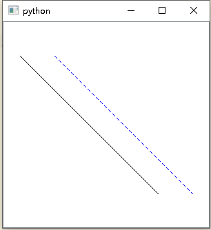

对于没有父项的项目，`pos` 位于场景坐标中。其中的参数 `pos` 可以是 `QPointF` 或者 `(x, y)`。

#### 3.1.2 自定义线元

`QGraphicsLineItem` 使用线条和笔的宽度来提供 `boundingRect()`，`shape()` 和 `contains()` 的合理实现。`paint()` 函数使用项目的关联笔来绘制线条。

```python
from xinet import QtWidgets, QtGui, QtCore
from xinet.run_qt import run


class LineItem(QtWidgets.QGraphicsItem):
    def __init__(self, *args, **kwargs):
        super().__init__(*args, **kwargs)
        self.source = QtCore.QPointF(0, 250)
        self.dest = QtCore.QPointF(120, 120)
        self.line = QtCore.QLineF(self.source, self.dest)
        self.line.setLength(self.line.length() - 20)

    def boundingRect(self):
        return QtCore.QRectF(0, 0, 600, 400)

    def paint(self, painter, QStyleOptionGraphicsItem, QWidget_widget=None):
        # setPen
        pen = QtGui.QPen()
        pen.setWidth(5) # 笔宽
        pen.setJoinStyle(QtCore.Qt.MiterJoin)  # 让箭头变尖
        painter.setPen(pen)
        # draw line
        painter.drawLine(self.line)


class MainWindow(QtWidgets.QGraphicsView):
    def __init__(self, *args, **kwargs):
        super().__init__(*args, **kwargs)
        # 设定视图尺寸
        self.setFixedSize(300, 300)
        # 创建场景
        self.scene = QtWidgets.QGraphicsScene()
        self.setSceneRect(0, 0, 250, 250)  # 设置场景的边界矩形，即可视化区域矩形
        # x1, y1, x2, y2
        self.item = LineItem()
        # pen = QtGui.QPen(QtCore.Qt.blue, 5, QtCore.Qt.DashLine)
        # self.line.setPen(pen)
        self.scene.addItem(self.item)
        self.item.setFlags(QtWidgets.QGraphicsItem.ItemIsSelectable |
                           QtWidgets.QGraphicsItem.ItemIsMovable)

        # 设定视图的场景
        self.setScene(self.scene)


if __name__ == '__main__':
    run(MainWindow)
```

效果图：

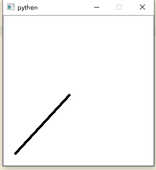

在这条线的基础上画上箭头：

1. 首先利用`QLineF().unitVector()`函数得到它的单位向量，并将它移到原线的终点位置，注意这里的偏移量。

```python
v = self.line.unitVector()
v.setLength(20) # 改变单位向量的大小，实际就是改变箭头长度
v.translate(QPointF(self.line.dx(), self.line.dy()))
```

2. 然后我们利用`normalVector()`函数得到他的法向量。

```python
n = v.normalVector() # 法向量
n.setLength(n.length() * 0.5) # 这里设定箭头的宽度
n2 = n.normalVector().normalVector() # 两次法向量运算以后，就得到一个反向的法向量
```

3. 然后我们取得 3 个向量的终点 为箭头的三个端点，并以这三点为顶点画出三角形：

```python
p1 = v.p2()
p2 = n.p2()
p3 = n2.p2()        
painter.drawPolygon(p1, p2, p3)
```

至此，箭头就算完成了！如果你喜欢，你还可以填充箭头：

```python
brush = QtGui.QBrush()
brush.setColor(QtCore.Qt.black)
brush.setStyle(QtCore.Qt.SolidPattern)
painter.setBrush(brush)
```

这样的操作有点繁琐，可以直接使用`QPainterPath`实现带箭头的线。`QPainterPath`其实是一个容器，他可以包含一个或者多个不同的绘画步骤，通过这些步骤组成较为复杂的图案，然后使用`QPainter.drawPath()`将这些图案一次性画出来。

实现的方式和普通方法的区别在于：

普通方法分两步画出图形，先画线，再画箭头：

```python
painter.drawLine(self.line)
painter.drawPolygon(p1, p2, p3)
```

而利用`QPainterPath`，则是先将整个绘制过程设置好，然后一次性画出整个path：

```python
arrow = QtGui.QPolygonF([p1, p2, p3, p1])
path = QtGui.QPainterPath()
path.moveTo(self.source) # 移动到线原点
path.lineTo(self.dest) # 添加线的路径
path.addPolygon(arrow) # 添加箭头路径
    
painter.drawPath(path) # 画出整个路径
```

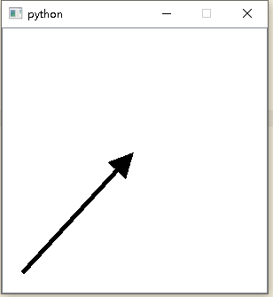

### 3.2 像素图元：QGraphicsPixmapItem

要设置像素图元 [QGraphicsPixmapItem](https://doc.qt.io/qtforpython/PySide2/QtWidgets/QGraphicsPixmapItem.html#qgraphicspixmapitem "Permalink to this headline")，请将 `QPixmap` 传递给 QGraphicsPixmapItem 的构造函数，或调用 `setPixmap()` 函数。`pixmap()` 函数返回当前的像素图。

QGraphicsPixmapItem 使用 pixmap 的可选 alpha 蒙版，以合理地实现 `boundingRect()`，`shape()` 和 `contains()`。

像素图是在像素图元的 $(0, 0)$ 坐标处绘制的，由 `offset()` 返回。您可以通过调用 `setOffset()` 来更改图形偏移量。

您可以通过调用 `setTransformationMode()` 来设置像素图的变换模式。默认情况下，使用 `FastTransformation`，它提供了快速，non-smooth scaling。`SmoothTransformation` 在  painter 上启用`SmoothPixmapTransform`，其质量取决于平台和视口（platform and viewport）。结果通常不如直接调用 `QPixmap::scale()` 好。调用 `transformationMode()` 以获取该项目的当前变换模式。

```python
from xinet import QtWidgets, QtGui, QtCore
from xinet.run_qt import run


class MainWindow(QtWidgets.QGraphicsView):
    def __init__(self, *args, **kwargs):
        super().__init__(*args, **kwargs)
        # 设定视图尺寸
        self.resize(300, 300)
        # 创建场景
        self.scene = QtWidgets.QGraphicsScene()
        self.pic = QtWidgets.QGraphicsPixmapItem()
        pix = QtGui.QPixmap(r'D:\share\study\images\巴西建筑\017.jpg')
        self.pic.setPixmap(pix.scaled(120, 100))
        self.pic.setFlags(QtWidgets.QGraphicsItem.ItemIsSelectable |
                          QtWidgets.QGraphicsItem.ItemIsMovable)
        self.pic.setOffset(100, 120)
        self.scene.addItem(self.pic)
        # 设定视图的场景
        self.setScene(self.scene)


if __name__ == '__main__':
    run(MainWindow)
```

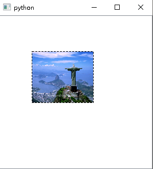

该例子使用了 `QtWidgets.QGraphicsItem.setFlags(flags)` 函数设定图元为可选择且可移动，参数 `flags` 为 `GraphicsItemFlags`。g该函数将图元项目标志设置为 `flags`。`flags` 中的所有标志均已启用；禁用所有不在 `flags` 中的标记。如果图元项目具有焦点（focus ），并且 `flags` 未启用 `ItemIsFocusable`，则由于调用此函数而导致项目失去焦点。同样，如果选择了图元项目，并且 `flags` 没有启用 `ItemIsSelectable`，则会自动取消选择该项目。

默认情况下，未启用任何标志。（默认情况下，[QGraphicsWidget](https://doc.qt.io/qtforpython/overviews/graphicsview.html#graphics-view-framework) 启用 `ItemSendsGeometryChanges` 标志以跟踪位置变化。）

还有 [`QtWidgets.QGraphicsItem.flags()`](https://doc.qt.io/qtforpython/PySide2/QtWidgets/QGraphicsItem.html#PySide2.QtWidgets.PySide2.QtWidgets.QGraphicsItem.flags "Permalink to this definition") 返回图元项目的标志（默认情况下，未启用任何标志）。这些标志描述了启用或不启用该图元项目的哪些可配置功能。例如，如果标志包括`ItemIsFocusable`，则该项目可以接受输入焦点。

[`QtWidgets.QGraphicsItem.setFlag(*flag*[, *enabled=true*])`](https://doc.qt.io/qtforpython/PySide2/QtWidgets/QGraphicsItem.html#PySide2.QtWidgets.PySide2.QtWidgets.QGraphicsItem.setFlag "Permalink to this definition") 如果 `enabled` 为 `true`，则启用图元项目标志标志；否则，它被禁用。

### 3.3 图元分组：QGraphicsItemGroup

[`QGraphicsItemGroup`](https://doc.qt.io/qtforpython/PySide2/QtWidgets/QGraphicsItemGroup.html#qgraphicsitemgroup "Permalink to this headline") 类提供了一个将一组图元项目视为单个项目的容器（container）。

QGraphicsItemGroup 是一种特殊类型的复合项，它会将自身及其所有子项视为一个项（即，所有子项的所有事件和几何都合并在一起）。当用户要将多个较小的图元项目归为一个大图元项目时，通常在演示工具中使用项目组，以简化项目的移动和复制。

如果只想将项目存储在其他项目中，则可以通过将合适的父级传递给 `setParentItem()` 来直接使用任何 QGraphicsItem。

QGraphicsItemGroup 的 `boundingRect()` 函数返回项目组中所有项目的边界矩形。QGraphicsItemGroup 忽略其子项上的 ItemIgnoresTransformations 标志（即，相对于组项的几何形状，将子项视为可变形的（transformable））。

有两种构造项目组的方法。最简单，最常见的方法是将项目列表（例如所有选定的项目）传递给 `createItemGroup()`，该列表将返回新的 QGraphicsItemGroup 项目。另一种方法是手动构造 QGraphicsItemGroup 项，然后调用 `addItem()` 将其添加到场景中，然后通过调用 `addToGroup()` 一次将项手动添加到组中。要拆除（“取消分组”）项目组，可以调用 `destroyItemGroup()`，也可以通过调用 `removeFromGroup()` 手动从组中删除所有图元项目。

```python
# Group all selected items together
group = scene.createItemGroup(scene.selecteditems())

# Destroy the group, and delete the group item
scene.destroyItemGroup(group)
```

与调用 `setParentItem()`（仅保留子项的父项相对位置和转换）相反，添加和删除项的操作将保留项的场景相对位置（scene-relative position）和变换。

`addtoGroup()` 函数将目标项目重新添加到该项目组，从而使项目相对于场景的位置和变换保持完整。从视觉上看，这意味着通过 `addToGroup()` 添加的项目将由于此操作而保持完全不变，而不管该项目或组的当前位置或变换如何； 尽管该项目的位置和矩阵可能会发生变化。

removeFromGroup() 函数的语义与 `setParentItem()` 相似；它将项目重定为项目组的父项目。与 `addtoGroup()`  一样，项目的场景相对位置和变换保持不变。

### 3.4 路径抽象类：QAbstractGraphicsShapeItem

[QAbstractGraphicsShapeItem](https://doc.qt.io/qtforpython/PySide2/QtWidgets/QAbstractGraphicsShapeItem.html#qabstractgraphicsshapeitem "Permalink to this headline") 类为所有路径项提供了通用基础。

此类不能完全实现一个项目。特别是，它没有实现 QGraphicsItem 继承的 `boundingRect()` 和 `paint()`。您可以将此项目子类化，以提供该项目的笔和画笔（pen and brush）的访问器的简单基础实现。

```python
def brush ()
def pen ()
def setBrush (brush)
def setPen (pen)
```

被如下类继承：[QGraphicsEllipseItem](https://doc.qt.io/qtforpython/PySide2/QtWidgets/QGraphicsEllipseItem.html#qgraphicsellipseitem), [QGraphicsPathItem](https://doc.qt.io/qtforpython/PySide2/QtWidgets/QGraphicsPathItem.html#qgraphicspathitem), [QGraphicsPolygonItem](https://doc.qt.io/qtforpython/PySide2/QtWidgets/QGraphicsPolygonItem.html#qgraphicspolygonitem), [QGraphicsRectItem](https://doc.qt.io/qtforpython/PySide2/QtWidgets/QGraphicsRectItem.html#qgraphicsrectitem), [QGraphicsSimpleTextItem](https://doc.qt.io/qtforpython/PySide2/QtWidgets/QGraphicsSimpleTextItem.html#qgraphicssimpletextitem)。

#### 3.4.1 矩形元：QGraphicsRectItem

要设置项目的矩形元 [`QGraphicsRectItem`](https://doc.qt.io/qtforpython/PySide2/QtWidgets/QGraphicsRectItem.html#qgraphicsrectitem "Permalink to this headline")，请将 `QRectF` 传递给 QGraphicsRectItem 的构造函数，或调用 `setRect()` 函数。`rect()` 函数返回当前矩形元。

```python
QGraphicsRectItem(rect[, parent=None])  # rect 即 `QRectF`
QGraphicsRectItem(x, y, w, h[, parent=None])
```

QGraphicsRectItem 使用矩形和笔宽来提供 `boundingRect()`，`shape()` 和 `contains()` 的合理实现。`paint()` 函数使用与图元项目关联的笔刷绘制矩形，您可以通过调用 `setPen()` 和 `setBrush()` 函数来设置矩形。

```python
from xinet import QtWidgets, QtGui, QtCore
from xinet.run_qt import run


class MainWindow(QtWidgets.QGraphicsView):
    def __init__(self, *args, **kwargs):
        super().__init__(*args, **kwargs)
        # 设定视图尺寸
        self.resize(300, 300)
        # 创建场景
        self.scene = QtWidgets.QGraphicsScene()
        self.rect = QtWidgets.QGraphicsRectItem(0, 0, 200, 200)
        pen = QtGui.QPen(QtCore.Qt.blue, 0, QtCore.Qt.DashLine)
        self.rect.setPen(pen)
        self.rect.setPos(50, 10)  # 平移矩形元
        self.scene.addItem(self.rect)
        rect2 = QtWidgets.QGraphicsRectItem(0, 0, 200, 200)
        brush = QtGui.QBrush(QtCore.Qt.SolidPattern)
        brush.setColor(QtGui.QColor('yellow'))
        rect2.setBrush(brush)
        self.scene.addItem(rect2)
        # 设定视图的场景
        self.setScene(self.scene)


if __name__ == '__main__':
    run(MainWindow)
```

效果：

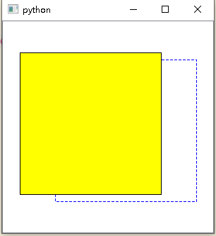

#### 3.4.2 多边形元：QGraphicsPolygonItem

要设置项目的多边形 [`QGraphicsPolygonItem`](https://doc.qt.io/qtforpython/PySide2/QtWidgets/QGraphicsPolygonItem.html#qgraphicspolygonitem "Permalink to this headline")，请将 QPolygonF 传递给 QGraphicsPolygonItem 的构造函数，或调用 `setPolygon()` 函数。`polygon()` 函数返回当前多边形。

```python
QGraphicsPolygonItem(polygon[, parent=None])
```

QGraphicsPolygonItem 使用多边形和笔宽来提供 `boundingRect()`，`shape()` 和 `contains()` 的合理实现。`paint()` 函数使用与图元项目关联的笔刷绘制矩形，您可以通过调用 `setPen()` 和 `setBrush()` 函数来设置。

```python
from xinet import QtWidgets, QtGui, QtCore
from xinet.run_qt import run


class MainWindow(QtWidgets.QGraphicsView):
    def __init__(self, *args, **kwargs):
        super().__init__(*args, **kwargs)
        # 设定视图尺寸
        self.resize(300, 300)
        # 创建场景
        self.scene = QtWidgets.QGraphicsScene()
        points = [QtCore.QPointF(*point)
                  for point in [(0, 0), (0, 200), (100, 100), (250, 100)]]
        item = QtWidgets.QGraphicsPolygonItem(points)
        brush = QtGui.QBrush(QtCore.Qt.SolidPattern)
        brush.setColor(QtGui.QColor(255, 255, 0, 80))
        item.setBrush(brush)
        self.scene.addItem(item)
        # 设定视图的场景
        self.setScene(self.scene)


if __name__ == '__main__':
    run(MainWindow)
```

效果：

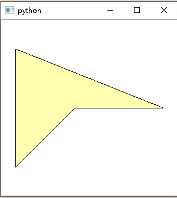

#### 3.4.3 椭圆元：QGraphicsEllipseItem

[`QGraphicsEllipseItem`](https://doc.qt.io/qtforpython/PySide2/QtWidgets/QGraphicsEllipseItem.html#qgraphicsellipseitem "Permalink to this headline") 表示具有填充和轮廓的椭圆，也可以将其用于椭圆块（请参见 [`startAngle()`](https://doc.qt.io/qtforpython/PySide2/QtWidgets/QGraphicsEllipseItem.html#PySide2.QtWidgets.PySide2.QtWidgets.QGraphicsEllipseItem.startAngle "PySide2.QtWidgets.PySide2.QtWidgets.QGraphicsEllipseItem.startAngle") ，[`spanAngle()`](https://doc.qt.io/qtforpython/PySide2/QtWidgets/QGraphicsEllipseItem.html#PySide2.QtWidgets.PySide2.QtWidgets.QGraphicsEllipseItem.spanAngle "PySide2.QtWidgets.PySide2.QtWidgets.QGraphicsEllipseItem.spanAngle")）。

```python
QGraphicsEllipseItem(rect[, parent=None])
QGraphicsEllipseItem(x, y, w, h[, parent=None])
```

要设置椭圆元，请将 `QRectF` 传递给 QGraphicsEllipseItem 的构造函数，或调用 `setRect()`。`rect()` 函数返回当前的椭圆结构。

QGraphicsEllipseItem 使用椭圆和笔宽来提供 `boundingRect()`，`shape()` 和 `contains()` 的合理实现。`paint()` 函数使用与图元项目关联的笔刷绘制椭圆，您可以通过调用 `setPen()` 和 `setBrush()` 函数来设置。

```python
from xinet import QtWidgets, QtGui, QtCore
from xinet.run_qt import run


class MainWindow(QtWidgets.QGraphicsView):
    def __init__(self, *args, **kwargs):
        super().__init__(*args, **kwargs)
        # 设定视图尺寸
        self.resize(300, 300)
        # 创建场景
        self.scene = QtWidgets.QGraphicsScene()
        # 绘制圆
        item = QtWidgets.QGraphicsEllipseItem(20, 20, 100, 100)
        brush = QtGui.QBrush(QtCore.Qt.SolidPattern)
        brush.setColor(QtGui.QColor(25, 25, 25, 80))
        item.setBrush(brush)
        self.scene.addItem(item)
        # 绘制椭圆块
        item1 = QtWidgets.QGraphicsEllipseItem(120, 120, 100, 80)
        # 1/16 为 1°
        item1.setStartAngle(7*360)  # 默认为 0
        item1.setSpanAngle(14*360)  # 默认为 360 * 16
        item1.setBrush(brush)
        self.scene.addItem(item1)
        # 设定视图的场景
        self.setScene(self.scene)


if __name__ == '__main__':
    run(MainWindow)
```

效果：

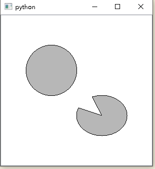

#### 3.4.4 路径元：QGraphicsPathItem

要设置路径元 [`QGraphicsPathItem`](https://doc.qt.io/qtforpython/PySide2/QtWidgets/QGraphicsPathItem.html#qgraphicspathitem "Permalink to this headline")，请将 `QPainterPath` 传递给 QGraphicsPathItem 的构造函数，或调用 `setPath()` 函数。`path()` 函数返回当前路径。

QGraphicsPathItem 使用路径和笔宽来提供 `boundingRect()`，`shape()` 和 `contains()` 的合理实现。`paint()` 函数使用与图元项目关联的笔刷绘制椭圆，您可以通过调用 `setPen()` 和 `setBrush()` 函数来设置。

```python
from xinet import QtWidgets, QtGui, QtCore
from xinet.run_qt import run


class MainWindow(QtWidgets.QGraphicsView):
    def __init__(self, *args, **kwargs):
        super().__init__(*args, **kwargs)
        # 设定视图尺寸
        self.resize(300, 300)
        # 创建场景
        self.scene = QtWidgets.QGraphicsScene()
        self.tri_path = QtGui.QPainterPath()
        self.tri_path.moveTo(100, 550)
        self.tri_path.lineTo(130, 390)
        self.tri_path.lineTo(100, 390)
        self.tri_path.lineTo(100, 550)
        self.tri_path.closeSubpath()
        path = QtWidgets.QGraphicsPathItem(self.tri_path)
        self.scene.addItem(path)
        self.setScene(self.scene)


if __name__ == '__main__':
    run(MainWindow)
```

效果：

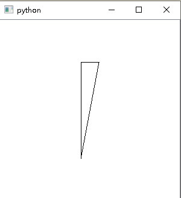

有函数：

```python
def path ()
def setPath (path)
```

#### 3.4.5 简单文本元：QGraphicsSimpleTextItem

[`QGraphicsSimpleTextItem`](https://doc.qt.io/qtforpython/PySide2/QtWidgets/QGraphicsSimpleTextItem.html#PySide2.QtWidgets.QGraphicsSimpleTextItem "PySide2.QtWidgets.QGraphicsSimpleTextItem") 类提供了一个简单的文本路径项，您可以将其添加到 [`QGraphicsScene`](https://doc.qt.io/qtforpython/PySide2/QtWidgets/QGraphicsScene.html#PySide2.QtWidgets.QGraphicsScene "PySide2.QtWidgets.QGraphicsScene")。

要设置项目的文本，您可以将 QString 传递给 QGraphicsSimpleTextItem 的构造函数，也可以稍后调用 `setText()` 来更改文本。要设置文本填充颜色，请调用 `setBrush()`。

简单文本项可以同时具有填充和轮廓。`setBrush()` 将设置文本填充（即文本颜色），而 `setPen()` 设置将用于绘制文本轮廓的笔。（后者可能会很慢，特别是对于复杂的笔和带有长文本内容的项目。）如果只想绘制简单的文本行，则应仅调用 `setBrush()` 并保持笔未设置；QGraphicsSimpleTextItem 的笔默认为 `NoPen`。

QGraphicsSimpleTextItem 使用文本的格式化大小和关联的字体来提供 `boundingRect()`，`shape()` 和 `contains()` 的合理实现。您可以通过调用 `setFont()` 来设置字体。

QGraphicsSimpleText 不显示 RTF（rich text）；相反，您可以使用 `QGraphicsTextItem`，它提供完整的文本控制功能。

```python
QGraphicsSimpleTextItem(text[, parent=None])

def font ()
def setFont(font)
def setText(text)
def text()
```

### 3.5 文本图元：QGraphicsTextItem

[`QGraphicsTextItem`](https://doc.qt.io/qtforpython/PySide2/QtWidgets/QGraphicsTextItem.html#qgraphicstextitem "Permalink to this headline") 类提供了一个文本项，您可以将其添加到 QGraphicsScene 中以显示格式化的文本。

如果只需要在项目中显示纯文本（plain text），请考虑改用 `QGraphicsSimpleTextItem`。

要设置项目的文本，请将 `QString` 传递给 `QGraphicsTextItem` 的构造函数，或调用 `setHtml()`/ `setPlainText()`。

QGraphicsTextItem 使用文本的格式化大小和关联的字体来提供 `boundingRect()`，`shape()` 和 `contains()` 的合理实现。您可以通过调用 `setFont()` 来设置字体。

通过使用 `setTextInteractionFlags()` 设置 `TextEditorInteraction` 标志，可以使该项目可编辑。可以使用 `setTextWidth()` 设置项目的首选文本宽度，并使用 `textWidth()` 获得该宽度。

> 为了使 HTML 文本居中对齐，必须设置项目的文本宽度。否则，您可以在设置项目的文本后调用 `AdjustSize()`。
> QGraphicsTextItem 默认情况下接受悬停事件。您可以使用 `setAcceptHoverEvents()` 更改此设置。

```python
from xinet import QtWidgets, QtGui, QtCore
from xinet.run_qt import run


class MainWindow(QtWidgets.QGraphicsView):
    def __init__(self, *args, **kwargs):
        super().__init__(*args, **kwargs)
        # 设定视图尺寸
        self.resize(300, 300)
        # 创建场景
        self.scene = QtWidgets.QGraphicsScene()
        text = QtWidgets.QGraphicsTextItem('这是一个纯文本')
        self.scene.addItem(text)
        self.setScene(self.scene)


if __name__ == '__main__':
    run(MainWindow)
```

效果：

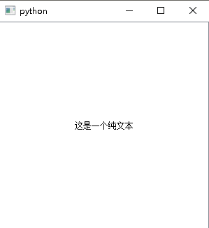

`QGraphicsTextItem.document()`：返回项目的文本文档。`QGraphicsTextItem.font()`：返回项目的字体，该字体用于呈现文本。

```python
from xinet import QtWidgets, QtGui, QtCore
from xinet.run_qt import run


class MainWindow(QtWidgets.QGraphicsView):
    def __init__(self, *args, **kwargs):
        super().__init__(*args, **kwargs)
        # 设定视图尺寸
        self.resize(300, 300)
        # 创建场景
        self.scene = QtWidgets.QGraphicsScene()
        text = QtWidgets.QGraphicsTextItem()
        text.setPlainText('这是一个纯文本') # 纯文本
        text.setDefaultTextColor(QtGui.QColor(66, 222, 88)) # 设定字体颜色
        font = QtGui.QFont("华文琥珀", 20, QtGui.QFont.Bold)
        text.setFont(font)
        text.setPos(10, 30)
        text2 = QtWidgets.QGraphicsTextItem()
        text2.setPlainText('这是可编辑的文本')
        text2.setTextInteractionFlags(QtCore.Qt.TextEditorInteraction)
        text2.setPos(10, 80)
        text3 = QtWidgets.QGraphicsTextItem()
        text3.setHtml('<a href="https://www.cnblogs.com/q735613050/">我的博客</a>')
        text3.setOpenExternalLinks(True)
        text3.setTextInteractionFlags(QtCore.Qt.TextBrowserInteraction)
        text3.setPos(10, 100)
        self.scene.addItem(text)
        self.scene.addItem(text2)
        self.scene.addItem(text3)
        self.setScene(self.scene)


if __name__ == '__main__':
    run(MainWindow)
```

效果：

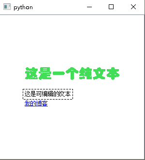


## 4 Graphics View 场景与视角

如果不使用 `QtWidgets.QGraphicsScene.addItem` 添加图元，可以直接使用特定的图元创建函数添加图元。

>* def [`addEllipse`](https://doc.qt.io/qtforpython/PySide2/QtWidgets/QGraphicsScene.html#id0 "PySide2.QtWidgets.PySide2.QtWidgets.QGraphicsScene.addEllipse") (rect[, pen=QPen()[, brush=QBrush()]])
>* def [`addEllipse`](https://doc.qt.io/qtforpython/PySide2/QtWidgets/QGraphicsScene.html#id0 "PySide2.QtWidgets.PySide2.QtWidgets.QGraphicsScene.addEllipse") (x, y, w, h[, pen=QPen()[, brush=QBrush()]])
>* def [`addItem`](https://doc.qt.io/qtforpython/PySide2/QtWidgets/QGraphicsScene.html#PySide2.QtWidgets.PySide2.QtWidgets.QGraphicsScene.addItem "PySide2.QtWidgets.PySide2.QtWidgets.QGraphicsScene.addItem") (item)
>* def [`addLine`](https://doc.qt.io/qtforpython/PySide2/QtWidgets/QGraphicsScene.html#id2 "PySide2.QtWidgets.PySide2.QtWidgets.QGraphicsScene.addLine") (line[, pen=QPen()])
>* def [`addLine`](https://doc.qt.io/qtforpython/PySide2/QtWidgets/QGraphicsScene.html#id2 "PySide2.QtWidgets.PySide2.QtWidgets.QGraphicsScene.addLine") (x1, y1, x2, y2[, pen=QPen()])
>* def [`addPath`](https://doc.qt.io/qtforpython/PySide2/QtWidgets/QGraphicsScene.html#PySide2.QtWidgets.PySide2.QtWidgets.QGraphicsScene.addPath "PySide2.QtWidgets.PySide2.QtWidgets.QGraphicsScene.addPath") (path[, pen=QPen()[, brush=QBrush()]])
>* def [`addPixmap`](https://doc.qt.io/qtforpython/PySide2/QtWidgets/QGraphicsScene.html#PySide2.QtWidgets.PySide2.QtWidgets.QGraphicsScene.addPixmap "PySide2.QtWidgets.PySide2.QtWidgets.QGraphicsScene.addPixmap") (pixmap)
>* def [`addPolygon`](https://doc.qt.io/qtforpython/PySide2/QtWidgets/QGraphicsScene.html#PySide2.QtWidgets.PySide2.QtWidgets.QGraphicsScene.addPolygon "PySide2.QtWidgets.PySide2.QtWidgets.QGraphicsScene.addPolygon") (polygon[, pen=QPen()[, brush=QBrush()]])
>* def [`addRect`](https://doc.qt.io/qtforpython/PySide2/QtWidgets/QGraphicsScene.html#id3 "PySide2.QtWidgets.PySide2.QtWidgets.QGraphicsScene.addRect") (rect[, pen=QPen()[, brush=QBrush()]])
>* def [`addRect`](https://doc.qt.io/qtforpython/PySide2/QtWidgets/QGraphicsScene.html#id3 "PySide2.QtWidgets.PySide2.QtWidgets.QGraphicsScene.addRect") (x, y, w, h[, pen=QPen()[, brush=QBrush()]])
>* def [`addSimpleText`](https://doc.qt.io/qtforpython/PySide2/QtWidgets/QGraphicsScene.html#PySide2.QtWidgets.PySide2.QtWidgets.QGraphicsScene.addSimpleText "PySide2.QtWidgets.PySide2.QtWidgets.QGraphicsScene.addSimpleText") (text[, font=QFont()])
>* def [`addText`](https://doc.qt.io/qtforpython/PySide2/QtWidgets/QGraphicsScene.html#PySide2.QtWidgets.PySide2.QtWidgets.QGraphicsScene.addText "PySide2.QtWidgets.PySide2.QtWidgets.QGraphicsScene.addText") (text[, font=QFont()])
>* def [`addWidget`](https://doc.qt.io/qtforpython/PySide2/QtWidgets/QGraphicsScene.html#PySide2.QtWidgets.PySide2.QtWidgets.QGraphicsScene.addWidget "PySide2.QtWidgets.PySide2.QtWidgets.QGraphicsScene.addWidget") (widget[, wFlags=Qt.WindowFlags()])

下面仅以 `addText` 为例说明如何使用这些函数。

```python
from xinet import QtWidgets, QtGui, QtCore
from xinet.run_qt import run


class TextView(QtWidgets.QGraphicsView):
    def __init__(self, *args, **kwargs):
        super().__init__(*args, **kwargs)
        self.resize(500, 400)
        scene = QtWidgets.QGraphicsScene()  # 创建场景
        font = QtGui.QFont("华文琥珀", 50, QtGui.QFont.Bold)
        A = scene.addText("水", font)  # 在场景中添加文本
        B = scene.addText("胡", font)  # 在场景中添加文本
        A.setPos(0, 0) 
        B.setPos(80, 0) #图元默认位置为 $(0, 0)$，可以自定义位置
        self.setScene(scene)


if __name__ == '__main__':
    run(TextView)
```

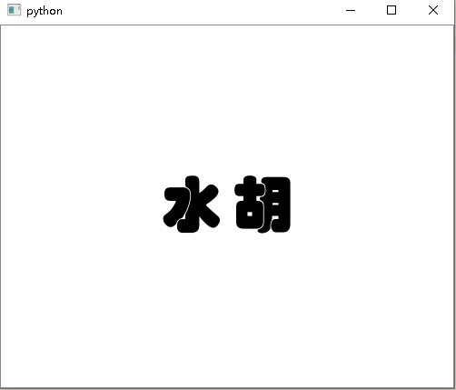

可以同时展示不同的 View，不同的 Scene：

```python
class MainWindow(QtWidgets.QWidget):
    def __init__(self, *args, **kwargs):
        super().__init__(*args, **kwargs)
        self.resize(500, 400)
        scene = QtWidgets.QGraphicsScene(self)  # 创建场景
        scene.addText("Hello, world!")  # 在场景中添加文本
        view = QtWidgets.QGraphicsView(scene, self)  # 创建视图窗口
        view.move(10, 10)
        view1 = TextView(self)
        view1.move(50, 50)
        view2 = TextView(self)
        view2.move(150, 150)
        

if __name__ == '__main__':
    run(MainWindow)
```

效果：

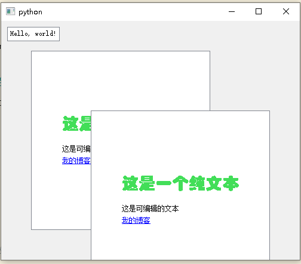

展示相同的 Scene，不同的 View：

```python
from xinet import QtWidgets, QtGui, QtCore
from xinet.run_qt import run


class MainWindow(QtWidgets.QWidget):
    def __init__(self, *args, **kwargs):
        super().__init__(*args, **kwargs)
        self.resize(500, 400)
        scene = QtWidgets.QGraphicsScene(self)  # 创建场景
        scene.addText("Hello, world!")  # 在场景中添加文本
        view = QtWidgets.QGraphicsView(scene, self)  # 创建视图窗口
        view.move(10, 10)
        scene1 = self.text_scene()
        view1 = QtWidgets.QGraphicsView(self)
        view1.setScene(scene1)
        view1.move(50, 50)
        view2 = QtWidgets.QGraphicsView(self)
        view2.setScene(scene1)
        view2.move(150, 150)

    def text_scene(self):
        # 创建场景
        scene = QtWidgets.QGraphicsScene()
        text = QtWidgets.QGraphicsTextItem()
        text.setPlainText('这是一个纯文本')  # 纯文本
        text.setDefaultTextColor(QtGui.QColor(66, 222, 88))  # 设定字体颜色
        font = QtGui.QFont("华文琥珀", 20, QtGui.QFont.Bold)
        text.setFont(font)
        text.setPos(10, 30)
        text2 = QtWidgets.QGraphicsTextItem()
        text2.setPlainText('这是可编辑的文本')
        text2.setTextInteractionFlags(QtCore.Qt.TextEditorInteraction)
        text2.setPos(10, 80)
        text3 = QtWidgets.QGraphicsTextItem()
        text3.setHtml('<a href="https://www.cnblogs.com/q735613050/">我的博客</a>')
        text3.setOpenExternalLinks(True)
        text3.setTextInteractionFlags(QtCore.Qt.TextBrowserInteraction)
        text3.setPos(10, 100)
        scene.addItem(text)
        scene.addItem(text2)
        scene.addItem(text3)
        return scene


if __name__ == '__main__':
    run(MainWindow)
```

效果：

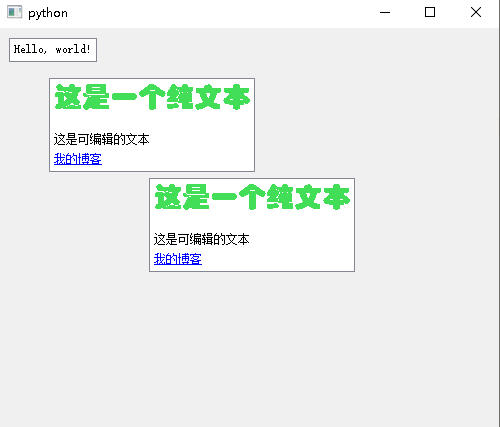

## 5 

