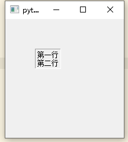
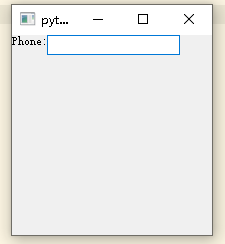
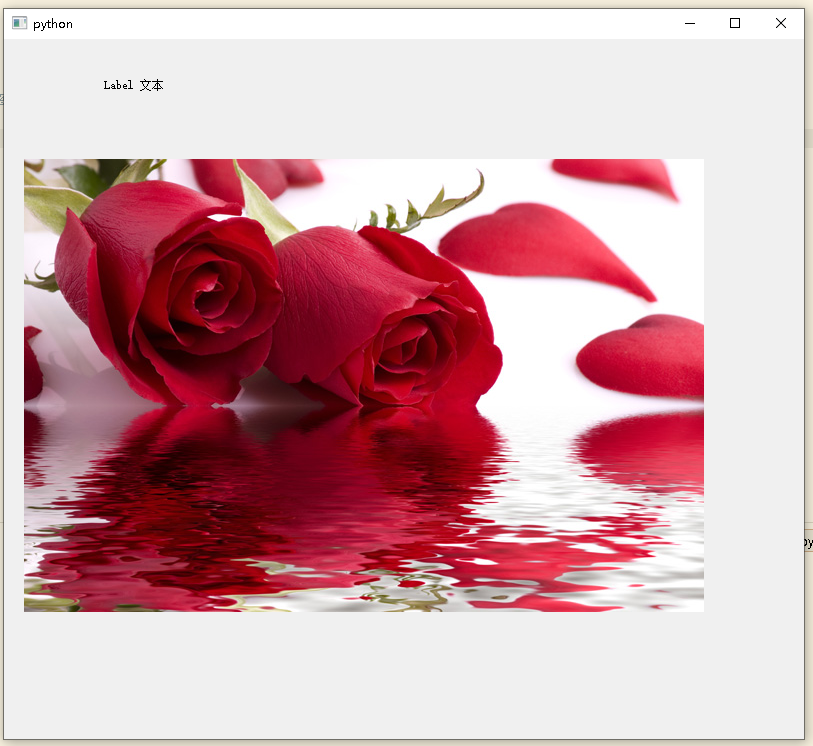
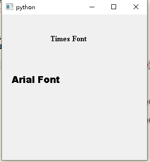
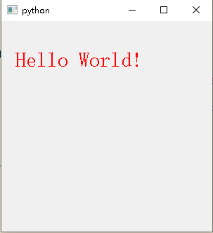
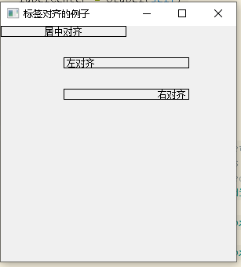

## 4 QLabel 展示文本或图像

`QLabel`用于显示文本或图像。没有提供用户交互功能。标签的视觉外观可以通过各种方式进行配置，并且可以用于为另一个窗口小部件指定焦点助记键。`QLabel`可以包含以下任何类型的内容：

Content|Setting
---|---
Plain text|将`QString`传递给[setText()](https://doc.qt.io/qtforpython/PySide2/QtWidgets/QLabel.html#PySide2.QtWidgets.PySide2.QtWidgets.QLabel.setText "PySide2.QtWidgets.PySide2.QtWidgets.QLabel.setText")
Rich text|将包含富文本的`QString`传递给`setText()`
A pixmap|将[QPixmap](https://doc.qt.io/qtforpython/PySide2/QtGui/QPixmap.html#PySide2.QtGui.QPixmap "PySide2.QtGui.QPixmap")传递给[setPixmap()](https://doc.qt.io/qtforpython/PySide2/QtWidgets/QLabel.html#PySide2.QtWidgets.PySide2.QtWidgets.QLabel.setPixmap "PySide2.QtWidgets.PySide2.QtWidgets.QLabel.setPixmap")
A movie|将[QMovie](https://doc.qt.io/qtforpython/PySide2/QtGui/QMovie.html#PySide2.QtGui.QMovie "PySide2.QtGui.QMovie")传递给[setMovie()](https://doc.qt.io/qtforpython/PySide2/QtWidgets/QLabel.html#PySide2.QtWidgets.PySide2.QtWidgets.QLabel.setMovie "PySide2.QtWidgets.PySide2.QtWidgets.QLabel.setMovie")
A number|将 *int* 或 *double* 传递给[setNum()](https://doc.qt.io/qtforpython/PySide2/QtWidgets/QLabel.html#id0 "PySide2.QtWidgets.PySide2.QtWidgets.QLabel.setNum")，用于将数字转换为纯文本
Nothing|与空的纯文本相同。这是默认值。由[clear()](https://doc.qt.io/qtforpython/PySide2/QtWidgets/QLabel.html#PySide2.QtWidgets.PySide2.QtWidgets.QLabel.clear "PySide2.QtWidgets.PySide2.QtWidgets.QLabel.clear")设置。

<table>
<font color=BlueViolet face="华文行楷">警告</font>：
<td bgcolor = #00BF6B><font color = #F7FF50>

当将 `QString` 传递给构造函数或调用 `setText()` 时，请确保清理您的输入，因为 `QLabel` 会尝试猜测它是将文本显示为纯文本还是富文本（HTML 4 标记的子集）。您可能需要显式调用 [setTextFormat()](https://doc.qt.io/qtforpython/PySide2/QtWidgets/QLabel.html#PySide2.QtWidgets.PySide2.QtWidgets.QLabel.setTextFormat "PySide2.QtWidgets.PySide2.QtWidgets.QLabel.setTextFormat")，例如，如果您希望文本为纯格式，但无法控制文本源（例如，当显示从 Web 加载的数据时）。
</td>
</table>

使用这些函数中的任何一个更改内容时，将清除以前的所有内容。默认情况下，标签显示左对齐，垂直居中（[left-aligned, vertically-centered](https://doc.qt.io/qtforpython/overviews/stylesheet-reference.html#qt-style-sheets-reference)）的文本和图像，其中要显示的文本中的所有选项卡都会**自动展开**。但是，`QLabel`的外观可以通过几种方式进行调整和微调。

可以使用 [setAlignment(Alignment)](https://doc.qt.io/qtforpython/PySide2/QtWidgets/QLabel.html#PySide2.QtWidgets.PySide2.QtWidgets.QLabel.setAlignment "PySide2.QtWidgets.PySide2.QtWidgets.QLabel.setAlignment") 和 [setIndent(int arg)](https://doc.qt.io/qtforpython/PySide2/QtWidgets/QLabel.html#PySide2.QtWidgets.PySide2.QtWidgets.QLabel.setIndent "PySide2.QtWidgets.PySide2.QtWidgets.QLabel.setIndent") 来调整 `QLabel` 小部件区域内内容的位置。文本内容还可以使用 [setWordWrap()](https://doc.qt.io/qtforpython/PySide2/QtWidgets/QLabel.html#PySide2.QtWidgets.PySide2.QtWidgets.QLabel.setWordWrap "PySide2.QtWidgets.PySide2.QtWidgets.QLabel.setWordWrap") 沿单词边界换行。

方法|描述
:-|:-
setAlignment()|按固定值方式对齐文本。`Qt.AlignLeft`：水平方向靠左对齐；`Qt.AlignRight`:水平方向靠右对齐；`Qt.AlignCenter`：水平方向居中对齐；`Qt.AlignJustify`：水平方向调整间距两端对齐；`Qt.AlignTop`：垂直方向靠上对齐；`Qt.AlignBottom`：垂直方向靠下对齐；`Qt.AlignVCenter`：垂直方向居中对齐。
serIndent()|设置文本缩进值
setPixmap()|设置 QLabel 为一个 Pixmap 图片
text()|获得 Qlabel 的文本内容
setText()|设置 Qlabel 的文本内容
selectedText()|返回所选择的字符
setBuddy()|设置 QLabel 的助记符及 buddy（伙伴），及使用 Qlabel 设置快捷键，会在快捷键后将焦点设置到其 buddy 上，这里用到了 Qlabel 的交互控件功能，此外，buddy 可以是任何一个 widget 控件，使用 `setBuddy(QWidget*)` 设置，其 Qlabel 必须是文本内容，并且使用 “&” 符号设置了助记符
setWordWrap()|设置是否允许换行

Qlabel 类中的常用信号：

信号|描述
:-|:-
linkActiveted|当单击标签中的超链接，希望在新窗口打开这个超链接时，`setOpenExternalLinks` 特性必须设置为 `True`，即`setOpenExternalLinks(True)`
linkHovered|当鼠标指针滑过标签中嵌入的超链接时，需要用槽函数与这个信号进行绑定

例如，下面的代码设置了一个下沉的面板，该面板的右下角有两行文本（两行与标签的右侧齐平）：

<font color=#00FF size=4 face="华文彩云">Code2.2</font>

```python
from xinet import QtWidgets, QtCore, QtGui
from xinet.run_qt import run

QFrame = QtWidgets.QFrame
Qt = QtCore.Qt
QLabel = QtWidgets.QLabel


class Window(QtWidgets.QWidget):
    def __init__(self, *args, **kw):
        super().__init__(*args, **kw)
        self.resize(200, 200)
        label = QLabel(self)
        label.move(50, 50)
        label.setFrameStyle(QFrame.Panel | QFrame.Sunken)
        label.setText("第一行\n第二行")
        # 设定对齐方式
        label.setAlignment(Qt.AlignBottom | Qt.AlignRight)


if __name__ == "__main__":
    run(Window)
```

效果：



`QLabel` 从 `QFrame` 继承的属性和函数也可以用于指定要用于任何给定标签的小部件框架。

`QLabel`通常用作交互式窗口小部件的标签（label）。对于此用途，`QLabel`提供了一种有用的机制来添加助记符（mnemonic，请参阅 [QKeySequence](https://doc.qt.io/qtforpython/PySide2/QtGui/QKeySequence.html#PySide2.QtGui.QKeySequence "PySide2.QtGui.QKeySequence")），该助记符会将键盘焦点（keyboard focus）设置到另一个小部件（称为`QLabel`的 “buddy”）。例如：

<font color=#00FF size=4 face="华文彩云">Code2.3</font>

```python
from xinet import QtWidgets, QtCore, QtGui
from xinet.run_qt import run

QFrame = QtWidgets.QFrame
Qt = QtCore.Qt
QLabel = QtWidgets.QLabel
QLineEdit = QtWidgets.QLineEdit


class Window(QtWidgets.QWidget):
    def __init__(self, *args, **kw):
        super().__init__(*args, **kw)
        self.resize(200, 200)
        phoneEdit = QLineEdit(self)
        phoneLabel = QLabel("&Phone:", self)
        phoneLabel.setBuddy(phoneEdit)
        phoneEdit.move(35, 0)


if __name__ == "__main__":
    run(Window)
```



在此示例中，当用户按下 `Alt + P` 时，键盘焦点转移到了标签的 buddy（[QLineEdit](https://doc.qt.io/qtforpython/PySide2/QtWidgets/QLineEdit.html#PySide2.QtWidgets.QLineEdit "PySide2.QtWidgets.QLineEdit")）上。如果 buddy 是一个按钮（从 [QAbstractButton](https://doc.qt.io/qtforpython/PySide2/QtWidgets/QAbstractButton.html#PySide2.QtWidgets.QAbstractButton "PySide2.QtWidgets.QAbstractButton") 继承），则触发助记符将模拟按钮单击。

### 4.1 组合图片与文字

下面的例子组合了图片、文字：

```python
from xinet import QtWidgets, QtGui
from xinet.run_qt import run


QLabel = QtWidgets.QLabel


class Window(QtWidgets.QWidget):
    def __init__(self):
        super().__init__()
        self.setGeometry(800, 300, 800, 700)
        labelA = QLabel(self)
        labelB = QLabel(self)
        labelA.setText('Label 文本')  # 文本
        labelB.setPixmap(QtGui.QPixmap('aaa.jpg'))  # 图片
        labelA.move(100, 40)  # 布局
        labelB.move(20, 120)  # 布局


if __name__ == "__main__":
    run(Window)
```

显示：



### 4.2 设置字体

也可以设置字体的大小和样式：

```python
from xinet import QtWidgets, QtGui
from xinet.run_qt import run


QLabel = QtWidgets.QLabel
QFont = QtGui.QFont


class Window(QtWidgets.QWidget):
    def __init__(self):
        super().__init__()
        self.setGeometry(400, 200, 300, 300)
        labelA = QLabel(self)
        labelB = QLabel(self)
        labelA.setText('Times Font')
        labelA.setFont(QFont("Times", 12, QFont.Bold))
        labelB.setText('Arial Font')
        labelB.setFont(QFont("Arial", 14, QFont.Black))
        labelA.move(100, 40)  # 布局
        labelB.move(20, 120)  # 布局


if __name__ == "__main__":
    run(Window)
```

效果：



### 4.3 使用 HTML 语法

```python
from xinet import QtWidgets, QtGui
from xinet.run_qt import run


QLabel = QtWidgets.QLabel


class Window(QtWidgets.QWidget):
    def __init__(self):
        super().__init__()
        self.setGeometry(400, 200, 300, 300)
        labelA = QLabel(self)
        labelA.setText("<font color=red size=40>Hello World!</font>")
        labelA.move(20, 40)  # 布局


if __name__ == "__main__":
    run(Window)
```

效果：



### 4.4 使用 CSS 样式语法

```python
from xinet import QtWidgets, QtGui, QtCore
from xinet.run_qt import run


QLabel = QtWidgets.QLabel
QFont = QtGui.QFont
Qt = QtCore.Qt


class Window(QtWidgets.QWidget):
    def __init__(self):
        super().__init__()
        self.setGeometry(400, 200, 300, 300)
        self.setWindowTitle('标签对齐的例子')
        labelLeft = QLabel(self)
        labelRight = QLabel(self)
        labelCenter = QLabel(self)

        labelLeft.setText('左对齐')
        labelRight.setText('右对齐')
        labelCenter.setText('居中对齐')

        labelLeft.setFixedWidth(160)
        labelRight.setFixedWidth(160)
        labelCenter.setFixedWidth(160)

        # We could use CSS-alike style sheet to set the styles of the PyQt5 widgets.
        #  Here, the border of the label is set to be solid black with the border with of 1px,
        # and the border radius is specified as 25px.
        labelLeft.setStyleSheet("border-radius: 25px;border: 1px solid black;")
        labelRight.setStyleSheet(
            "border-radius: 25px;border: 1px solid black;")
        labelCenter.setStyleSheet(
            "border-radius: 25px;border: 1px solid black;")

        labelLeft.setAlignment(Qt.AlignLeft)
        labelRight.setAlignment(Qt.AlignRight)
        labelCenter.setAlignment(Qt.AlignCenter)

        labelLeft.move(80, 40)
        labelRight.move(80, 80)
        # 这个函数的意义就在于是否将缩放其内容以填充所有可用空间。
        # 当启用时，标签显示一个像素图，它将缩放像素图以填充可用空间。该属性的默认值是 False。
        labelCenter.setScaledContents(True)


if __name__ == "__main__":
    run(Window)
```

效果：


