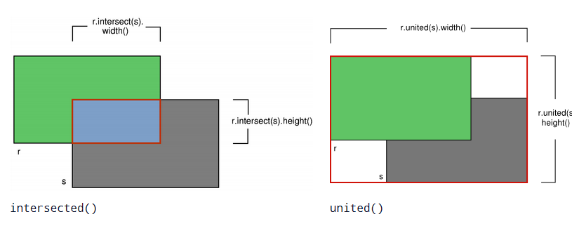
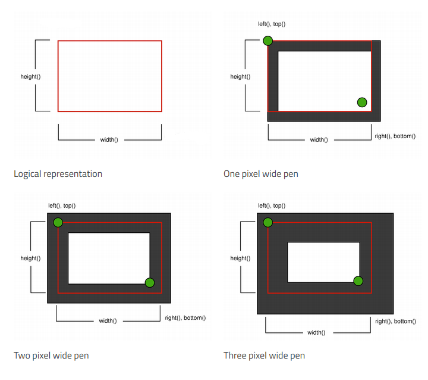
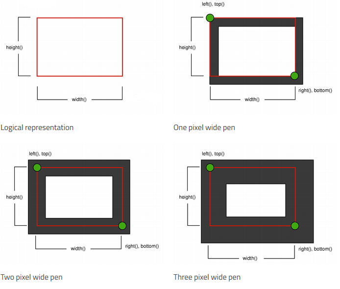
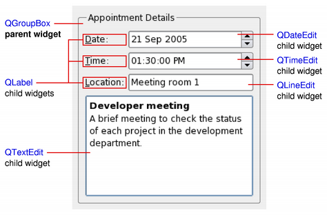
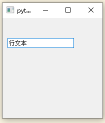

## 1 平面中的向量

我们知道几何图形是由一系列的点组成的。在数学中，一般使用向量表示**点**，即点 $P(x,y)$ 一般写作 $p = (x,y)$，代表点 $P$ 是由原点 $(0, 0)$ 到点 $(x, y)$ 的向量。

### 1.1 平面中的点

[QPoint](https://doc.qt.io/qtforpython/PySide2/QtCore/QPoint.html#qpoint "Permalink to this headline") 与 [QPointF](https://doc.qt.io/qtforpython/PySide2/QtCore/QPointF.html#qpointf "Permalink to this headline") 分别使用整数精度与浮点精度定义平面（plane）中的一个点。

一个点由 x 坐标和 y 坐标指定，可以使用 `x()` 和 `y()` 函数进行访问。如果 x 和 y 都设置为 0，则 `isNull()` 函数返回 `True`（即`QPoint(0, 0)==QPoint()`）。可以使用 `setX()` 和 `setY()` 函数，来设置（或更改）坐标。或者使用 `p.x()` 和 `p.y()` 函数引用坐标直接设定。

```python
QPoint = QtCore.QPoint

p = QPoint()

p.setX(p.x() + 1)
p += QPoint(1, 0)
```

更多的设定有：

```python
QPoint = QtCore.QPoint

p = QPoint()  # 创建一个空点
print(p)

print(p.isNull())  # 该点为空

p.setX(2)  # 设定 x=2
print(p)

p.setY(5)  # 设定 y=5
print(p)

print(p.x(), p.y())  # 获取坐标
```

结果符合预期：

```js
PyQt5.QtCore.QPoint()
True
PyQt5.QtCore.QPoint(2, 0)
PyQt5.QtCore.QPoint(2, 5)
2 5
```

也可以使用如下方式构造点：

```python
p1 = QPoint(20, 30)
print(p1)
p2 = QPointF(20, 30)
print(p2)
p3 = QPointF(p1)
print(p2)
```

结果符合预期：

```js
PyQt5.QtCore.QPoint(20, 30)
PyQt5.QtCore.QPointF(20.0, 30.0)
PyQt5.QtCore.QPointF(20.0, 30.0)
```

`QPoint`/`QPointF` 对象也可以用作向量：加法和减法的定义与向量相同（每个分量对应相加）。`QPoint`/`QPointF` 对象也可以与 `int` 或 `qreal` 相除或相乘。`QPoint`/`QPointF` 类提供了 `manhattanLength()` 函数，该函数提供了廉价的点对象长度的近似值，该长度被解释为矢量长度。最后，`QPoint`/`QPointF` 对象可以进行流传输并进行比较。

```python
p1 = QPoint(20, 30)
print('p1:', p1)
p2 = QPointF(40, 60)
print('p2:', p2)
print('p1+p2:', p1 + p2) # 向量加法
print('p1-p2:', p1 - p2) # 向量减法
# 向量数乘
print('p1 * 5:', p1 * 5)
print('p2 / 4:', p2 / 4)
# 计算向量长度
print('p1:',p1.manhattanLength())
print('p2:',p2.manhattanLength())
```

结果符合预期：

```js
p1: PyQt5.QtCore.QPoint(20, 30)
p2: PyQt5.QtCore.QPointF(40.0, 60.0)
p1+p2: PyQt5.QtCore.QPointF(60.0, 90.0)
p1-p2: PyQt5.QtCore.QPointF(-20.0, -30.0)
p1 * 5: PyQt5.QtCore.QPoint(100, 150)
p2 / 4: PyQt5.QtCore.QPointF(10.0, 15.0)
p1: 50
p2: 100.0
```

另外，`QPointF` 类提供了一个将 `QPoint` 对象转换为 `QPointF` 对象的构造函数，以及一个相应的 `toPoint()` 函数，该函数返回此点的 `QPoint` 副本。

其他的计算：

```python
p1 == p2 # 真值判断
p1 += p2 # 增量赋值
QPointF.dotProduct(p1, p2) # 向量内积
```

### 1.2 平面中的矩形

一个**矩形**通常被表示为 $(x,y,w,h)$ 形式，其中 $(x,y)$ 表示左上角坐标，$w$ 与 $h$ 表示矩形的宽和高。Qt 中使用 [QRect](https://doc.qt.io/qtforpython/PySide2/QtCore/QRect.html#qrect "Permalink to this headline") 和 [QRectF](https://doc.qt.io/qtforpython/PySide2/QtCore/QRectF.html#qrectf "Permalink to this headline") 渲染矩形。

由于历史原因，`QRect` 的 `bottom()` 和 `right()` 函数返回的值与矩形的真实右下角不同。`right()` 函数返回 `left() + width() - 1`, `bottom()` 函数返回 `top() + height() - 1`。`QRect` 不推荐使用 top-left and bottom-right 的坐标系统。


`QRect`/`QRectF` 类提供了一个函数集合，这些函数返回各种矩形坐标，并可以对其进行操作。`QRect`/`QRectF` 还提供了相对于各种坐标移动矩形的功能。此外，还有一个 `moveTo()` 函数可移动矩形，将其左上角保留在给定的坐标处。或者，`translate()` 函数将矩形移动到相对于当前位置的给定偏移位置，然后 `translated()` 函数返回此矩形的转换后副本。

`size()` 函数将矩形的尺寸作为 `QSize` 返回。也可以使用 `width()` 和 `height()` 函数获取尺寸（dimensions）。要操作尺寸，请使用 `setSize()`，`setWidth()` 或`setHeight()` 函数。或者，可以通过应用设置矩形坐标的两个函数之一来更改大小，例如 `setBottom()` 或 `setRight()`。

`contains()` 函数告知给定点是否在矩形内，如果该矩形与给定矩形相交，则 `intersects()` 数返回 **true**。`intersected()` 函数返回相交矩形（即**交集**），以及 `united()` 函数返回包围给定矩形的矩形（即**并集**）：



如果 `left()` > `right()` 或 `top()` > `bottom()`，则 `isEmpty()` 函数返回 **true**。请注意，空白矩形无效：如果 `left()` <= `right()` 和 `top()` <= `bottom()`，则 `isValid()` 函数将返回 **true**。另一方面，空矩形（`isNull() == true`）的宽度和高度均设置为0。空 `QRect` 的定义与 `QRectF` 基本上相同。

#### 1.2.1 渲染

渲染([Rendering](https://doc.qt.io/qtforpython/PySide2/QtCore/QRect.html#rendering "Permalink to this headline")) 使用 anti-aliased painter 时，`QRect`/`QRectF` 的边界线将对称地渲染为数学矩形边界线的两侧。但是，当使用 aliased painter（默认设置）时，其他规则也适用。

然后，当使用一个像素宽的笔进行渲染时，`QRect`/`QRectF` 的边界线将在数学矩形边界线的右侧和下方渲染。使用两像素宽的笔进行渲染时，边界线将在中间被数学矩形分开。只要将笔设置为偶数像素，便会出现这种情况，而使用奇数像素的笔进行渲染时，备用像素将在数学矩形的右侧和下方渲染，就像在一个像素的情况下一样。





#### 1.2.2 [Coordinates](https://doc.qt.io/qtforpython/PySide2/QtCore/QRect.html#coordinates "Permalink to this headline")


可以使用 `adjust()` 函数向该矩形的坐标添加偏移量，以及使用 `adjusted()` 函数根据原始矩形的调整来检索新矩形。如果宽度和高度中的任何一个为负，请使用 `normalized()` 函数（就是说如果自己的 `width()<0`，则交换左右边缘；如果自己的 `height()<0` 则交换上下边缘）检索交换了角的矩形。

另外，QRect 提供了 `getCoords()` 函数，该函数提取矩形的左上角和右下角的位置，以及 `getRect()` 函数，提取矩形的左上角，宽度和高度。 使用 `setCoords()` 和 `setRect()` 函数可以一次性操作矩形的坐标和尺寸。

不带 `ed` 的版本的函数会把计算结果应用到自己身上，而带 `ed` 的版本的函数则不会，而是把计算结果通过返回值给出。

函数|含义
:-|:-
adjust(self, int dx1, int dy1, int dx2, int dy2); adjusted(self, int xp1, int yp1, int xp2, int yp2)|左上角右下角坐标加上相应参数
intersect(self, QRect r); intersected (self, QRect other)|两个矩形取交集(没交集时返回全 0 矩形)
unite(self, QRect r); united(self, QRect r)|两个矩形取并集
translate(self, int dx, int dy); translated(self, QPoint p)|左上角坐标加上相应参数，size 不变；相当于 moveTopLeft

#### 1.2.3 关于 QRect 与 QRectF 的感想

关于官网讨论的历史遗留问题，我的观点是 `QRect` 主要用于处理像素级的图形（比如，图片），而 `QRectF` 则是针对真实的数学概念中的矩形（即二维笛卡尔积）进行处理。这样一来，那个历史遗留问题的设定是正确的。


## 2 QWidget 概述

[QWidget](https://doc.qt.io/qtforpython/PySide2/QtWidgets/QWidget.html#PySide2.QtWidgets.QWidget "Permalink to this definition") 类是所有用户界面对象的基类。小部件（widget，即 `QWidget` 的实例对象）是用户界面的原子：它从窗口系统接收鼠标，键盘和其他事件，并将其自身绘制在屏幕上。每个小部件都是矩形的，并且按 Z-order 排序。小部件会被其父级及其前面的小部件裁剪。

未嵌入到**父组件**（parent widget）中的小部件称为**窗口**（window）。通常，窗口具有框架（frame）和标题栏（title bar），尽管也可以使用适当的**窗口标记**（window flags）来创建没有这种修饰的窗口。在 Qt 中最常见的窗口类型（window types）是 [QMainWindow](https://doc.qt.io/qtforpython/PySide2/QtWidgets/QMainWindow.html#PySide2.QtWidgets.QMainWindow "PySide2.QtWidgets.QMainWindow") 和 [QDialog](https://doc.qt.io/qtforpython/PySide2/QtWidgets/QDialog.html#PySide2.QtWidgets.QDialog "PySide2.QtWidgets.QDialog") 的各种子类。

每个小部件的构造函数都接受一个或两个标准参数，即 `QWidget([parent=None[, f=Qt.WindowFlags()]])`。如果 `parent` 为 `None`（为默认值），则新的小部件将成为一个窗口。如果 `parent` 是另一个小部件，则此小部件将成为 `parent` 内部的子组件。删除 `parent` 时，将删除该新的小部件。`f` 为小部件标志（即 `WindowFlags`），其默认值适用于几乎所有小部件，但是要获取例如没有窗口系统框架的窗口，必须使用特殊标志。标志参数 `f` 通常为 `0`，但可以将其设置为自定义窗口框架（即 `parent` 必须为 `None`）。要自定义 frame，请使用由任何 **window flags**（可查看 [PySide2.QtCore.Qt.WindowType](https://doc.qt.io/qtforpython/PySide2/QtCore/Qt.html#PySide2.QtCore.PySide2.QtCore.Qt.WindowType "Permalink to this definition")）的**按位或**组成的值。标志可由 [QWidget.windowFlags()](https://doc.qt.io/qtforpython/PySide2/QtWidgets/QWidget.html#PySide2.QtWidgets.PySide2.QtWidgets.QWidget.windowFlags "Permalink to this definition") 获取，可由 [setWindowFlags(WindowFlags)](https://doc.qt.io/qtforpython/PySide2/QtWidgets/QWidget.html#PySide2.QtWidgets.PySide2.QtWidgets.QWidget.setWindowFlags "Permalink to this definition") 修改。

<font color=BlueViolet face="华文行楷">如果将子组件添加到已经可见的小部件，则必须显式展示子组件以使其可见。</font>请注意，Qt 的 X11 版本可能无法在所有系统上提供样式标志的所有组合。这是因为 Qt 在 X11 上只能询问窗口管理器，并且窗口管理器可以覆盖应用程序的设置。在 Windows 上，Qt 可以设置所需的任何标志。

`QWidget`有很多成员函数，但是其中一些没有直接被应用。例如，`QWidget` 具有 `font` 属性，但从未使用过它。有许多子类提供了真正的实用的功能，例如 [QLabel](https://doc.qt.io/qtforpython/PySide2/QtWidgets/QLabel.html#PySide2.QtWidgets.QLabel "PySide2.QtWidgets.QLabel")，[QPushButton](https://doc.qt.io/qtforpython/PySide2/QtWidgets/QPushButton.html#PySide2.QtWidgets.QPushButton "PySide2.QtWidgets.QPushButton")，[QListWidget](https://doc.qt.io/qtforpython/PySide2/QtWidgets/QListWidget.html#PySide2.QtWidgets.QListWidget "PySide2.QtWidgets.QListWidget") 和 [QTabWidget](https://doc.qt.io/qtforpython/PySide2/QtWidgets/QTabWidget.html#PySide2.QtWidgets.QTabWidget "PySide2.QtWidgets.QTabWidget")。

### 1.1 顶层窗口与子组件

没有父组件的小部件始终是一个独立的窗口（top-level widget）。对于这些小部件，[setWindowTitle()](https://doc.qt.io/qtforpython/PySide2/QtWidgets/QWidget.html#PySide2.QtWidgets.PySide2.QtWidgets.QWidget.setWindowTitle "PySide2.QtWidgets.PySide2.QtWidgets.QWidget.setWindowTitle") 和 [setWindowIcon()](https://doc.qt.io/qtforpython/PySide2/QtWidgets/QWidget.html#PySide2.QtWidgets.PySide2.QtWidgets.QWidget.setWindowIcon "PySide2.QtWidgets.PySide2.QtWidgets.QWidget.setWindowIcon") 分别设置标题栏和图标。

非窗口小部件（Non-window widgets）是子组件（child widget），显示在其父组件（parent widgets）内。Qt 中的大多数小部件主要用作子组件。例如，可以将按钮显示为顶级窗口，但是大多数人更喜欢将其按钮放置在其他小部件（例如 `QDialog` ）中。



上图显示了 [QGroupBox](https://doc.qt.io/qtforpython/PySide2/QtWidgets/QGroupBox.html#PySide2.QtWidgets.QGroupBox "PySide2.QtWidgets.QGroupBox") 小部件，该小部件用于在 [QGridLayout](https://doc.qt.io/qtforpython/PySide2/QtWidgets/QGridLayout.html#PySide2.QtWidgets.QGridLayout "PySide2.QtWidgets.QGridLayout") 提供的布局中保留各种子组件。[QLabel](https://doc.qt.io/qtforpython/PySide2/QtWidgets/QLabel.html#PySide2.QtWidgets.QLabel "PySide2.QtWidgets.QLabel") 子组件有轮廓以指示其完整大小。

如果要使用 `QWidget` 来容纳子组件，通常需要向父 `QWidget` 添加布局。有关更多信息，请参见 [Layout Management](https://doc.qt.io/qtforpython/overviews/layout.html#layout-management)。

### 1.2 复合组件

当将小部件用作对多个子小部件进行分组的容器时，它称为**复合组件**（composite widget）。可以通过构造具有所需视觉属性的小部件 [QFrame](https://doc.qt.io/qtforpython/PySide2/QtWidgets/QFrame.html#PySide2.QtWidgets.QFrame "PySide2.QtWidgets.QFrame")，向其添加子组件（通常由布局管理）来创建这些小部件。

也可以通过子类化标准小部件（例如 `QWidget` 或 `QFrame`）在子类的构造函数中添加必要的布局和子组件来创建复合组件。Qt 提供的许多示例都使用这种方法。

### 1.3 自定义小部件和绘画

由于 `QWidget` 是 [QPaintDevice](https://doc.qt.io/qtforpython/PySide2/QtGui/QPaintDevice.html#PySide2.QtGui.QPaintDevice "PySide2.QtGui.QPaintDevice") 的子类，因此可以使用其子类来显示自定义内容，该内容是由一系列借助 [QPainter](https://doc.qt.io/qtforpython/PySide2/QtGui/QPainter.html#PySide2.QtGui.QPainter "PySide2.QtGui.QPainter") 类的实例的绘画操作组成。这种方法与 [Graphics View Framework](https://doc.qt.io/qtforpython/overviews/graphicsview.html#graphics-view-framework) 所使用的 canvas-style 方法形成对比，在图形视图框架中，item 由应用程序添加到 scene，并由框架本身进行渲染。

每个小部件都从其 [paintEvent()](https://doc.qt.io/qtforpython/PySide2/QtWidgets/QWidget.html#PySide2.QtWidgets.PySide2.QtWidgets.QWidget.paintEvent "PySide2.QtWidgets.PySide2.QtWidgets.QWidget.paintEvent") 函数内执行所有绘画操作。每当由于外部更改或应用程序要求而需要重新绘制时，都会调用此方法。

[Analog Clock example](https://doc.qt.io/qtforpython/overviews/qtwidgets-widgets-analogclock-example.html#analog-clock-example) 示例展现了一个简单的小部件如何处理绘制事件。

### 1.4 尺寸提示和策略

在实现新的小部件时，重新实现 [sizeHint()](https://doc.qt.io/qtforpython/PySide2/QtWidgets/QWidget.html#PySide2.QtWidgets.PySide2.QtWidgets.QWidget.sizeHint "PySide2.QtWidgets.PySide2.QtWidgets.QWidget.sizeHint") 为小部件提供合理的默认尺寸，并使用 [setSizePolicy()](https://doc.qt.io/qtforpython/PySide2/QtWidgets/QWidget.html#id20 "PySide2.QtWidgets.PySide2.QtWidgets.QWidget.setSizePolicy") 设置正确的尺寸策略，几乎总是有用的。

默认情况下，不提供**尺寸提示**（size hint）的复合组件将根据其子组件的空间需求来调整尺寸。

**尺寸策略**（size policy ）使您可以为布局管理系统提供良好的默认行为，以便其他小部件可以轻松地包含和管理您的小部件。默认的尺寸策略指示尺寸提示代表小部件的首选大小，这对于许多小部件通常足够好。

<table>
<font color=BlueViolet face="华文行楷">注意</font>：
<td bgcolor = #00BF6B><font color = #F7FF50>

顶层小部件的尺寸限制为桌面高度和宽度的 2/3。如果这些边界不足，您可以手动调整窗口小部件的大小。
</td>
</table>

### 1.5 事件

小部件响应由用户操作引起的事件。Qt 通过使用包含有关每个事件信息的 [QEvent](https://doc.qt.io/qtforpython/PySide2/QtCore/QEvent.html#PySide2.QtCore.QEvent "PySide2.QtCore.QEvent") 子类的实例调用特定的事件控制函数来将事件传递给小部件。

如果您的小部件仅包含子组件，则可能不需要实现任何事件处理程序。如果您想在子组件中单击鼠标，请在小部件的 [mousePressEvent()](https://doc.qt.io/qtforpython/PySide2/QtWidgets/QWidget.html#PySide2.QtWidgets.PySide2.QtWidgets.QWidget.mousePressEvent "PySide2.QtWidgets.PySide2.QtWidgets.QWidget.mousePressEvent") 函数中调用子组件的 [underMouse()](https://doc.qt.io/qtforpython/PySide2/QtWidgets/QWidget.html#PySide2.QtWidgets.PySide2.QtWidgets.QWidget.underMouse "PySide2.QtWidgets.PySide2.QtWidgets.QWidget.underMouse") 函数。

[Scribble example](https://doc.qt.io/qtforpython/overviews/qtwidgets-widgets-scribble-example.html#scribble-example) 实现了一系列事件，以处理鼠标移动，按钮按下和窗口大小调整。

您将需要提供自己的小部件的行为和内容，但是这里是与 `QWidget` 相关的事件的简要概述，从最常见的事件开始：

- 每当需要重新绘制小部件时，都会调用 [paintEvent()](https://doc.qt.io/qtforpython/PySide2/QtWidgets/QWidget.html#PySide2.QtWidgets.PySide2.QtWidgets.QWidget.paintEvent "PySide2.QtWidgets.PySide2.QtWidgets.QWidget.paintEvent")。每个显示自定义内容的小部件都必须实现它。使用 `QPainter` 的绘画只能在 `paintEvent()` 或 `paintEvent()` 调用的函数中进行。
- 调整窗口小部件的大小时，将调用 [resizeEvent()](https://doc.qt.io/qtforpython/PySide2/QtWidgets/QWidget.html#PySide2.QtWidgets.PySide2.QtWidgets.QWidget.resizeEvent "PySide2.QtWidgets.PySide2.QtWidgets.QWidget.resizeEvent")。
- 当鼠标光标在小部件内时，或者当窗口小部件使用 [grabMouse()](https://doc.qt.io/qtforpython/PySide2/QtWidgets/QWidget.html#id2 "PySide2.QtWidgets.PySide2.QtWidgets.QWidget.grabMouse") 抓住鼠标时，按下鼠标按钮将调用 [mousePressEvent()](https://doc.qt.io/qtforpython/PySide2/QtWidgets/QWidget.html#PySide2.QtWidgets.PySide2.QtWidgets.QWidget.mousePressEvent "PySide2.QtWidgets.PySide2.QtWidgets.QWidget.mousePressEvent")。在不释放鼠标的情况下按下鼠标，实际上与调用 `grabMouse()` 相同。
- 释放鼠标按钮时，将调用 [mouseReleaseEvent()](https://doc.qt.io/qtforpython/PySide2/QtWidgets/QWidget.html#PySide2.QtWidgets.PySide2.QtWidgets.QWidget.mouseReleaseEvent "PySide2.QtWidgets.PySide2.QtWidgets.QWidget.mouseReleaseEvent")。小部件在收到相应的鼠标按下事件时会收到鼠标释放事件。这意味着，如果用户在小部件内按下鼠标，然后在释放鼠标按钮之前将鼠标拖到其他位置，则小部件会收到释放事件。有一个例外：如果在按住鼠标按钮的同时出现弹出菜单，则该弹出窗口会立即窃取鼠标事件。
- 当用户双击窗口小部件时，将调用 [mouseDoubleClickEvent()](https://doc.qt.io/qtforpython/PySide2/QtWidgets/QWidget.html#PySide2.QtWidgets.PySide2.QtWidgets.QWidget.mouseDoubleClickEvent "PySide2.QtWidgets.PySide2.QtWidgets.QWidget.mouseDoubleClickEvent")。如果用户双击，则小部件会收到一个鼠标按下事件，一个鼠标释放事件，（一个鼠标点击事件），第二次鼠标按下，该事件以及最后一个第二次鼠标释放事件。 （如果在此操作过程中鼠标未保持稳定，则可能还会收到一些鼠标移动事件。）在第二次单击到达之前，无法将单击与双击区分开。 （这就是为什么大多数 GUI 书籍都建议双击是单击的扩展，而不是触发其他操作的原因之一。）

接受键盘输入的小部件需要重新实现一些事件处理程序：

- 每当按下某个键时，就会调用 [keyPressEvent()](https://doc.qt.io/qtforpython/PySide2/QtWidgets/QWidget.html#PySide2.QtWidgets.PySide2.QtWidgets.QWidget.keyPressEvent "PySide2.QtWidgets.PySide2.QtWidgets.QWidget.keyPressEvent")；按住该键的时间足够长时会使其自动重复。 `Tab` 和 `Shift + Tab` 键仅在焦点更改机制未使用时才传递给小部件。要强制这些键由您的小部件处理，必须重新实现 `event()`。
- 当小部件获得键盘焦点时会调用 [focusInEvent()](https://doc.qt.io/qtforpython/PySide2/QtWidgets/QWidget.html#PySide2.QtWidgets.PySide2.QtWidgets.QWidget.focusInEvent "PySide2.QtWidgets.PySide2.QtWidgets.QWidget.focusInEvent") （假设您已调用 [setFocusPolicy()](https://doc.qt.io/qtforpython/PySide2/QtWidgets/QWidget.html#PySide2.QtWidgets.PySide2.QtWidgets.QWidget.setFocusPolicy "PySide2.QtWidgets.PySide2.QtWidgets.QWidget.setFocusPolicy")）。行为良好的小部件表示它们以清晰但谨慎的方式拥有键盘焦点。
- 当小部件失去键盘焦点时，将调用 [focusOutEvent()](https://doc.qt.io/qtforpython/PySide2/QtWidgets/QWidget.html#PySide2.QtWidgets.PySide2.QtWidgets.QWidget.focusOutEvent "PySide2.QtWidgets.PySide2.QtWidgets.QWidget.focusOutEvent")。

您可能还需要重新实现一些不太常见的事件处理程序：

- 只要在按住鼠标按钮的同时移动鼠标，就会调用 [mouseMoveEvent()](https://doc.qt.io/qtforpython/PySide2/QtWidgets/QWidget.html#PySide2.QtWidgets.PySide2.QtWidgets.QWidget.mouseMoveEvent "PySide2.QtWidgets.PySide2.QtWidgets.QWidget.mouseMoveEvent")。这在拖放操作期间很有用。如果调用[setMouseTracking(true)](https://doc.qt.io/qtforpython/PySide2/QtWidgets/QWidget.html#PySide2.QtWidgets.PySide2.QtWidgets.QWidget.setMouseTracking "PySide2.QtWidgets.PySide2.QtWidgets.QWidget.setMouseTracking")，即使没有按下任何按钮，也将获得鼠标移动事件。（另请参见[Drag and Drop](https://doc.qt.io/qtforpython/overviews/graphicsview.html#graphics-view-framework)）
- 每当释放键并按住键时（如果键是自动重复的），都会调用 [keyReleaseEvent()](https://doc.qt.io/qtforpython/PySide2/QtWidgets/QWidget.html#PySide2.QtWidgets.PySide2.QtWidgets.QWidget.keyReleaseEvent "PySide2.QtWidgets.PySide2.QtWidgets.QWidget.keyReleaseEvent")。在这种情况下，小部件每次重复都会收到一对按键释放和按键事件。`Tab` 和 `Shift + Tab` 键仅在焦点更改机制未使用时才传递给小部件。要强制这些键由您的小部件处理，必须重新实现 `event()`。
- 每当用户在小部件具有焦点的情况下转动鼠标滚轮时，就会调用 [wheelEvent()](https://doc.qt.io/qtforpython/PySide2/QtWidgets/QWidget.html#PySide2.QtWidgets.PySide2.QtWidgets.QWidget.wheelEvent "PySide2.QtWidgets.PySide2.QtWidgets.QWidget.wheelEvent")。
- 当鼠标进入小部件的屏幕空间时，将调用 [enterEvent()](https://doc.qt.io/qtforpython/PySide2/QtWidgets/QWidget.html#PySide2.QtWidgets.PySide2.QtWidgets.QWidget.enterEvent "PySide2.QtWidgets.PySide2.QtWidgets.QWidget.enterEvent")。 （这不包括小部件的任何子级拥有的屏幕空间。）
- 当鼠标离开窗口小部件的屏幕空间时，将调用 [leaveEvent()](https://doc.qt.io/qtforpython/PySide2/QtWidgets/QWidget.html#PySide2.QtWidgets.PySide2.QtWidgets.QWidget.leaveEvent "PySide2.QtWidgets.PySide2.QtWidgets.QWidget.leaveEvent")。如果鼠标进入子窗口小部件，则不会导致 `leaveEvent()`。
- 当窗口小部件已相对于其父级移动时，将调用 [`moveEvent()`](https://doc.qt.io/qtforpython/PySide2/QtWidgets/QWidget.html#PySide2.QtWidgets.PySide2.QtWidgets.QWidget.moveEvent "PySide2.QtWidgets.PySide2.QtWidgets.QWidget.moveEvent") 。
- 当用户关闭窗口小部件时（或调用 [close()](https://doc.qt.io/qtforpython/PySide2/QtWidgets/QWidget.html#PySide2.QtWidgets.PySide2.QtWidgets.QWidget.close "PySide2.QtWidgets.PySide2.QtWidgets.QWidget.close") 时），将调用 [closeEvent()](https://doc.qt.io/qtforpython/PySide2/QtWidgets/QWidget.html#PySide2.QtWidgets.PySide2.QtWidgets.QWidget.closeEvent "PySide2.QtWidgets.PySide2.QtWidgets.QWidget.closeEvent")。

`Type` 文档中还描述了一些相当模糊的事件。要处理这些事件，您需要直接重新实现 `event()`。`event()` 的默认实现处理 `Tab` 和 `Shift + Tab`（以移动键盘焦点），并将大多数其他事件传递给上述更专门的处理程序之一。

事件及其传递机制在 [The Event System](https://doc.qt.io/qtforpython/overviews/eventsandfilters.html#the-event-system) 中介绍。

### 1.6 函数和属性组

Context|函数和属性
---|---
Window functions|[`show()`](#PySide2.QtWidgets.PySide2.QtWidgets.QWidget.show "PySide2.QtWidgets.PySide2.QtWidgets.QWidget.show") , [`hide()`](#PySide2.QtWidgets.PySide2.QtWidgets.QWidget.hide "PySide2.QtWidgets.PySide2.QtWidgets.QWidget.hide") , `raise()` , [`lower()`](#PySide2.QtWidgets.PySide2.QtWidgets.QWidget.lower "PySide2.QtWidgets.PySide2.QtWidgets.QWidget.lower") , [`close()`](#PySide2.QtWidgets.PySide2.QtWidgets.QWidget.close "PySide2.QtWidgets.PySide2.QtWidgets.QWidget.close") .
Top-level windows|`windowModified` , [`windowTitle`](#PySide2.QtWidgets.PySide2.QtWidgets.QWidget.windowTitle "PySide2.QtWidgets.PySide2.QtWidgets.QWidget.windowTitle") , [`windowIcon`](#PySide2.QtWidgets.PySide2.QtWidgets.QWidget.windowIcon "PySide2.QtWidgets.PySide2.QtWidgets.QWidget.windowIcon") , [`isActiveWindow`](#PySide2.QtWidgets.PySide2.QtWidgets.QWidget.isActiveWindow "PySide2.QtWidgets.PySide2.QtWidgets.QWidget.isActiveWindow") , [`activateWindow()`](#PySide2.QtWidgets.PySide2.QtWidgets.QWidget.activateWindow "PySide2.QtWidgets.PySide2.QtWidgets.QWidget.activateWindow") , `minimized` , [`showMinimized()`](#PySide2.QtWidgets.PySide2.QtWidgets.QWidget.showMinimized "PySide2.QtWidgets.PySide2.QtWidgets.QWidget.showMinimized") , `maximized` , [`showMaximized()`](#PySide2.QtWidgets.PySide2.QtWidgets.QWidget.showMaximized "PySide2.QtWidgets.PySide2.QtWidgets.QWidget.showMaximized") , `fullScreen` , [`showFullScreen()`](#PySide2.QtWidgets.PySide2.QtWidgets.QWidget.showFullScreen "PySide2.QtWidgets.PySide2.QtWidgets.QWidget.showFullScreen") , [`showNormal()`](#PySide2.QtWidgets.PySide2.QtWidgets.QWidget.showNormal "PySide2.QtWidgets.PySide2.QtWidgets.QWidget.showNormal") .
Window contents|[`update()`](#id23 "PySide2.QtWidgets.PySide2.QtWidgets.QWidget.update") , [`repaint()`](#id7 "PySide2.QtWidgets.PySide2.QtWidgets.QWidget.repaint") , [`scroll()`](#id9 "PySide2.QtWidgets.PySide2.QtWidgets.QWidget.scroll") .
Geometry|[`pos`](#PySide2.QtWidgets.PySide2.QtWidgets.QWidget.pos "PySide2.QtWidgets.PySide2.QtWidgets.QWidget.pos") , [`x()`](#PySide2.QtWidgets.PySide2.QtWidgets.QWidget.x "PySide2.QtWidgets.PySide2.QtWidgets.QWidget.x") , [`y()`](#PySide2.QtWidgets.PySide2.QtWidgets.QWidget.y "PySide2.QtWidgets.PySide2.QtWidgets.QWidget.y") , [`rect`](#PySide2.QtWidgets.PySide2.QtWidgets.QWidget.rect "PySide2.QtWidgets.PySide2.QtWidgets.QWidget.rect") , [`size`](#PySide2.QtWidgets.PySide2.QtWidgets.QWidget.size "PySide2.QtWidgets.PySide2.QtWidgets.QWidget.size") , `width()` , `height()` , [`move()`](#id3 "PySide2.QtWidgets.PySide2.QtWidgets.QWidget.move") , [`resize()`](#id8 "PySide2.QtWidgets.PySide2.QtWidgets.QWidget.resize") , [`sizePolicy`](#PySide2.QtWidgets.PySide2.QtWidgets.QWidget.sizePolicy "PySide2.QtWidgets.PySide2.QtWidgets.QWidget.sizePolicy") , [`sizeHint()`](#PySide2.QtWidgets.PySide2.QtWidgets.QWidget.sizeHint "PySide2.QtWidgets.PySide2.QtWidgets.QWidget.sizeHint") , [`minimumSizeHint()`](#PySide2.QtWidgets.PySide2.QtWidgets.QWidget.minimumSizeHint "PySide2.QtWidgets.PySide2.QtWidgets.QWidget.minimumSizeHint") , [`updateGeometry()`](#PySide2.QtWidgets.PySide2.QtWidgets.QWidget.updateGeometry "PySide2.QtWidgets.PySide2.QtWidgets.QWidget.updateGeometry") , [`layout()`](#PySide2.QtWidgets.PySide2.QtWidgets.QWidget.layout "PySide2.QtWidgets.PySide2.QtWidgets.QWidget.layout") , [`frameGeometry`](#PySide2.QtWidgets.PySide2.QtWidgets.QWidget.frameGeometry "PySide2.QtWidgets.PySide2.QtWidgets.QWidget.frameGeometry") , [`geometry`](#PySide2.QtWidgets.PySide2.QtWidgets.QWidget.geometry "PySide2.QtWidgets.PySide2.QtWidgets.QWidget.geometry") , [`childrenRect`](#PySide2.QtWidgets.PySide2.QtWidgets.QWidget.childrenRect "PySide2.QtWidgets.PySide2.QtWidgets.QWidget.childrenRect") , [`childrenRegion`](#PySide2.QtWidgets.PySide2.QtWidgets.QWidget.childrenRegion "PySide2.QtWidgets.PySide2.QtWidgets.QWidget.childrenRegion") , [`adjustSize()`](#PySide2.QtWidgets.PySide2.QtWidgets.QWidget.adjustSize "PySide2.QtWidgets.PySide2.QtWidgets.QWidget.adjustSize") , [`mapFromGlobal()`](#PySide2.QtWidgets.PySide2.QtWidgets.QWidget.mapFromGlobal "PySide2.QtWidgets.PySide2.QtWidgets.QWidget.mapFromGlobal") , [`mapToGlobal()`](#PySide2.QtWidgets.PySide2.QtWidgets.QWidget.mapToGlobal "PySide2.QtWidgets.PySide2.QtWidgets.QWidget.mapToGlobal") , [`mapFromParent()`](#PySide2.QtWidgets.PySide2.QtWidgets.QWidget.mapFromParent "PySide2.QtWidgets.PySide2.QtWidgets.QWidget.mapFromParent") , [`mapToParent()`](#PySide2.QtWidgets.PySide2.QtWidgets.QWidget.mapToParent "PySide2.QtWidgets.PySide2.QtWidgets.QWidget.mapToParent") , [`maximumSize`](#PySide2.QtWidgets.PySide2.QtWidgets.QWidget.maximumSize "PySide2.QtWidgets.PySide2.QtWidgets.QWidget.maximumSize") , [`minimumSize`](#PySide2.QtWidgets.PySide2.QtWidgets.QWidget.minimumSize "PySide2.QtWidgets.PySide2.QtWidgets.QWidget.minimumSize") , [`sizeIncrement`](#PySide2.QtWidgets.PySide2.QtWidgets.QWidget.sizeIncrement "PySide2.QtWidgets.PySide2.QtWidgets.QWidget.sizeIncrement") , [`baseSize`](#PySide2.QtWidgets.PySide2.QtWidgets.QWidget.baseSize "PySide2.QtWidgets.PySide2.QtWidgets.QWidget.baseSize") , [`setFixedSize()`](#id12 "PySide2.QtWidgets.PySide2.QtWidgets.QWidget.setFixedSize")
Mode|`visible` , [`isVisibleTo()`](#PySide2.QtWidgets.PySide2.QtWidgets.QWidget.isVisibleTo "PySide2.QtWidgets.PySide2.QtWidgets.QWidget.isVisibleTo") , `enabled` , [`isEnabledTo()`](#PySide2.QtWidgets.PySide2.QtWidgets.QWidget.isEnabledTo "PySide2.QtWidgets.PySide2.QtWidgets.QWidget.isEnabledTo") , `modal` , [`isWindow()`](#PySide2.QtWidgets.PySide2.QtWidgets.QWidget.isWindow "PySide2.QtWidgets.PySide2.QtWidgets.QWidget.isWindow") , `mouseTracking` , [`updatesEnabled`](#PySide2.QtWidgets.PySide2.QtWidgets.QWidget.updatesEnabled "PySide2.QtWidgets.PySide2.QtWidgets.QWidget.updatesEnabled") , [`visibleRegion()`](#PySide2.QtWidgets.PySide2.QtWidgets.QWidget.visibleRegion "PySide2.QtWidgets.PySide2.QtWidgets.QWidget.visibleRegion") .
Look and feel|[`style()`](#PySide2.QtWidgets.PySide2.QtWidgets.QWidget.style "PySide2.QtWidgets.PySide2.QtWidgets.QWidget.style") , [`setStyle()`](#PySide2.QtWidgets.PySide2.QtWidgets.QWidget.setStyle "PySide2.QtWidgets.PySide2.QtWidgets.QWidget.setStyle") , [styleSheet](../../overviews/stylesheet.html#qt-style-sheets) , [`cursor`](#PySide2.QtWidgets.PySide2.QtWidgets.QWidget.cursor "PySide2.QtWidgets.PySide2.QtWidgets.QWidget.cursor") , [font](../../overviews/stylesheet-reference.html#qt-style-sheets-reference) , [`palette`](#PySide2.QtWidgets.PySide2.QtWidgets.QWidget.palette "PySide2.QtWidgets.PySide2.QtWidgets.QWidget.palette") , [`backgroundRole()`](#PySide2.QtWidgets.PySide2.QtWidgets.QWidget.backgroundRole "PySide2.QtWidgets.PySide2.QtWidgets.QWidget.backgroundRole") , [`setBackgroundRole()`](#PySide2.QtWidgets.PySide2.QtWidgets.QWidget.setBackgroundRole "PySide2.QtWidgets.PySide2.QtWidgets.QWidget.setBackgroundRole") , [`fontInfo()`](#PySide2.QtWidgets.PySide2.QtWidgets.QWidget.fontInfo "PySide2.QtWidgets.PySide2.QtWidgets.QWidget.fontInfo") , [`fontMetrics()`](#PySide2.QtWidgets.PySide2.QtWidgets.QWidget.fontMetrics "PySide2.QtWidgets.PySide2.QtWidgets.QWidget.fontMetrics") .
Keyboard focus functions|`focus` , [`focusPolicy`](#PySide2.QtWidgets.PySide2.QtWidgets.QWidget.focusPolicy "PySide2.QtWidgets.PySide2.QtWidgets.QWidget.focusPolicy") , [`setFocus()`](#id13 "PySide2.QtWidgets.PySide2.QtWidgets.QWidget.setFocus") , [`clearFocus()`](#PySide2.QtWidgets.PySide2.QtWidgets.QWidget.clearFocus "PySide2.QtWidgets.PySide2.QtWidgets.QWidget.clearFocus") , [`setTabOrder()`](#PySide2.QtWidgets.PySide2.QtWidgets.QWidget.setTabOrder "PySide2.QtWidgets.PySide2.QtWidgets.QWidget.setTabOrder") , [`setFocusProxy()`](#PySide2.QtWidgets.PySide2.QtWidgets.QWidget.setFocusProxy "PySide2.QtWidgets.PySide2.QtWidgets.QWidget.setFocusProxy") , [`focusNextChild()`](#PySide2.QtWidgets.PySide2.QtWidgets.QWidget.focusNextChild "PySide2.QtWidgets.PySide2.QtWidgets.QWidget.focusNextChild") , [`focusPreviousChild()`](#PySide2.QtWidgets.PySide2.QtWidgets.QWidget.focusPreviousChild "PySide2.QtWidgets.PySide2.QtWidgets.QWidget.focusPreviousChild") .
Mouse and keyboard grabbing|[`grabMouse()`](#id2 "PySide2.QtWidgets.PySide2.QtWidgets.QWidget.grabMouse") , [`releaseMouse()`](#PySide2.QtWidgets.PySide2.QtWidgets.QWidget.releaseMouse "PySide2.QtWidgets.PySide2.QtWidgets.QWidget.releaseMouse") , [`grabKeyboard()`](#PySide2.QtWidgets.PySide2.QtWidgets.QWidget.grabKeyboard "PySide2.QtWidgets.PySide2.QtWidgets.QWidget.grabKeyboard") , [`releaseKeyboard()`](#PySide2.QtWidgets.PySide2.QtWidgets.QWidget.releaseKeyboard "PySide2.QtWidgets.PySide2.QtWidgets.QWidget.releaseKeyboard") , [`mouseGrabber()`](#PySide2.QtWidgets.PySide2.QtWidgets.QWidget.mouseGrabber "PySide2.QtWidgets.PySide2.QtWidgets.QWidget.mouseGrabber") , [`keyboardGrabber()`](#PySide2.QtWidgets.PySide2.QtWidgets.QWidget.keyboardGrabber "PySide2.QtWidgets.PySide2.QtWidgets.QWidget.keyboardGrabber") .
Event handlers|`event()` , [`mousePressEvent()`](#PySide2.QtWidgets.PySide2.QtWidgets.QWidget.mousePressEvent "PySide2.QtWidgets.PySide2.QtWidgets.QWidget.mousePressEvent") , [`mouseReleaseEvent()`](#PySide2.QtWidgets.PySide2.QtWidgets.QWidget.mouseReleaseEvent "PySide2.QtWidgets.PySide2.QtWidgets.QWidget.mouseReleaseEvent") , [`mouseDoubleClickEvent()`](#PySide2.QtWidgets.PySide2.QtWidgets.QWidget.mouseDoubleClickEvent "PySide2.QtWidgets.PySide2.QtWidgets.QWidget.mouseDoubleClickEvent") , [`mouseMoveEvent()`](#PySide2.QtWidgets.PySide2.QtWidgets.QWidget.mouseMoveEvent "PySide2.QtWidgets.PySide2.QtWidgets.QWidget.mouseMoveEvent") , [`keyPressEvent()`](#PySide2.QtWidgets.PySide2.QtWidgets.QWidget.keyPressEvent "PySide2.QtWidgets.PySide2.QtWidgets.QWidget.keyPressEvent") , [`keyReleaseEvent()`](#PySide2.QtWidgets.PySide2.QtWidgets.QWidget.keyReleaseEvent "PySide2.QtWidgets.PySide2.QtWidgets.QWidget.keyReleaseEvent") , [`focusInEvent()`](#PySide2.QtWidgets.PySide2.QtWidgets.QWidget.focusInEvent "PySide2.QtWidgets.PySide2.QtWidgets.QWidget.focusInEvent") , [`focusOutEvent()`](#PySide2.QtWidgets.PySide2.QtWidgets.QWidget.focusOutEvent "PySide2.QtWidgets.PySide2.QtWidgets.QWidget.focusOutEvent") , [`wheelEvent()`](#PySide2.QtWidgets.PySide2.QtWidgets.QWidget.wheelEvent "PySide2.QtWidgets.PySide2.QtWidgets.QWidget.wheelEvent") , [`enterEvent()`](#PySide2.QtWidgets.PySide2.QtWidgets.QWidget.enterEvent "PySide2.QtWidgets.PySide2.QtWidgets.QWidget.enterEvent") , [`leaveEvent()`](#PySide2.QtWidgets.PySide2.QtWidgets.QWidget.leaveEvent "PySide2.QtWidgets.PySide2.QtWidgets.QWidget.leaveEvent") , [`paintEvent()`](#PySide2.QtWidgets.PySide2.QtWidgets.QWidget.paintEvent "PySide2.QtWidgets.PySide2.QtWidgets.QWidget.paintEvent") , [`moveEvent()`](#PySide2.QtWidgets.PySide2.QtWidgets.QWidget.moveEvent "PySide2.QtWidgets.PySide2.QtWidgets.QWidget.moveEvent") , [`resizeEvent()`](#PySide2.QtWidgets.PySide2.QtWidgets.QWidget.resizeEvent "PySide2.QtWidgets.PySide2.QtWidgets.QWidget.resizeEvent") , [`closeEvent()`](#PySide2.QtWidgets.PySide2.QtWidgets.QWidget.closeEvent "PySide2.QtWidgets.PySide2.QtWidgets.QWidget.closeEvent") , [`dragEnterEvent()`](#PySide2.QtWidgets.PySide2.QtWidgets.QWidget.dragEnterEvent "PySide2.QtWidgets.PySide2.QtWidgets.QWidget.dragEnterEvent") , [`dragMoveEvent()`](#PySide2.QtWidgets.PySide2.QtWidgets.QWidget.dragMoveEvent "PySide2.QtWidgets.PySide2.QtWidgets.QWidget.dragMoveEvent") , [`dragLeaveEvent()`](#PySide2.QtWidgets.PySide2.QtWidgets.QWidget.dragLeaveEvent "PySide2.QtWidgets.PySide2.QtWidgets.QWidget.dragLeaveEvent") , [`dropEvent()`](#PySide2.QtWidgets.PySide2.QtWidgets.QWidget.dropEvent "PySide2.QtWidgets.PySide2.QtWidgets.QWidget.dropEvent") , `childEvent()` , [`showEvent()`](#PySide2.QtWidgets.PySide2.QtWidgets.QWidget.showEvent "PySide2.QtWidgets.PySide2.QtWidgets.QWidget.showEvent") , [`hideEvent()`](#PySide2.QtWidgets.PySide2.QtWidgets.QWidget.hideEvent "PySide2.QtWidgets.PySide2.QtWidgets.QWidget.hideEvent") , `customEvent()` . [`changeEvent()`](#PySide2.QtWidgets.PySide2.QtWidgets.QWidget.changeEvent "PySide2.QtWidgets.PySide2.QtWidgets.QWidget.changeEvent") ,
System functions|[`parentWidget()`](#PySide2.QtWidgets.PySide2.QtWidgets.QWidget.parentWidget "PySide2.QtWidgets.PySide2.QtWidgets.QWidget.parentWidget") , [`window()`](#PySide2.QtWidgets.PySide2.QtWidgets.QWidget.window "PySide2.QtWidgets.PySide2.QtWidgets.QWidget.window") , [`setParent()`](#id18 "PySide2.QtWidgets.PySide2.QtWidgets.QWidget.setParent") , [`winId()`](#PySide2.QtWidgets.PySide2.QtWidgets.QWidget.winId "PySide2.QtWidgets.PySide2.QtWidgets.QWidget.winId") , [`find()`](#PySide2.QtWidgets.PySide2.QtWidgets.QWidget.find "PySide2.QtWidgets.PySide2.QtWidgets.QWidget.find") , `metric()` .
Context menu|[`contextMenuPolicy`](#PySide2.QtWidgets.PySide2.QtWidgets.QWidget.contextMenuPolicy "PySide2.QtWidgets.PySide2.QtWidgets.QWidget.contextMenuPolicy") , [`contextMenuEvent()`](#PySide2.QtWidgets.PySide2.QtWidgets.QWidget.contextMenuEvent "PySide2.QtWidgets.PySide2.QtWidgets.QWidget.contextMenuEvent") , [`customContextMenuRequested()`](#PySide2.QtWidgets.PySide2.QtWidgets.QWidget.customContextMenuRequested "PySide2.QtWidgets.PySide2.QtWidgets.QWidget.customContextMenuRequested") , [`actions()`](#PySide2.QtWidgets.PySide2.QtWidgets.QWidget.actions "PySide2.QtWidgets.PySide2.QtWidgets.QWidget.actions")
Interactive help|[`setToolTip()`](#PySide2.QtWidgets.PySide2.QtWidgets.QWidget.setToolTip "PySide2.QtWidgets.PySide2.QtWidgets.QWidget.setToolTip") , [`setWhatsThis()`](#PySide2.QtWidgets.PySide2.QtWidgets.QWidget.setWhatsThis "PySide2.QtWidgets.PySide2.QtWidgets.QWidget.setWhatsThis")

### 1.7 小部件样式表

除了每个平台的标准小部件样式外，还可以根据 [style sheet](https://doc.qt.io/qtforpython/overviews/stylesheet.html#qt-style-sheets) 中指定的规则来设置小部件的样式。此功能使您可以自定义特定小部件的外观，以向用户提供有关其用途的视觉提示。例如，可以特定方式设置按钮样式，以指示其执行了破坏性操作。

[Qt Style Sheets](https://doc.qt.io/qtforpython/overviews/stylesheet.html#qt-style-sheets) 文档中更详细地描述了小部件样式表的使用。

### 1.8 透明度和双缓冲

从 Qt 4.0 开始，`QWidget` 自动对其绘画进行双缓冲，因此无需在 `paintEvent()` 中编写双缓冲代码来避免闪烁（flicker）。

从 Qt 4.1 开始，不推荐使用 `WA_ContentsPropagated` 小部件属性。而是默认情况下，只要未设置 `WA_PaintOnScreen`，父组件的内容就会传播到它们的每个子组件。可以编写自定义小部件以利用此功能，方法是更新不规则区域（以创建非矩形子窗口小部件），或者使用少于完整 alpha 分量的颜色进行绘画。下图显示了如何微调自定义窗口小部件的属性和属性以实现不同的效果。


在上图中，构造了一个删除区域的半透明矩形子小部件并将其添加到父组件（显示像素图的 `QLabel`）。然后，设置不同的属性和小部件属性以实现不同的效果：

- 左侧小部件未设置其他属性或小部件属性。此默认状态适合大多数使用透明度的自定义窗口小部件，它们的形状不规则，或者不使用不透明的笔刷在其整个区域上绘制。
- 中心小部件具有 [autoFillBackground](https://doc.qt.io/qtforpython/PySide2/QtWidgets/QWidget.html#PySide2.QtWidgets.PySide2.QtWidgets.QWidget.autoFillBackground "PySide2.QtWidgets.PySide2.QtWidgets.QWidget.autoFillBackground") 属性集。此属性与依赖于小部件提供默认背景的自定义小部件一起使用，并且不使用不透明的笔刷在其整个区域上绘制。
- 右侧小部件具有 `WA_OpaquePaintEvent` 小部件属性集。这表示该小部件将使用不透明的颜色在其整个区域上绘画。小部件的区域最初将是未初始化的，在图中以红色斜线网格图案表示，该图案在覆盖区域上发光。  `Qt::WA_OpaquePaintArea` 属性对于需要快速绘制自己专用内容且不需要默认填充背景的小部件很有用。

要使用简单的背景颜色快速更新自定义小部件，例如实时绘图或图形化小部件，最好定义合适的背景颜色（将 [setBackgroundRole()](https://doc.qt.io/qtforpython/PySide2/QtWidgets/QWidget.html#PySide2.QtWidgets.PySide2.QtWidgets.QWidget.setBackgroundRole "PySide2.QtWidgets.PySide2.QtWidgets.QWidget.setBackgroundRole") 与 **Window role** 一起使用），设置 [autoFillBackground](https://doc.qt.io/qtforpython/PySide2/QtWidgets/QWidget.html#PySide2.QtWidgets.PySide2.QtWidgets.QWidget.autoFillBackground "PySide2.QtWidgets.PySide2.QtWidgets.QWidget.autoFillBackground") 属性，并仅实现必要的小部件的 `paintEvent()` 中的绘画功能。

要快速更新不断用不透明内容在其整个区域上绘制的自定义小部件，例如视频流小部件，最好设置小部件的 `WA_OpaquePaintEvent`，避免与重新绘制小部件的背景有关的任何不必要的开销。

如果小部件同时设置了 `WA_OpaquePaintEvent` 小部件属性和 `autoFillBackground` 属性，则 `WA_OpaquePaintEvent` 属性优先。根据您的要求，您应该选择其中之一。

从 Qt 4.1 开始，父组件的内容也传播到标准 Qt 小部件。如果父组件以非标准方式进行装饰，则可能导致某些意外结果，如下图所示。


自定义标准 Qt 小部件的绘画行为的范围（不求助于子类）比自定义小部件的范围小。通常，可以通过设置标准小部件的 `autoFillBackground` 属性来获得所需的外观。

### 1.9 创建半透明窗口

从 Qt 4.5 开始，就可以在支持合成的窗口系统上创建具有半透明区域的窗口。

要在顶级窗口中启用此功能，请使用 [setAttribute()](https://doc.qt.io/qtforpython/PySide2/QtWidgets/QWidget.html#PySide2.QtWidgets.PySide2.QtWidgets.QWidget.setAttribute "PySide2.QtWidgets.PySide2.QtWidgets.QWidget.setAttribute") 设置其 `WA_TranslucentBackground` 属性，并确保其背景在要部分透明的区域中以不透明的颜色绘制。

平台说明：

- X11：此功能依赖于使用支持 ARGB 视觉效果的 X 服务器和合成窗口管理器。
- Windows：小部件需要设置 `FramelessWindowHint` 窗口标志才能使半透明起作用。

### 1.10 本地小部件与外来小部件

在 Qt 4.4 中引入的外来小部件（alien widgets）是窗口系统未知的小部件。它们没有与之关联的本机窗口句柄（native window handle）。此功能大大加快了小部件绘制，调整大小并消除闪烁的速度。

如果您需要本机窗口的旧行为，则可以选择以下选项之一：

1. 在您的环境中使用 `QT_USE_NATIVE_WINDOWS=1`。
2. 在您的应用程序上设置 `AA_NativeWindows` 属性。所有小部件都是本机小部件。
3. 在小部件上设置 `WA_NativeWindow` 属性：小部件本身及其所有祖先将变为本机（除非设置了 `WA_DontCreateNativeAncestors`）。
4. 调用 [winId](https://doc.qt.io/qtforpython/PySide2/QtWidgets/QWidget.html#PySide2.QtWidgets.PySide2.QtWidgets.QWidget.winId "PySide2.QtWidgets.PySide2.QtWidgets.QWidget.winId") 强制执行本机窗口（这意味着3）。
5. 设置 `WA_PaintOnScreen` 属性以强制执行本机窗口（这意味着3）。


## 3 创建简单窗口

## 4 单行文本编辑器 QLineEdit

[QLineEdit](https://doc.qt.io/qtforpython/PySide2/QtWidgets/QLineEdit.html#qlineedit "Permalink to this headline") 小部件是单行文本编辑器。它允许用户输入和编辑一行纯文本，其中包含有用的编辑功能集合，包括撤消和重做，剪切和粘贴以及拖放（请参阅 [setDragEnabled()](https://doc.qt.io/qtforpython/PySide2/QtWidgets/QLineEdit.html#PySide2.QtWidgets.PySide2.QtWidgets.QLineEdit.setDragEnabled "PySide2.QtWidgets.PySide2.QtWidgets.QLineEdit.setDragEnabled")）。通过更改行编辑的 [echoMode()](https://doc.qt.io/qtforpython/PySide2/QtWidgets/QLineEdit.html#PySide2.QtWidgets.PySide2.QtWidgets.QLineEdit.echoMode "PySide2.QtWidgets.PySide2.QtWidgets.QLineEdit.echoMode")，它也可以用作“只写”字段，用于输入密码等。

文本的长度可以限制为 [maxLength()](https://doc.qt.io/qtforpython/PySide2/QtWidgets/QLineEdit.html#PySide2.QtWidgets.PySide2.QtWidgets.QLineEdit.maxLength "PySide2.QtWidgets.PySide2.QtWidgets.QLineEdit.maxLength")。可以使用 [validator()](https://doc.qt.io/qtforpython/PySide2/QtWidgets/QLineEdit.html#PySide2.QtWidgets.PySide2.QtWidgets.QLineEdit.validator "PySide2.QtWidgets.PySide2.QtWidgets.QLineEdit.validator") 或 [inputMask()](https://doc.qt.io/qtforpython/PySide2/QtWidgets/QLineEdit.html#PySide2.QtWidgets.PySide2.QtWidgets.QLineEdit.inputMask "PySide2.QtWidgets.PySide2.QtWidgets.QLineEdit.inputMask") 或两者任意约束文本。在同一行编辑器的验证器和输入掩码之间切换时，最好清除验证器或输入掩码，以防止发生未定义的行为。

一个相关的类是 [QTextEdit](https://doc.qt.io/qtforpython/PySide2/QtWidgets/QTextEdit.html#PySide2.QtWidgets.QTextEdit "PySide2.QtWidgets.QTextEdit")，它允许多行富文本编辑。

您可以使用 [setText()](https://doc.qt.io/qtforpython/PySide2/QtWidgets/QLineEdit.html#PySide2.QtWidgets.PySide2.QtWidgets.QLineEdit.setText "PySide2.QtWidgets.PySide2.QtWidgets.QLineEdit.setText") 或 [insert()](https://doc.qt.io/qtforpython/PySide2/QtWidgets/QLineEdit.html#PySide2.QtWidgets.PySide2.QtWidgets.QLineEdit.insert "PySide2.QtWidgets.PySide2.QtWidgets.QLineEdit.insert") 更改文本。使用 [text()](https://doc.qt.io/qtforpython/PySide2/QtWidgets/QLineEdit.html#PySide2.QtWidgets.PySide2.QtWidgets.QLineEdit.text "PySide2.QtWidgets.PySide2.QtWidgets.QLineEdit.text") 检索文本；使用 [displayText()](https://doc.qt.io/qtforpython/PySide2/QtWidgets/QLineEdit.html#PySide2.QtWidgets.PySide2.QtWidgets.QLineEdit.displayText "PySide2.QtWidgets.PySide2.QtWidgets.QLineEdit.displayText") 检索显示的文本（可能有所不同，请参见 `EchoMode`）。可以使用 [setSelection()](https://doc.qt.io/qtforpython/PySide2/QtWidgets/QLineEdit.html#PySide2.QtWidgets.PySide2.QtWidgets.QLineEdit.setSelection "PySide2.QtWidgets.PySide2.QtWidgets.QLineEdit.setSelection")  或 [selectAll()](https://doc.qt.io/qtforpython/PySide2/QtWidgets/QLineEdit.html#PySide2.QtWidgets.PySide2.QtWidgets.QLineEdit.selectAll "PySide2.QtWidgets.PySide2.QtWidgets.QLineEdit.selectAll") 选择文本，选择内容可以为 [cut()](https://doc.qt.io/qtforpython/PySide2/QtWidgets/QLineEdit.html#PySide2.QtWidgets.PySide2.QtWidgets.QLineEdit.cut "PySide2.QtWidgets.PySide2.QtWidgets.QLineEdit.cut")，[copy()](https://doc.qt.io/qtforpython/PySide2/QtWidgets/QLineEdit.html#PySide2.QtWidgets.PySide2.QtWidgets.QLineEdit.copy "PySide2.QtWidgets.PySide2.QtWidgets.QLineEdit.copy") 和 [paste()](https://doc.qt.io/qtforpython/PySide2/QtWidgets/QLineEdit.html#PySide2.QtWidgets.PySide2.QtWidgets.QLineEdit.paste "PySide2.QtWidgets.PySide2.QtWidgets.QLineEdit.paste")。文本可以设定 [setAlignment()](https://doc.qt.io/qtforpython/PySide2/QtWidgets/QLineEdit.html#PySide2.QtWidgets.PySide2.QtWidgets.QLineEdit.setAlignment "PySide2.QtWidgets.PySide2.QtWidgets.QLineEdit.setAlignment") 对齐。

当文本更改时，将发出  [textChanged()](https://doc.qt.io/qtforpython/PySide2/QtWidgets/QLineEdit.html#PySide2.QtWidgets.PySide2.QtWidgets.QLineEdit.textChanged "PySide2.QtWidgets.PySide2.QtWidgets.QLineEdit.textChanged") 信号；当文本不是通过调用 `setText()` 进行更改时，将发出 [textEdited()](https://doc.qt.io/qtforpython/PySide2/QtWidgets/QLineEdit.html#PySide2.QtWidgets.PySide2.QtWidgets.QLineEdit.textEdited "PySide2.QtWidgets.PySide2.QtWidgets.QLineEdit.textEdited") 信号；当光标移动时，会发出 [cursorPositionChanged()](https://doc.qt.io/qtforpython/PySide2/QtWidgets/QLineEdit.html#PySide2.QtWidgets.PySide2.QtWidgets.QLineEdit.cursorPositionChanged "PySide2.QtWidgets.PySide2.QtWidgets.QLineEdit.cursorPositionChanged") 信号；当按下 `Return` 或 `Enter` 键时，将返回 [returnPressed()](https://doc.qt.io/qtforpython/PySide2/QtWidgets/QLineEdit.html#PySide2.QtWidgets.PySide2.QtWidgets.QLineEdit.returnPressed "PySide2.QtWidgets.PySide2.QtWidgets.QLineEdit.returnPressed") 信号。

编辑完成后，由于行编辑失去焦点或按下了 `Return`/`Enter` 键，都会发出 [editingFinished()](https://doc.qt.io/qtforpython/PySide2/QtWidgets/QLineEdit.html#PySide2.QtWidgets.PySide2.QtWidgets.QLineEdit.editingFinished "PySide2.QtWidgets.PySide2.QtWidgets.QLineEdit.editingFinished") 信号。

请注意，如果在行编辑中设置了验证器，则仅当验证器返回 `Acceptable` 时，才会发出 [returnPressed()](https://doc.qt.io/qtforpython/PySide2/QtWidgets/QLineEdit.html#PySide2.QtWidgets.PySide2.QtWidgets.QLineEdit.returnPressed "PySide2.QtWidgets.PySide2.QtWidgets.QLineEdit.returnPressed") / [editingFinished()](https://doc.qt.io/qtforpython/PySide2/QtWidgets/QLineEdit.html#PySide2.QtWidgets.PySide2.QtWidgets.QLineEdit.editingFinished "PySide2.QtWidgets.PySide2.QtWidgets.QLineEdit.editingFinished") 信号。

默认情况下，`QLineEdit` 具有由平台样式指南指定的框架。您可以通过调用 [setFrame(false)](https://doc.qt.io/qtforpython/PySide2/QtWidgets/QLineEdit.html#PySide2.QtWidgets.PySide2.QtWidgets.QLineEdit.setFrame "PySide2.QtWidgets.PySide2.QtWidgets.QLineEdit.setFrame") 将其关闭。

下表列出常用的快捷键：

Keypress|Action
---|---
Left Arrow|Moves the cursor one character to the left.
Shift+Left Arrow|Moves and selects text one character to the left.
Right Arrow|Moves the cursor one character to the right.
Shift+Right Arrow|Moves and selects text one character to the right.
Home|Moves the cursor to the beginning of the line.
End|Moves the cursor to the end of the line.
Backspace|Deletes the character to the left of the cursor.
Ctrl+Backspace|Deletes the word to the left of the cursor.
Delete|Deletes the character to the right of the cursor.
Ctrl+Delete|Deletes the word to the right of the cursor.
Ctrl+A|Select all.
Ctrl+C|Copies the selected text to the clipboard.
Ctrl+Insert|Copies the selected text to the clipboard.
Ctrl+K|Deletes to the end of the line.
Ctrl+V|Pastes the clipboard text into line edit.
Shift+Insert|Pastes the clipboard text into line edit.
Ctrl+X|Deletes the selected text and copies it to the clipboard.
Shift+Delete|Deletes the selected text and copies it to the clipboard.
Ctrl+Z|Undoes the last operation.
Ctrl+Y|Redoes the last undone operation.

```python
from xinet import QtWidgets, QtCore, QtGui
from xinet.run_qt import run

QLineEdit = QtWidgets.QLineEdit


class Window(QtWidgets.QWidget):
    def __init__(self):
        super().__init__()
        self.resize(200, 200)
        self.line_text = QtWidgets.QLineEdit('行文本', self)
        self.line_text.move(10, 40)


if __name__ == "__main__":
    run(Window)
```

效果图：



## 6 创建组件的框架 QFrame

## 7 QLabel 展示文本或图像