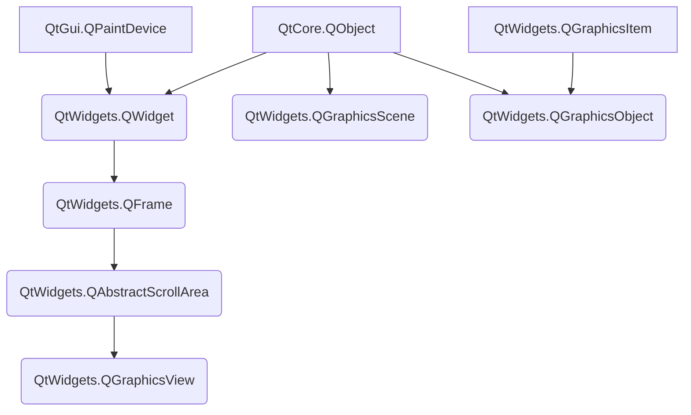

# Graphics View Framework

交互式 2D 图形的 Graphics View 框架概述。自 Qt4.2 中引入了 Graphics View，以取代其前身 QCanvas。Graphics View 提供了一个用于管理和交互大量的可定制的 2D 图形项与用于可视化这些项的 View 小部件的 surface，并提供缩放（zooming）和旋转（rotation）功能支持。

该框架包括事件传播体系结构（an event propagation architecture），该体系结构允许对场景中的项目进行精确的双精度交互功能。 图元可以被如下操作处理：按键事件，鼠标按下，移动，释放和双击事件，它们还可以跟踪鼠标的移动。

Graphics View 使用 BSP（二进制空间分区）树提供了非常快速的图元发现功能，因此，它可以实时可视化大型场景，甚至包含数百万个图元。

## The Graphics View Architecture

Graphics View 提供了一种基于项目（item-based）的方法来进行模型视图编程（model-view programming），非常类似于 InterView 的便利类 QTableView，QTreeView 和 QListView。多个视图可以观察单个场景，并且该场景包含各种几何形状的项目。

## 1 The Scene

[`QGraphicsScene`](https://doc.qt.io/qtforpython/PySide2/QtWidgets/QGraphicsScene.html#PySide2.QtWidgets.QGraphicsScene "PySide2.QtWidgets.QGraphicsScene") 提供了 Graphics View 场景。场景具有如下功能：

* 提供用于管理大量项目的快速界面
* 将事件传播到每个项目 
* 管理项目状态，例如选择和焦点处理
* 提供未被转换的渲染功能；主要用于印刷

场景用作 QGraphicsItem 对象的容器。它与 QGraphicsView 一起用于可视化 2D 曲面上（2D surface）的图形项目，例如线条，矩形，文本，甚至是自定义项目。通过调用 `addItem()` 将项目添加到场景中，然后通过调用许多项目查找功能之一来检索项目。`items()` 及其重载返回由点，矩形，多边形或通用矢量路径包含或相交的所有项目。`itemAt()` 返回特定点的最外层项目（topmost item）。所有项目查找功能均以降序堆叠的方式返回项目（即，第一个返回的项目是最顶部，而最后一个项目是最底部）。

请注意，QGraphicsScene 没有自己的视觉外观。它只管理图元项目。您需要创建一个 QGraphicsView 小部件以可视化场景。

比如：

```python
from xinet import QtWidgets, QtGui, QtCore
from xinet.run_qt import run


class MainWindow(QtWidgets.QWidget):
    def __init__(self, *args, **kwargs):
        super().__init__(*args, **kwargs)
        self.resize(500, 400)
        scene = QtWidgets.QGraphicsScene(self)  # 创建场景
        scene.addText("Hello, world!")  # 在场景中添加文本
        view = QtWidgets.QGraphicsView(scene, self)  # 创建视图窗口
        view.move(10, 10)
        view.show()


if __name__ == '__main__':
    run(MainWindow)
```

效果图：


要将项目添加到场景，首先需要构造一个 QGraphicsScene 对象。然后，您有两个选择：通过调用 `addItem()` 添加现有的 QGraphicsItem 对象，或者可以调用下列便捷函数之一 `addEllipse()`，`addLine()`，`addPath()`，`addPixmap()`，`addPolygon()`，`addRect()` 或 `addText()`，它们都返回一个指向新添加项目的指针。使用这些功能添加的图元的维度是相对于图元（item）的坐标系的，并且图元的位置在场景中被初始化为 $(0,0)$。

您可以使用 QGraphicsView 可视化场景。当场景发生变化时（例如，当某项移动或变换时），QGraphicsScene 发出 `change()` 信号。要删除项目，请调用 `removeItem()`。

QGraphicsScene 使用索引算法来有效地管理项目的位置。默认情况下，使用 BSP（二进制空间分区）树；一种适用于大型场景的算法，其中大多数图元保持静止（即不要四处移动）。您可以选择通过调用 `setItemIndexMethod()` 禁用此索引。

通过调用 `setSceneRect()` 设置场景的边界矩形。可以将图元项目放置在场景中的任何位置，默认情况下，场景的大小不受限制。场景 rect 仅用于内部簿记，维护场景的图元项目索引。如果未设置场景矩形，则 QGraphicsScene 将使用 `itemsBoundingRect()` 返回的所有项目的边界区域作为场景矩形。但是，`itemsBoundingRect()` 是一个相对耗时的函数，因为它通过收集场景中每个项目的位置信息进行操作。因此，在大型场景上操作时，应始终设置场景 rect。

场景的调用方法：

```python
QGraphicsScene(sceneRect[, parent=None])
QGraphicsScene(x, y, width, height[, parent=None])
```

QGraphicsScene 的最大优势之一就是能够有效确定图元的位置。即使场景中有数百万个项目，`items()` 函数也可以在几毫秒内确定项目的位置。`items()` 有多个重载：一个重载在某个位置查找项目，一个重载在多边形或矩形内部或与之相交，等等。返回的项目列表按堆叠顺序排序，最高的项目是列表中的第一项目。为了方便起见，还有一个 `itemAt()` 函数可在给定位置返回最上面的项目。

QGraphicsScene 维护场景的选择信息。要选择项目，请调用 `setSelectionArea()`，并要清除当前选择，请调用`clearSelection()`。调用 `selectedItems()` 以获取所有选定项的列表。

### 1.1 添加文本图元

为场景添加文本图元：

```python
from xinet import QtWidgets, QtGui, QtCore
from xinet.run_qt import run


class MainWindow(QtWidgets.QGraphicsView):
    def __init__(self, *args, **kwargs):
        super().__init__(*args, **kwargs)
        self.resize(500, 400) # 设定视图大小
        scene = QtWidgets.QGraphicsScene()  # 创建场景
        scene.addText("Hello, world!")  # 在场景中添加文本
        self.setScene(scene)


if __name__ == '__main__':
    run(MainWindow)
```

效果图：


自定义文本字体：

```python
font = QtGui.QFont("华文琥珀", 20, QtGui.QFont.Bold)
scene.addText("Hello, world!", font)  # 在场景中添加文本
```


图元默认位置为 $(0, 0)$，可以自定义位置：

```python
from xinet import QtWidgets, QtGui, QtCore
from xinet.run_qt import run


class MainWindow(QtWidgets.QGraphicsView):
    def __init__(self, *args, **kwargs):
        super().__init__(*args, **kwargs)
        self.resize(500, 400)
        scene = QtWidgets.QGraphicsScene()  # 创建场景
        font = QtGui.QFont("华文琥珀", 50, QtGui.QFont.Bold)
        A = scene.addText("水", font)  # 在场景中添加文本
        B = scene.addText("胡", font)  # 在场景中添加文本
        A.setPos(0, 0)
        B.setPos(80, 0)
        self.setScene(scene)


if __name__ == '__main__':
    run(MainWindow)
```


### 1.2 添加矩形图元



