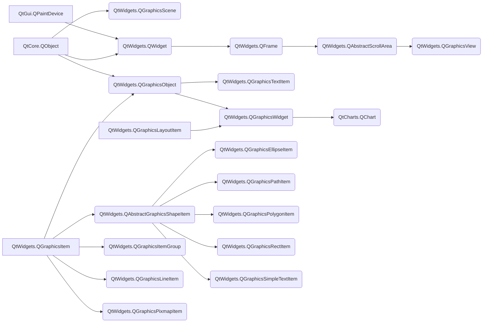
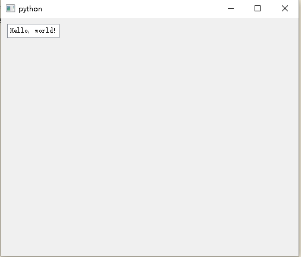
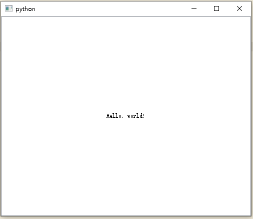
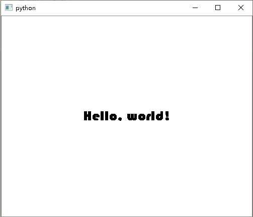
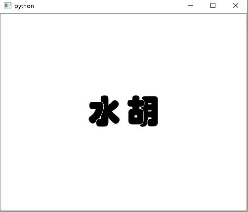
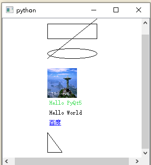
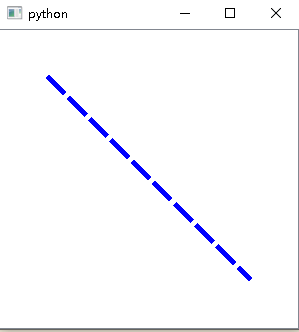
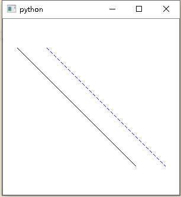
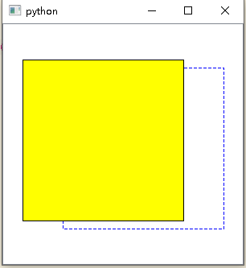

# Graphics View Framework

交互式 2D 图形的 Graphics View 框架概述。自 Qt4.2 中引入了 Graphics View，以取代其前身 QCanvas。Graphics View 提供了一个用于管理和交互大量的可定制的 2D 图形项与用于可视化这些项的 View 小部件的 surface（曲面），并提供缩放（zooming）和旋转（rotation）功能支持。

该框架包括事件传播体系结构（an event propagation architecture），该体系结构允许对场景中的项目进行精确的双精度交互功能。图元可以被如下操作处理：按键事件，鼠标按下，移动，释放和双击事件，它们还可以跟踪鼠标的移动。

Graphics View 使用 BSP（二进制空间分区）树提供了非常快速的图元发现功能，因此，它可以实时可视化大型场景（甚至可以包含数百万个图元）。下面列出 Graphics View Framework 的常用模块：



## 1 [QtWidgets.QGraphicsItem](https://doc.qt.io/qtforpython/PySide2/QtWidgets/QGraphicsItem.html#PySide2.QtWidgets.QGraphicsItem)

`QtWidgets.QGraphicsItem` 类是 `QtWidgets.QGraphicsScene` 中所有图形项的基类。为了方便描述，将 `QtWidgets.QGraphicsItem` 实例命名为**图元**。`QtWidgets.QGraphicsItem` 为编写您自己的自定义图元项提供了一个轻量级的基础。它包括定义图元项的几何形状（geometry），碰撞检测（collision detection），且有绘画实现以及通过事件处理程序进行的图元项交互。

为方便起见，Qt为最常见的形状提供了一组标准图形项：

* [`QGraphicsEllipseItem`](https://doc.qt.io/qtforpython/PySide2/QtWidgets/QGraphicsEllipseItem.html#PySide2.QtWidgets.QGraphicsEllipseItem "PySide2.QtWidgets.QGraphicsEllipseItem")：提供 ellipse item
* [`QGraphicsLineItem`](https://doc.qt.io/qtforpython/PySide2/QtWidgets/QGraphicsLineItem.html#PySide2.QtWidgets.QGraphicsLineItem "PySide2.QtWidgets.QGraphicsLineItem")：提供 line item
* [`QGraphicsPathItem`](https://doc.qt.io/qtforpython/PySide2/QtWidgets/QGraphicsPathItem.html#PySide2.QtWidgets.QGraphicsPathItem "PySide2.QtWidgets.QGraphicsPathItem")：提供任意 path item
* [`QGraphicsPixmapItem`](https://doc.qt.io/qtforpython/PySide2/QtWidgets/QGraphicsPixmapItem.html#PySide2.QtWidgets.QGraphicsPixmapItem "PySide2.QtWidgets.QGraphicsPixmapItem")：提供 pixmap item
* [`QGraphicsPolygonItem`](https://doc.qt.io/qtforpython/PySide2/QtWidgets/QGraphicsPolygonItem.html#PySide2.QtWidgets.QGraphicsPolygonItem "PySide2.QtWidgets.QGraphicsPolygonItem")：提供 polygon item
* [`QGraphicsRectItem`](https://doc.qt.io/qtforpython/PySide2/QtWidgets/QGraphicsRectItem.html#PySide2.QtWidgets.QGraphicsRectItem "PySide2.QtWidgets.QGraphicsRectItem")：提供 rectangular item
* [`QGraphicsSimpleTextItem`](https://doc.qt.io/qtforpython/PySide2/QtWidgets/QGraphicsSimpleTextItem.html#PySide2.QtWidgets.QGraphicsSimpleTextItem "PySide2.QtWidgets.QGraphicsSimpleTextItem")：提供简单 text label item
* [`QGraphicsTextItem`](https://doc.qt.io/qtforpython/PySide2/QtWidgets/QGraphicsTextItem.html#PySide2.QtWidgets.QGraphicsTextItem "PySide2.QtWidgets.QGraphicsTextItem")：提供高级 text browser item

图元项目的所有几何信息均基于其**本地坐标系**（Local Coordinate System）[^1]。该图元项的位置 `pos()` 是唯一在本地坐标中不起作用的函数，因为它在父坐标中返回一个位置。

[^1]: 本地坐标系是以物体自身位置作为原点，表示物体间相对位置和方向，并且会根据物体自身旋转而旋转。

您可以通过调用 `setVisible()` 设置图元项目是否应可见（即绘制和接受事件）。隐藏图元项目也会隐藏其子项。同样，您可以通过调用 `setEnabled()` 启用或禁用图元项目。

如果禁用某个图元项目，则其所有子项也将被禁用。默认情况下，图元项目既可见又启用。若要切换是否选择图元项目，请首先通过设置 `ItemIsSelectable` 标志启用选择，然后调用 `setSelected()`。通常，由于用户交互，场景（scene）会切换选择。

要编写自定义的图元项目，首先创建 `QGraphicsItem` 的子类，然后实现其两个纯虚拟公共函数：`boundingRect()` 返回该图元项目所绘制区域的估计值，`paint()` 实现实际绘图（the actual painting）。例如：

```python
class SimpleItem(QtWidgets.QGraphicsItem):
    def boundingRect(self):
        penWidth = 1.0
        return QtCore.QRectF(-10 - penWidth / 2, -10 - penWidth / 2,
                             20 + penWidth, 20 + penWidth)

    def paint(self, painter, option, widget):
        painter.drawRoundedRect(-10, -10, 20, 20, 5, 5)
```

`boundingRect()` 函数有许多不同的用途。`QtWidgets.QGraphicsScene` 的项目索引基于 `boundingRect()`，并且 `QtWidgets.QGraphicsView` 将其用于剔除不可见的项目以及确定绘制重叠项目时需要重新组合的区域。此外，`QtWidgets.QGraphicsItem` 的碰撞检测机制使用 `boundingRect()` 提供有效的截止点（cut-off）。`collidesWithItem()` 中的细粒度碰撞算法基于调用 `shape()` 的方法，该方法会返回图元形状的精确轮廓作为`QtGui.QPainterPath`。

`QtWidgets.QGraphicsScene` 期望所有图元项目的 `boundingRect()` 和 `shape()` 保持不变，除非得到通知。如果您想以任何方式更改图元的几何形状，则必须首先调用 `prepareGeometryChange()` 以允许 `QtWidgets.QGraphicsScene` 更新其簿记（bookkeeping）。

碰撞检测可以通过两种方式完成：

1. 重新实现 `shape()` 以为您的图元返回准确的形状，并依靠 `collidesWithItem()` 的默认实现进行形状与形状的交点（shape-shape intersection）。如果形状复杂，这可能代价会非常高。
2. 重新实现 `collidesWithItem()` 以提供您自己的自定义图元项目和形状碰撞算法。

可以调用 `contains()` 函数来确定图元项目是否包含一个点。该函数也可以通过图元项重新实现。`contains()` 的默认行为是基于调用 `shape()` 的。

图元项目可以包含其他图元项目，也可以被包含在其他图元项目中。所有图元项目都可以有一个父图元项目和一列子项目。除非该图元项目没有父对象，否则它的位置是父对象的坐标（即父对象的本地坐标）。父项将其位置及其变换传播给所有子项。

### 1.1 [Transformations](https://doc.qt.io/qtforpython/PySide2/QtWidgets/QGraphicsItem.html#pyside2-qtwidgets-qgraphicsitem-transformations "Permalink to this headline")

`QtWidgets.QGraphicsItem` 除了提供其基本位置 `pos()` 外，还支持投影变换（projective transformations）。有几种更改图元项目变换的方法。对于简单转换，可以调用便捷函数 `setRotation()` 或`setScale()`，也可以将任何变换矩阵传递给 `setTransform()`。对于高级转换控制，您还可以通过调用 `setTransformations()` 来设置多个组合转换。

图元项变换从父项到子项累积，因此，如果父项和子项都旋转 90 度，则子项的总转换将为 180 度。同样，如果项目的父项缩放到其原始大小的 2 倍（2x），则其子项也将扩大两倍。图元项的变形不会影响其自身的局部几何关系（ local geometry）；所有几何函数（例如，`contains()`，`update()` 和所有映射函数）仍在局部坐标（local coordinates）下运行。为方便起见，`QtWidgets.QGraphicsItem` 提供了一个函数 `SceneTransform()`（它返回该项的总变换矩阵（包括其位置以及所有父项的位置和变换））和 `scenePos()`（该函数返回其在场景坐标中的位置）。 要重置图元的矩阵，请调用 `resetTransform()`。

某些转换操作根据其应用顺序产生不同的结果。例如，如果缩放转换然后旋转，则可能会得到与首先旋转转换不同的结果。但是，您在 `QtWidgets.QGraphicsItem` 上设置转换属性的顺序不会影响最终的转换。`QtWidgets.QGraphicsItem` 始终以固定的定义顺序应用属性：

>The item’s base transform is applied ( transform() )
The item’s transformations list is applied in order ( transformations() )
The item is rotated relative to its transform origin point ( rotation() , transformOriginPoint() )
The item is scaled relative to its transform origin point ( scale() , transformOriginPoint() )

### 1.2 [Painting](https://doc.qt.io/qtforpython/PySide2/QtWidgets/QGraphicsItem.html#painting "Permalink to this headline")

`QtWidgets.QGraphicsView` 调用 `paint()` 函数来绘制图元项目的内容。该图元项目没有背景或没有默认填充值；该图元项目后面的任何内容都会在此功能中未明确绘制的所有区域中 shine。您可以调用 `update()` 安排重新绘制，可以选择传递需要重新绘制的矩形。根据图元项目是否在视图中可见，该项目可能会或可能不会重新粉刷（repaint）。`QtWidgets.QGraphicsItem` 中没有等效于 `repaint()` 的函数。

图元项目是按视图绘制的，从父项开始，然后是子项，按升序排列。您可以通过调用 `setZValue()` 设置图元的堆叠顺序，并通过调用 `zValue()` 对其进行测试，其中，在 z 值高的图元之前先绘制 z 值低的图元。堆叠顺序适用于同级图元；父项总是在子项前被绘制。

### 1.3 [Sorting](https://doc.qt.io/qtforpython/PySide2/QtWidgets/QGraphicsItem.html#sorting "Permalink to this headline")

所有图元项目均按定义的稳定顺序绘制，并且此相同的顺序决定了当您单击场景时哪些项目将首先接收鼠标输入。通常，您不必担心排序，因为项目遵循“自然顺序”，遵循场景的逻辑结构。

某个图元项目的子项堆叠在父项的顶部，而同级项则按照插入顺序（即，它们被添加到场景或添加到同一父项的顺序）堆叠。如果您添加项目 A，然后添加 B，则 B 将位于 A 的顶部。如果您添加 C，则项目的堆叠顺序将是 A，然后是 B，然后是 C。

对于高级用户，有一些方法可以更改项目的排序方式：

- 您可以在一个图元项目上调用 `setZValue()`，以将其显式堆叠在其他同级项目之上或之下。项的默认 Z 值为 0。具有相同 Z 值的项按插入顺序堆叠。
- 您可以调用 `stackBefore()` 重新排序子级列表。这将直接修改插入顺序。
- 您可以设置 `ItemStacksBehindParent` 标志以将子项堆叠在其父项之后。

两个同级图元的堆叠顺序也计入每个图元的子代图元和后代图元。因此，如果一项在另一项之上，则其所有子项也将在另一项所有子项之上。

### 1.4 [Events](https://doc.qt.io/qtforpython/PySide2/QtWidgets/QGraphicsItem.html#events "Permalink to this headline")

`QtWidgets.QGraphicsItem` 通过虚拟函数 `sceneEvent()` 从 `QtWidgets.QGraphicsScene` 接收事件。此函数将最常见的事件分配给一组便捷事件处理程序：

- `contextMenuEvent()` handles context menu events
- `focusInEvent()` and `focusOutEvent()` handle focus in and out events
- `hoverEnterEvent()` , `hoverMoveEvent()` , and `hoverLeaveEvent()` handles hover enter, move and leave events
- `inputMethodEvent()` handles input events, for accessibility support
- `keyPressEvent()` and `keyReleaseEvent()` handle key press and release events
- `mousePressEvent()` , `mouseMoveEvent()` , `mouseReleaseEvent()` , and `mouseDoubleClickEvent()` handles mouse press, move, release, click and doubleclick events

您可以通过安装事件过滤器（event filters）来过滤任何其他图元项目的事件。此功能与 Qt 的常规事件过滤器（请参阅 `installEventFilter()`）分开，后者仅适用于 QObject 的子类。在通过调用 `installSceneEventFilter()` 将项目安装为另一个项目的事件过滤器之后，虚拟函数 `sceneEventFilter()` 会接收到过滤后的事件。您可以通过调用 `removeSceneEventFilter()` 来删除项目事件过滤器。

### 1.5 [Custom Data](https://doc.qt.io/qtforpython/PySide2/QtWidgets/QGraphicsItem.html#custom-data "Permalink to this headline")

有时，将自定义数据注册到某个图元项目（自定义图元项目或标准图元项目）很有用。您可以在任何图元项目上调用 `setData()`，以使用键值对（键为整数，并且值为 `QVariant`）将数据存储在其中。要从项目中获取自定义数据，请调用 `data()`。Qt 本身完全没有涉及此功能。

### 1.6 `QtWidgets.QGraphicsItem` 的使用

`class QGraphicsItem([parent=None])` 使用给定的父项构造一个 `QtWidgets.QGraphicsItem`。它不会修改 `parent()` 返回的父对象。

如果 `parent` 是 `None`，你可以通过调用 [`addItem()`](https://doc.qt.io/qtforpython/PySide2/QtWidgets/QGraphicsScene.html#PySide2.QtWidgets.PySide2.QtWidgets.QGraphicsScene.addItem "PySide2.QtWidgets.PySide2.QtWidgets.QGraphicsScene.addItem") 将图元项目添加到场景中。该图元项目将成为顶级图元项目（top-level item）。

`QtWidgets.QGraphicsItem.GraphicsItemFlag`：枚举描述了可以在图元项目上设置的不同标志，以切换图元项目行为中的不同功能。

常量|描述
:-|:-
`QGraphicsItem.ItemIsMovable`|该项目支持使用鼠标进行交互式移动。通过单击该项目然后拖动，该项目将与鼠标光标一起移动。如果该项目有孩子，则所有孩子也将移动。如果项目是选择的一部分，则所有选择的项目也会移动。通过 `QtWidgets.QGraphicsItem` 的鼠标事件处理程序的基本实现，可以方便地提供此功能。
`QGraphicsItem.ItemIsSelectable`|该项目支持选择。启用此功能将使 `setSelected()` 可以切换图元项目的选择。通过调用 `setSelectionArea()`，单击某项或在 `QtWidgets.QGraphicsView` 中使用橡皮筋选择，它还将使该项自动被选择。
`QGraphicsItem.ItemIsFocusable`|该项目支持键盘输入焦点（即它是一个输入项目）。启用此标志将允许该项目接受焦点，这再次允许将键事件传递到 `keyPressEvent()` 和 `keyReleaseEvent()`。
`QGraphicsItem.ItemClipsToShape`|图元会剪裁成自己的形状。该项目无法在其形状之外绘制或接收鼠标，平板电脑，拖放或悬停事件。默认情况下禁用。此行为由 `drawItems()` 或 `drawItems()` 强制执行。这个标志是在 Qt 4.3 中引入的。
`QGraphicsItem.ItemClipsChildrenToShape`|该项将其所有后代的绘画剪裁成自己的形状。此项的直接或间接子项不能超出该项目的形状。默认情况下，此标志为禁用状态。孩子们可以在任何地方画画。此行为由 `drawItems()` 或 `drawItems()` 强制执行。 这个标志是在 Qt 4.3 中引入的。

更多 flags 见：[QGraphicsItem](https://doc.qt.io/qtforpython/PySide2/QtWidgets/QGraphicsItem.html#qgraphicsitem "Permalink to this headline")。

### 1.7 QtWidgets.QGraphicsItem.boundingRect()

返回 `QRectF`。这个纯虚函数将图元项目的外部边界定义为矩形；所有绘画都必须限制在图元项目的边界区域内。`QtWidgets.QGraphicsView` 使用它来确定该图元项目是否需要重绘。尽管图元项目的形状可以是任意的，但边界矩形始终为矩形，并且不受图元项目变换的影响。

如果要更改图元项目的边界矩形，必须首先调用 `prepareGeometryChange()`。这会通知场景即将发生的更改，以便可以更新其图元项目几何索引；否则，场景将不会意识到该图元的新几何形状，并且结果是不确定的（通常，渲染工件（ rendering artifacts）保留在视图（view）中）。

重新实现此功能，以使 `QtWidgets.QGraphicsView` 决定需要重绘窗口小部件的哪些部分（如果有）。注意：对于绘制轮廓/笔触的形状，重要的是在边界矩形中包括笔宽的一半。但是，没有必要补偿抗锯齿。

例子：

```python
def boundingRect(self):
    penWidth = 1.0
    return QtCore.QRectF(-radius - penWidth / 2, -radius - penWidth / 2,
                  diameter + penWidth, diameter + penWidth)
```

## 2 The Graphics View Architecture

Graphics View 提供了一种基于项目（item-based）的方法来进行模型视图编程（model-view programming），非常类似于 InterView 的便利类 QTableView，QTreeView 和 QListView。多个视图可以观察单个场景，并且该场景包含各种几何形状的项目。

### 2.1 Graphics View

`QtWidgets.QGraphicsView` 在可滚动 viewport 中可视化 `QtWidgets.QGraphicsScene` 的内容。

为了使场景可视化，首先要构造一个 `QtWidgets.QGraphicsView` 对象，然后将要可视化的场景的地址传递给 `QtWidgets.QGraphicsView` 的构造函数。另外，您可以调用 `setScene()` 在以后设置场景。调用 `show()` 后，默认情况下，视图将滚动到场景的中心并显示此时可见的所有图元项目。 例如：

```C++
scene = QGraphicsScene()
scene.addText("Hello, world!")

view = QGraphicsView(scene)
view.show()
```

您可以使用滚动条或调用 `centerOn()` 显式滚动到场景中的任何位置。通过将一个点传递给 `centerOn()`，QGraphicsView 将滚动其视口以确保该点在视图中居中。同时提供了用于滚动到 QGraphicsItem 的重载，在这种情况下，QGraphicsView 将看到项目的中心在视图中居中。如果只需要确保某个区域可见（但不必居中），则可以调用 `sureVisible()`。

QGraphicsView 可用于可视化整个场景或其中的一部分。默认情况下，第一次显示视图时，会自动检测到可视化区域（通过调用 `itemsBoundingRect()`）。要自己设置可视化区域矩形，可以调用 `setSceneRect()`。这将适当地调整滚动条的范围。请注意，尽管场景支持几乎不受限制的大小，但滚动条的范围永远不会超出整数 (INT_MIN, INT_MAX) 的范围。

QGraphicsScene 还管理某些图元项目状态，例如图元项目选择和焦点。您可以通过调用 `setSelectionArea()` 传递任意形状来选择场景中的项目。此函数还用作 QGraphicsView 中橡皮筋选择的基础。要获取所有当前选定项目的列表，请调用 `selectedItems()`。 QGraphicsScene 处理的另一个状态是项目是否具有键盘输入焦点。您可以通过调用 `setFocusItem()` 或 `setFocus()` 来设置焦点，或者通过调用 `focusItem()` 来获取当前焦点。

QGraphicsView 通过调用 `render()` 可视化场景。默认情况下，使用常规 QPainter 并使用默认渲染提示将项目绘制到视口上。若要更改绘画项目时 QGraphicsView 传递给 QPainter 的默认渲染提示，可以调用`setRenderHints()`。

默认情况下，QGraphicsView 为视口窗口小部件提供常规 QWidget。您可以通过调用 `viewport()` 来访问此小部件，也可以通过调用 `setViewport()` 来替换它。

要使用 OpenGL 进行渲染，只需调用 `setViewport`（新的 QOpenGLWidget）。`QGraphicsView` 拥有视口小部件的所有权。

QGraphicsView 使用 QTransform 支持仿射变换。最常见的两种转换是 `scaling`，用于实现缩放(zooming)和旋转(rotation)。QGraphicsView 在转换过程中保持视图中心不变。由于场景对齐（`setAligment()`），平移视图将不会产生视觉影响。您可以将矩阵传递给 `setTransform()`，也可以调用便捷函数之一 `rotate()`，`scale()`，`translate()` 或 `shear()`。

您可以使用鼠标和键盘与场景中的项目进行交互。QGraphicsView 将鼠标和键事件转换为场景事件（继承 QGraphicsSceneEvent 的事件），并将其转发到可视化场景。最后，处理事件并对事件做出反应的是独立项目。例如，如果单击一个可选择的项目，则该项目通常会让场景知道它已被选中，并且它还将重绘自身以显示选择矩形。类似地，如果您单击并拖动鼠标以移动可移动项，则它是处理鼠标移动并自行移动的项。默认情况下，图形项目互动处于启用状态，您可以触发调用。

您还可以通过创建 QGraphicsView 的子类并重新实现鼠标和键事件处理程序来提供自己的自定义场景交互。
为了简化您如何以编程方式与视图中的项目进行交互，QGraphicsView 提供了映射函数 `mapToScene()` 和 `mapFromScene()` 以及项目访问器 `items()` 和 `itemAt()`。这些功能允许您在视图坐标和场景坐标之间映射点，矩形，多边形和路径，并使用视图坐标在场景中查找项目。


`QtWidgets.QGraphicsView(scene[, parent=None])`：

- `parent`：QWidget
- `scene`：QGraphicsScene

### 2.2 The Scene

[`QtWidgets.QGraphicsScene`](https://doc.qt.io/qtforpython/PySide2/QtWidgets/QGraphicsScene.html#PySide2.QtWidgets.QGraphicsScene "PySide2.QtWidgets.QGraphicsScene") 提供了 Graphics View 场景。

场景的调用方法：

```python
QGraphicsScene(sceneRect[, parent=None])
QGraphicsScene(x, y, width, height[, parent=None])
```

场景具有如下功能：

* 提供用于管理大量图元项目的快速界面
* 将事件传播到每个图元项目 
* 管理图元项目状态，例如选择和焦点处理
* 提供未被转换的渲染功能；主要用于印刷

场景用作 `QtWidgets.QGraphicsItem` 对象的容器。它与 `QtWidgets.QGraphicsView` 一起用于可视化 2D 曲面上（2D surface）的图形项目，例如线条，矩形，文本，甚至是自定义项目。通过调用 `addItem()` 将图元项目添加到场景中，然后通过调用许多项目查找功能之一来检索项目。

请注意，QGraphicsScene 没有自己的视觉外观。它只管理图元项目。您需要创建一个 QGraphicsView 小部件以可视化场景。

要将项目添加到场景，首先需要构造一个 QGraphicsScene 对象。然后，您有两个选择：通过调用 `addItem()` 添加现有的 QGraphicsItem 对象，或者可以调用下列便捷函数之一 `addEllipse()`，`addLine()`，`addPath()`，`addPixmap()`，`addPolygon()`，`addRect()` 或 `addText()`，它们都返回一个指向新添加项目的指针。使用这些功能添加的图元的维度是相对于图元（item）的坐标系的，并且图元的位置在场景中被初始化为 $(0,0)$。

您可以使用 QGraphicsView 可视化场景。当场景发生变化时（例如，当某项移动或变换时），QGraphicsScene 发出 `change()` 信号。要删除项目，请调用 `removeItem()`。

QGraphicsScene 使用索引算法来有效地管理项目的位置。默认情况下，使用 BSP（二进制空间分区）树；一种适用于大型场景的算法，其中大多数图元保持静止（即不要四处移动）。您可以选择通过调用 `setItemIndexMethod()` 禁用此索引。

通过调用 `setSceneRect()` 设置场景的边界矩形。可以将图元项目放置在场景中的任何位置，默认情况下，场景的大小不受限制。场景 rect 仅用于内部簿记，维护场景的图元项目索引。如果未设置场景矩形，则 QGraphicsScene 将使用 `itemsBoundingRect()` 返回的所有项目的边界区域作为场景矩形。但是，`itemsBoundingRect()` 是一个相对耗时的函数，因为它通过收集场景中每个项目的位置信息进行操作。因此，在大型场景上操作时，应始终设置场景 rect。

QGraphicsScene 的最大优势之一就是能够有效确定图元的位置。即使场景中有数百万个项目，`items()` 函数也可以在几毫秒内确定项目的位置。`items()` 有多个重载：一个重载在某个位置查找项目，一个重载在多边形或矩形内部或与之相交，等等。返回的项目列表按堆叠顺序排序，最高的项目是列表中的第一项目。为了方便起见，还有一个 `itemAt()` 函数可在给定位置返回最上面的项目。

QGraphicsScene 维护场景的选择信息。要选择项目，请调用 `setSelectionArea()`，并要清除当前选择，请调用`clearSelection()`。调用 `selectedItems()` 以获取所有选定项的列表。

比如：

```python
from xinet import QtWidgets, QtGui, QtCore
from xinet.run_qt import run


class MainWindow(QtWidgets.QWidget):
    def __init__(self, *args, **kwargs):
        super().__init__(*args, **kwargs)
        self.resize(500, 400)
        scene = QtWidgets.QGraphicsScene(self)  # 创建场景
        scene.addText("Hello, world!")  # 在场景中添加文本
        view = QtWidgets.QGraphicsView(scene, self)  # 创建视图窗口
        view.move(10, 10)
        view.show()


if __name__ == '__main__':
    run(MainWindow)
```

效果图：



QGraphicsScene 的另一个职责是传播来自 QGraphicsView 的事件。要将事件发送到场景，您可以构造一个继承 QEvent 的事件，然后使用 `sendEvent()` 进行发送。`event()` 负责将事件调度到各个图元项目。一些常见事件由便利事件处理程序处理。例如，按键事件由 `keyPressEvent()` 处理，鼠标按键事件由 `mousePressEvent()` 处理。

按键事件将传递到焦点图元项目。要设置焦点图元项目，可以调用 `setFocusItem()`，传递接受焦点的图元项目，或者该项目本身可以调用 `setFocus()`。 调用 `focusItem()` 以获取当前的焦点项目。为了与小部件兼容，场景还保留其自己的焦点信息。默认情况下，场景没有焦点，并且所有按键事件都将被丢弃。如果调用 `setFocus()` 或场景中的某个项目获得焦点，则场景将自动获得焦点。如果场景具有焦点，则 `hasFocus()` 将返回 `true`，并将按键事件转发到焦点项（如果有）。如果场景失去焦点（例如，有人在某个项目具有焦点时调用 `clearFocus()`），则场景将保留其项目焦点信息，并且一旦场景重新获得焦点，它将确保最后一个焦点项目重新获得焦点。

对于鼠标悬停效果，QGraphicsScene 调度悬停事件。如果某个图元项目接受悬停事件（请参见`acceptHoverEvents()`），则当鼠标进入其区域时，它将收到 GraphicsSceneHoverEnter 事件。当鼠标继续在项目区域内移动时， QGraphicsScene 将向其发送 GraphicsSceneHoverMove 事件。当鼠标离开该项目的区域时，该项目将收到 GraphicsSceneHoverLeave 事件。

所有鼠标事件都会传递到当前的鼠标采集器项目。如果一个项目接受鼠标事件（请参见 `acceptedMouseButtons()` 并且接受鼠标按下，则它将成为场景的鼠标捕获器。当没有其他鼠标按钮被按下时，它会一直停留在鼠标抓取器上，直到释放鼠标为止。您可以调用 `mouseGrabberItem()` 来确定当前正在抓住鼠标的图元项目。

### 2.3 添加文本图元

为场景添加文本图元：

```python
from xinet import QtWidgets, QtGui, QtCore
from xinet.run_qt import run


class MainWindow(QtWidgets.QGraphicsView):
    def __init__(self, *args, **kwargs):
        super().__init__(*args, **kwargs)
        self.resize(500, 400) # 设定视图大小
        scene = QtWidgets.QGraphicsScene()  # 创建场景
        scene.addText("Hello, world!")  # 在场景中添加文本
        self.setScene(scene)


if __name__ == '__main__':
    run(MainWindow)
```

效果图：



自定义文本字体：

```python
font = QtGui.QFont("华文琥珀", 20, QtGui.QFont.Bold)
scene.addText("Hello, world!", font)  # 在场景中添加文本
```



图元默认位置为 $(0, 0)$，可以自定义位置：

```python
from xinet import QtWidgets, QtGui, QtCore
from xinet.run_qt import run


class MainWindow(QtWidgets.QGraphicsView):
    def __init__(self, *args, **kwargs):
        super().__init__(*args, **kwargs)
        self.resize(500, 400)
        scene = QtWidgets.QGraphicsScene()  # 创建场景
        font = QtGui.QFont("华文琥珀", 50, QtGui.QFont.Bold)
        A = scene.addText("水", font)  # 在场景中添加文本
        B = scene.addText("胡", font)  # 在场景中添加文本
        A.setPos(0, 0)
        B.setPos(80, 0)
        self.setScene(scene)


if __name__ == '__main__':
    run(MainWindow)
```




### 2.4 一个例子

```python
from xinet import QtWidgets, QtGui, QtCore
from xinet.run_qt import run


class MainWindow(QtWidgets.QGraphicsView):
    def __init__(self, *args, **kwargs):
        super().__init__(*args, **kwargs)
        # 设定视图尺寸
        self.resize(300, 300)
        # 创建场景
        self.scene = QtWidgets.QGraphicsScene()
        self.scene.setSceneRect(0, 0, 300, 300)
        self.init_Ui()  # 创建图元
        # 将图元加入场景
        self.scene.addItem(self.line)
        self.scene.addItem(self.rect)
        self.scene.addItem(self.ellipse)
        self.scene.addItem(self.pic)
        self.scene.addItem(self.text1)
        self.scene.addItem(self.text2)
        self.scene.addItem(self.text3)
        self.scene.addItem(self.path)
        # 设定视图的场景
        self.setScene(self.scene)

    def init_Ui(self):
        # 3
        self.line = QtWidgets.QGraphicsLineItem()
        self.line.setLine(100, 100, 200, 20)
        # self.line.setLine(QLineF(100, 10, 200, 10))

        # 4
        self.rect = QtWidgets.QGraphicsRectItem()
        self.rect.setRect(100, 30, 100, 30)
        # self.rect.setRect(QRectF(100, 30, 100, 30))

        # 5
        self.ellipse = QtWidgets.QGraphicsEllipseItem()
        self.ellipse.setRect(100, 80, 100, 20)
        # self.ellipse.setRect(QRectF(100, 80, 100, 20))

        # 6
        self.pic = QtWidgets.QGraphicsPixmapItem()
        self.pic.setPixmap(QtGui.QPixmap(
            r'D:\share\study\images\巴西建筑\017.jpg').scaled(60, 60))
        self.pic.setFlags(QtWidgets.QGraphicsItem.ItemIsSelectable |
                          QtWidgets.QGraphicsItem.ItemIsMovable)
        self.pic.setOffset(100, 120)
        # self.pic.setOffset(QPointF(100, 120))

        # 7
        self.text1 = QtWidgets.QGraphicsTextItem()
        self.text1.setPlainText('Hello PyQt5')
        self.text1.setDefaultTextColor(QtGui.QColor(66, 222, 88))
        self.text1.setPos(100, 180)

        self.text2 = QtWidgets.QGraphicsTextItem()
        self.text2.setPlainText('Hello World')
        self.text2.setTextInteractionFlags(QtCore.Qt.TextEditorInteraction)
        self.text2.setPos(100, 200)

        self.text3 = QtWidgets.QGraphicsTextItem()
        self.text3.setHtml('<a href="https://baidu.com">百度</a>')
        self.text3.setOpenExternalLinks(True)
        self.text3.setTextInteractionFlags(QtCore.Qt.TextBrowserInteraction)
        self.text3.setPos(100, 220)

        # 8
        self.path = QtWidgets.QGraphicsPathItem()

        self.tri_path = QtGui.QPainterPath()
        self.tri_path.moveTo(100, 250)
        self.tri_path.lineTo(130, 290)
        self.tri_path.lineTo(100, 290)
        self.tri_path.lineTo(100, 250)
        self.tri_path.closeSubpath()
        self.path.setPath(self.tri_path)


if __name__ == '__main__':
    run(MainWindow)
```

效果：



## 3 The Graphics View Coordinate System

Graphics View 基于笛卡尔坐标系；项在场景中的位置和几何形状由两个数字组成：x 坐标和 y 坐标。使用未变换的视图观察场景时，场景中的一个单元由屏幕上的一个像素表示。Graphics View 中有三个有效的坐标系在起作用：图元项目坐标，场景坐标和视图坐标。为了简化实现，“图形视图”提供了方便的功能，使您可以在三个坐标系之间进行映射。

### 3.1 Item Coordinates

图元项目位于它们自己的本地坐标系中。它们的坐标通常以其中心点 $(0,0)$ 为中心，这也是所有变换的中心。图元项目坐标系中的几何图元通常称为点元（item points），线元（item lines）或矩形元（item rectangles）。

创建自定义商图元时，您只需要担心图元坐标；QGraphicsScene 和 QGraphicsView 将为您执行所有转换。这使得实现自定义项非常容易。例如，如果收到鼠标按下或拖动输入事件，则事件位置以项目坐标给出。 `contains()` 虚拟函数，如果某个点位于您的图元内部，则返回 `true`；否则返回 `false`，它在图元坐标中采用 `point` 参数。同样，图元项目的边界矩形和形状都在项目坐标中。

在项目的位置是项目中心在其父级坐标系中的坐标；有时称为父坐标。从这个意义上说，场景被视为所有无父母图元的“父母”。顶级图元项目的位置在场景坐标中。

子坐标是相对于父坐标的。如果子对象未变形，则子坐标和父坐标之间的差异与父坐标中各项之间的距离相同。例如：如果未变换的子项正好位于其父项的中心点，则两个项的坐标系将相同。但是，如果孩子的位置是 $(10, 0)$，则孩子的 $(0, 10)$ 点将与其父级的 $(10, 10)$ 点相对应。

因为图元项目的位置和变换是相对于父项的，所以子项的坐标不受父项变换的影响，尽管父项的变换会隐式地变换子项。在上面的示例中，即使旋转父级和缩放父级，子级（0，10）的点仍将对应于父级（10，10）的点。但是，相对于场景，孩子将遵循父母的变换和位置。如果将父级缩放为（2x，2x），则子级的位置将位于场景坐标（20，0），并且其（10，0）点将与场景上的点（40，0）相对应。

`pos()` 是为数不多的例外之一，QGraphicsItem 的函数在项目坐标中操作，而与项目或其父项的任何转换无关。例如，始终在图元坐标中给出图元的边界矩形（即 `boundingRect()`）。

### 3.2 Scene Coordinates

场景代表所有项目的基本坐标系。场景坐标系描述了每个顶级项目的位置，并且还构成了从视图传递到场景的所有场景事件的基础。场景中的每个项目，除了其本地项目 `pos` 和边界矩形之外，还具有场景位置和边界矩形（`scenePos()`，`sceneBoundingRect()`）。场景位置描述了项目在场景坐标中的位置，其场景边界矩形构成了 QGraphicsScene 如何确定场景的哪些区域已更改的基础。场景中的更改通过 `changed(`) 信号进行通信，并且参数是场景矩形的列表。

### 3.3 View Coordinates

视图坐标是小部件的坐标。视图坐标中的每个单位对应一个像素。该坐标系的特殊之处在于它是相对于小部件或视口的，并且不受所观察场景的影响。QGraphicsView 的视口的左上角始终为（0，0），而其右下角始终为（视口宽度，视口高度）。所有鼠标事件和拖放事件最初都是作为视图坐标接收的，并且您需要将这些坐标映射到场景以便与项目进行交互。

## 4 基本图元

### 4.1 线元

[QGraphicsLineItem](https://doc.qt.io/qtforpython/PySide2/QtWidgets/QGraphicsLineItem.html#qgraphicslineitem "Permalink to this headline") 类提供了可以添加到 QGraphicsScene 的**线元**项目。

```python
QGraphicsLineItem(line[, parent=None])
QGraphicsLineItem(x1, y1, x2, y2[, parent=None])
```

要设置线元，请将 `QLineF` 传递给 `QGraphicsLineItem` 的构造函数，或调用 `setLine()` 函数。`line()` 函数返回当前线元。默认情况下，该线元是黑色，宽度为 $0$，但是您可以通过调用 `setPen()` 来更改它。

```python
from xinet import QtWidgets, QtGui, QtCore
from xinet.run_qt import run


class MainWindow(QtWidgets.QGraphicsView):
    def __init__(self, *args, **kwargs):
        super().__init__(*args, **kwargs)
        # 设定视图尺寸
        self.resize(300, 300)
        # 创建场景
        self.scene = QtWidgets.QGraphicsScene()
        # x1, y1, x2, y2
        self.line = QtWidgets.QGraphicsLineItem(0, 0, 200, 200)
        self.scene.addItem(self.line)
        # 设定视图的场景
        self.setScene(self.scene)


if __name__ == '__main__':
    run(MainWindow)
```

其中 `self.line = QtWidgets.QGraphicsLineItem(0, 0, 200, 200)` 可以被替换为 `self.line = QtWidgets.QGraphicsLineItem(QtCore.QLine(0, 0, 200, 200))` 或者：

```python
self.line = QtWidgets.QGraphicsLineItem()
self.line.setLine(0, 0, 200, 200) 
# 或者 self.line.setLine(QtCore.QLine(0, 0, 200, 200))
```

可以定制线元的 shape：

```python
from xinet import QtWidgets, QtGui, QtCore
from xinet.run_qt import run


class MainWindow(QtWidgets.QGraphicsView):
    def __init__(self, *args, **kwargs):
        super().__init__(*args, **kwargs)
        # 设定视图尺寸
        self.resize(300, 300)
        # 创建场景
        self.scene = QtWidgets.QGraphicsScene()
        self.line = QtWidgets.QGraphicsLineItem(0, 0, 200, 200)
        pen = QtGui.QPen(QtCore.Qt.blue, 5, QtCore.Qt.DashLine)
        self.line.setPen(pen)
        self.scene.addItem(self.line)
        # 设定视图的场景
        self.setScene(self.scene)


if __name__ == '__main__':
    run(MainWindow)
```

效果图：



平移线元：

```python
from xinet import QtWidgets, QtGui, QtCore
from xinet.run_qt import run


class MainWindow(QtWidgets.QGraphicsView):
    def __init__(self, *args, **kwargs):
        super().__init__(*args, **kwargs)
        # 设定视图尺寸
        self.resize(300, 300)
        # 创建场景
        self.scene = QtWidgets.QGraphicsScene()
        self.line = QtWidgets.QGraphicsLineItem(0, 0, 200, 200)
        pen = QtGui.QPen(QtCore.Qt.blue, 0, QtCore.Qt.DashLine)
        self.line.setPen(pen)
        self.line.setPos(50, 0)  # 平移线元
        self.scene.addItem(self.line)
        self.scene.addItem(QtWidgets.QGraphicsLineItem(0, 0, 200, 200))
        # 设定视图的场景
        self.setScene(self.scene)


if __name__ == '__main__':
    run(MainWindow)
```

效果：



### 4.2 矩形元

 
要设置项目的矩形元 [QGraphicsRectItem](https://doc.qt.io/qtforpython/PySide2/QtWidgets/QGraphicsRectItem.html#qgraphicsrectitem "Permalink to this headline")，请将 `QRectF` 传递给 QGraphicsRectItem 的构造函数，或调用 `setRect()` 函数。`rect()` 函数返回当前矩形元。

```python
QGraphicsRectItem(rect[, parent=None])  # rect 即 `QRectF`
QGraphicsRectItem(x, y, w, h[, parent=None])
```

QGraphicsRectItem 使用矩形和笔宽来提供 `boundingRect()`，`shape()` 和 `contains()` 的合理实现。`paint()` 函数使用与图元项目关联的笔刷绘制矩形，您可以通过调用 `setPen()` 和 `setBrush()` 函数来设置矩形。

```python
from xinet import QtWidgets, QtGui, QtCore
from xinet.run_qt import run


class MainWindow(QtWidgets.QGraphicsView):
    def __init__(self, *args, **kwargs):
        super().__init__(*args, **kwargs)
        # 设定视图尺寸
        self.resize(300, 300)
        # 创建场景
        self.scene = QtWidgets.QGraphicsScene()
        self.rect = QtWidgets.QGraphicsRectItem(0, 0, 200, 200)
        pen = QtGui.QPen(QtCore.Qt.blue, 0, QtCore.Qt.DashLine)
        self.rect.setPen(pen)
        self.rect.setPos(50, 10)  # 平移矩形元
        self.scene.addItem(self.rect)
        rect2 = QtWidgets.QGraphicsRectItem(0, 0, 200, 200)
        brush = QtGui.QBrush(QtCore.Qt.SolidPattern)
        brush.setColor(QtGui.QColor('yellow'))
        rect2.setBrush(brush)
        self.scene.addItem(rect2)
        # 设定视图的场景
        self.setScene(self.scene)


if __name__ == '__main__':
    run(MainWindow)
```

效果：



### 4.3 多边形元

要设置项目的多边形 [QGraphicsPolygonItem](https://doc.qt.io/qtforpython/PySide2/QtWidgets/QGraphicsPolygonItem.html#qgraphicspolygonitem "Permalink to this headline")，请将 QPolygonF 传递给 QGraphicsPolygonItem 的构造函数，或调用 `setPolygon()` 函数。`polygon()` 函数返回当前多边形。

```python
QGraphicsPolygonItem(polygon[, parent=None])
```

QGraphicsPolygonItem 使用多边形和笔宽来提供 `boundingRect()`，`shape()` 和 `contains()` 的合理实现。`paint()` 函数使用与图元项目关联的笔刷绘制矩形，您可以通过调用 `setPen()` 和 `setBrush()` 函数来设置矩形。
