# Qt 基础教程

## 1 创建窗口

Qt 创建一个窗口很简单：

==代码1==：

```python
from xinet import QtWidgets

if __name__ == '__main__':
    #import sys
    # 实例化一个QApplication对象，用于GUI的初始化
    app = QtWidgets.QApplication([])  # QtWidgets.QApplication(sys.argv)
    # 实例化一个 Window 对象，用于定义一个图形窗口
    window = QtWidgets.QWidget()
    window.resize(250, 150)  # 窗口大小
    window.move(300, 300)  # 窗口位置：即运行程序后，窗口的坐标
    window.setWindowTitle('Simple GUI')  # 设置标题为：simple GUI
    window.show()  # 显示主窗口
    app.exec_()  # 当GUI产生退出信号时Python程序结束
    # 利用内置模块sys的exit()方法侦听GUI的退出信号，以便关闭Python程序。
    #sys.exit(app.exec_())
```

效果图：

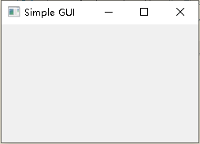

注意：`QtWidgets.QApplication(sys.argv)` 中的 `sys.argv` 用于传递命令行参数，本手册一般不会使用该模式，所以，使用 `[]` 即可。

在代码1 中仅仅创建了一个窗口，如果想要创建多个窗口，可以这样：

==代码2==：

```python
from xinet import QtWidgets


if __name__ == '__main__':
    app = QtWidgets.QApplication([])
    # 第一个控件
    w1 = QtWidgets.QWidget()
    w1.resize(250, 150)
    w1.move(100, 300)
    w1.setWindowTitle('First ')
    w1.show()

    # 第二个控件
    w2 = QtWidgets.QWidget()
    w2.resize(250, 150)
    w2.move(300, 200)
    w2.setWindowTitle('Second')
    w2.show()

    app.exec_()
```

效果：

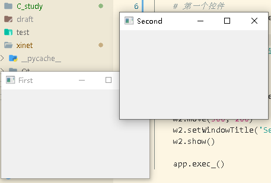

可以看到创建了 2 个窗口，标题名为 Second 的窗口在 First 之上，可以知道 Qt 默认后创建的控件在上层堆叠。

## 2 控件的父子关系

指定控件的父子关系，方便统一管理。比如在一个对话框中，里面的拥有 QButton，QLabel，QTextEdit 控件可以作为这个对话框的子控件，这样当父控件（对话框）被销毁的时候，子控件也自动销毁，而且子控件会约束在父控件中。

代码2 创建了两个空间，现在我们让其中一个作为子控件，另一个作为父控件：

==代码3==：

```python
from xinet import QtWidgets


if __name__ == '__main__':
    app = QtWidgets.QApplication([])
    # 父控件
    f = QtWidgets.QWidget()
    f.resize(250, 150)
    f.move(100, 200)
    f.setWindowTitle('MainWindow')  # 父控件坐标：原点（0,0）为屏幕的最左上角

    # 子控件
    s = QtWidgets.QWidget()
    s.resize(50, 100)
    s.move(10, 10)  # 子控件坐标：原点（0,0）为父控件的最左上角
    s.setParent(f)  # 设置f为s的父控件
    s.setStyleSheet("background:red;")  # 设置s这个控件的背景颜色为红色
    f.show()  # 显示父控件，子控件也自动显示

    app.exec_()
```

效果图：

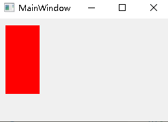

这段程序有以下几个知识点：

- 设置父子控件的代码为：`s.setParent(f)`
- 子控件没有设置标题栏，是因为没有作用，因为这个控件并没有标题栏，f 控件是因为是顶层控件，所以系统自动给添加的，因为这是一个普通基本窗口都会有的结构。
- 通过设置控件的表来配置控件的背景颜色，当然，可以设置显示的文字像素大小，字体等。

创建父控件还有另一种方便的方式，即在创建子控件时候，参数写入父控件，可一步完成创建控件和指定父控件的操作，程序如下所示：

```python
from xinet import QtWidgets


if __name__ == '__main__':
    app = QtWidgets.QApplication([])
    # 父控件
    f = QtWidgets.QWidget()
    f.resize(250, 150)
    f.move(100, 200)
    f.setWindowTitle('MainWindow')  # 父控件坐标：原点（0,0）为屏幕的最左上角

    # 子控件
    s = QtWidgets.QWidget(f) # 创建子控件s，并指定f为其父空间
    s.resize(50, 100)
    s.move(10, 10)  # 子控件坐标：原点（0,0）为父控件的最左上角
    s.setStyleSheet("background:red;")  # 设置s这个控件的背景颜色为红色
    f.show()  # 显示父控件，子控件也自动显示

    app.exec_()
```

这段程序使用 `s=QWidget(f)` 来指定f为s的父控件，所以也不再需要 `s.setParent(f)`，注意到，每一个子控件可以指定一个父控件，也只能拥有一个父控件，如果重复指定，那么只有最后指定的父控件是有效的。

拓展：创建一个可检测按钮状态的 GUI：

```python
from xinet import QtWidgets


if __name__ == '__main__':
    app = QtWidgets.QApplication([])
    # 父控件
    f = QtWidgets.QWidget()
    f.resize(250, 150)
    f.move(100, 200)
    f.setWindowTitle('MainWindow')  # 父控件坐标（0,0）为屏幕的最左上角

    redb = QtWidgets.QPushButton('red', f)  # 这是显示的文字为‘red’，指定父控件为f
    redb.setCheckable(True)
    redb.move(10, 10)
    redb.setStyleSheet("background:red;font-size:20px;")

    greb = QtWidgets.QPushButton('green', f)
    greb.setCheckable(True)
    greb.move(100, 10)
    greb.setStyleSheet("background:green;font-size:10px;")

    f.show()  # 显示父控件，子控件也自动显示

    app.exec_()
```

效果：

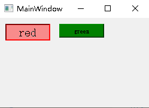

该代码中 `redb.setCheckable(True)` 表示，当您按下按钮，该按钮的状态会有下陷的显示状态。

上面的代码均是以过程式编程定制 GUI 的，考虑到代码的高复用性与 Pythonic，后续的代码将以类的形式定制 GUI 窗口。同时，为了提高代码的可读性与复用性，启动单个窗口的程序封装在 `run_qt.py` 的 `run` 函数内。这样代码3 可重写为：

```python
from xinet import QtWidgets, QtGui, QtCore
from xinet.run_qt import run


class MainWindow(QtWidgets.QWidget):
    def __init__(self, *args, **kw):
        super().__init__(*args, **kw)
        self.resize(250, 150)
        self.move(100, 200)
        self.setWindowTitle('MainWindow')  # 父控件坐标：原点（0,0）为屏幕的最左上角

        # 子控件
        s = QtWidgets.QWidget(self)  # 创建子控件s，并指定self为其父空间
        s.resize(50, 100)
        s.move(10, 10)  # 子控件坐标：原点（0,0）为父控件的最左上角
        s.setStyleSheet("background:red;")  # 设置s这个控件的背景颜色为红色


if __name__ == '__main__':
    run(MainWindow)
```

## 3 信号和槽

在 Qt 中，不同的控件如果需要通信，通常通过信号（signals）和槽（slots）来实现的。比如，当一个按钮控件被按下的时候，会发送一个信号，此时我们就可以把这个信号和一个函数连接起来，这样，当按钮按下的时候，这个函数就被执行了，这个函数也被称为槽函数。Qt 已经设计好了一系列的信号供程序员直接使用，比如按键的按下，单击（即按下又松开），双击，比如标题栏名字的改变，对象被销毁等等都会发送一个信号，只要我们将这些信号连接一个函数，就可以让我们的程序对这些事件作出预期的响应。注意到，Qt 的底层负责事件的派送，已经槽函数的调用。

信号和槽有以下几个知识点：

- 信号可以连接信号
- 一个槽可以监听多个信号
- 一个信号可以连接多个槽
- 信号槽连接以后，可以重复的断开和连接
- 发射的信号可以带参数

### 3.1 无参数信号

```python
from xinet import QtWidgets, QtGui, QtCore
from xinet.run_qt import run


class MainWindow(QtWidgets.QWidget):
    def __init__(self, *args, **kw):
        super().__init__(*args, **kw)
        self.init_Ui()
        # 0.运行一次QObject_Test()
        self.test_QObject()

    def destroy_slot(self):
        # 定义个槽函数
        print('obj 被释放了')

    def test_QObject(self):
        # 1.创建一个临时变量
        obj = QtCore.QObject()  # 创建一个 QObject 对象
        # 2.连接槽函数
        obj.destroyed.connect(self.destroy_slot)

    def init_Ui(self):
        self.setGeometry(300, 300, 300, 220)
        self.setWindowTitle('信号和槽实验')


if __name__ == '__main__':
    run(MainWindow)
```

### 3.2 带参数信号

以下程序演示了如何捕捉到窗口的标题改动时间，并获取到新的窗口名称。

```python
from xinet import QtWidgets, QtGui, QtCore
from xinet.run_qt import run


class MainWindow(QtWidgets.QWidget):
    def __init__(self, *args, **kw):
        super().__init__(*args, **kw)
        self.init_Ui()

    def new_title_print(self, title):
        # 定义槽函数
        print("现在的标题是： " + title)

    def init_Ui(self):
        self.setGeometry(300, 300, 300, 220)
        self.setWindowTitle("原标题")
        # 连接窗口标题改变信号到槽函数 new_title_print()
        self.windowTitleChanged.connect(self.new_title_print)
        self.setWindowTitle("新的标题！")


if __name__ == '__main__':
    run(MainWindow)
```

### 3.3 信号槽的断开与重连

上文的程序示例了如何连接信号，但是，信号并不是连接以后，就不再断开的。考虑一种情况，如果我们需要设计一个给窗口标题自动加入前缀的槽函数，那么我们首先将窗口标题改变的型号连接到一个槽函数，接着在槽函数里将标题加上前缀，但是如果单纯这么实现，将会无限地修改窗口标题，因为每改一次，就触发一次修改标题，每修改一次标题，又触发一次修改标题，如此循环，直至程序错误退出。所以我们再修改标题前，先断开信号和槽的连接，当然，修改以后再连接回来即可。以下程序示例了这个功能的正确实现：

```python
from xinet import QtWidgets, QtGui, QtCore
from xinet.run_qt import run


class MainWindow(QtWidgets.QWidget):
    def __init__(self, *args, **kw):
        super().__init__(*args, **kw)
        self.init_Ui()

    # 创建一个加入前缀的信号槽
    def add_prefix(self, title):
        # 1. 先断开
        self.windowTitleChanged.disconnect(self.add_prefix)
        # 2. 修改标题
        self.setWindowTitle('prefix ' + title)
        print("now titile is " + title)
        # 3. 再次连接
        self.windowTitleChanged.connect(self.add_prefix)

    def init_Ui(self):
        self.setGeometry(300, 300, 500, 300)
        self.setWindowTitle('信号和槽实验 NO.0')
        # 4. 连接信号槽
        self.windowTitleChanged.connect(self.add_prefix)
        self.setWindowTitle('信号和槽实验 NO.1')
        self.setWindowTitle('信号和槽实验 NO.2')
        self.setWindowTitle('信号和槽实验 NO.3')


if __name__ == '__main__':
    run(MainWindow)
```

程序可以正常运行，这是因为槽函数在修改标题的时候，先断开了信号，使得本身修改的时候不受理标题修改的型号，切记在修改以后，重新连接好信号和槽

### 3.4 控件之间的通信

上诉示例了3个程序，它们都是控件内部的交互，它们的连接也在类的内部。如果我们设计一个按钮，按下可以改变QWidght控件的背景颜色，则需要不同控件之间的通信，以下演示了该功能的实现：

```python
from xinet import QtWidgets, QtGui, QtCore
from xinet.run_qt import run


class MainWindow(QtWidgets.QWidget):
    def __init__(self, *args, **kw):
        super().__init__(*args, **kw)
        self.init_Ui()

    def init_Ui(self):
        self.setGeometry(300, 300, 200, 200)
        self.setWindowTitle("信号和槽")

        #1. 创建 wid 控件，并设置背景颜色等
        wid = QtWidgets.QWidget(self)
        wid.setStyleSheet("background:red;")
        wid.resize(50, 50)
        wid.move(75, 40)

        #2. 创建 pushButton 控件
        btn = QtWidgets.QPushButton("改变颜色", self)
        btn.move(65, 110)

        #3. 定义槽函数
        def setColorBlue():
            wid.setStyleSheet("background:Blue;")

        def setColorRed():
            wid.setStyleSheet("background:Red;")

        #4. 连接信号槽
        btn.pressed.connect(setColorBlue)          # 按下连接槽函数为：设置背景为蓝色
        btn.released.connect(setColorRed)          # 松开连接槽函数为：设置背景会红色


if __name__ == '__main__':
    run(MainWindow)
```

可以看到，当我的鼠标按下的时候，widget 变成蓝色，松开后又变成了红色。注意到，这个连接是在他们父类“层次”代码区间实现的。

### 3.5 自定义信号

上文的几个示例中，我们都只是自定义的槽函数，信号是由 Qt 给我没提供的。事实上，我们可以自己建立一个信号。接下来示例如何自定义一个不带参数的信号以及带参数的信号。

```python
from xinet import QtWidgets, QtGui, QtCore, Signal
from xinet.run_qt import run


#注：这里信号是必须封装为类的
class Communicate(QtCore.QObject):
    #1. 定义一个无参数信号
    printSignal = Signal() # 用来创建一个信号


class MainWindow(QtWidgets.QWidget):
    def __init__(self, *args, **kw):
        super().__init__(*args, **kw)
        self.initUI()

    def initUI(self):
        #2. 创建信号
        self.c = Communicate()
        #3. 连接信号
        self.c.printSignal.connect(self.print_val)

        self.setGeometry(300, 300, 290, 150)
        self.setWindowTitle('发送信号')
        self.show()
    #4. 实现槽函数

    def print_val(self):
        print('QWidget 被按下了')

    def mousePressEvent(self, event):
        #5. 发射信号
        self.c.printSignal.emit() # 用来发射一个信号


if __name__ == '__main__':
    run(MainWindow)
```

出现 `emit()` 函数是因为在自定义信号中，我们要告知系统何时发送该信号，而系统自带的信号它本身就知道何时被发送。

### 3.6 自定义信号（带参数）

```python
from xinet import QtWidgets, QtGui, QtCore, Signal
from xinet.run_qt import run


#注：这里信号是必须封装为类的
class Communicate(QtCore.QObject):
    #1. 在 pyqtSingal 后输入 int
    #    创建一个带 int 参数的信号
    printSignal = Signal(int)


class MainWindow(QtWidgets.QWidget):
    def __init__(self, *args, **kw):
        super().__init__(*args, **kw)
        self.initUI()

    def initUI(self):
        self.c = Communicate()
        self.c.printSignal.connect(self.print_val)

        self.setGeometry(300, 300, 290, 150)
        self.setWindowTitle('发送信号')
        self.show()

    #2. 定义槽函数，第二个参数为val，用来记录信号发送的值
    def print_val(self, val):
        #3. 打印信号的值
        print('para = ', val)

    def mousePressEvent(self, event):
        #2. 发送信号，并写入参数的值为：123
        self.c.printSignal.emit(123)


if __name__ == '__main__':
    run(MainWindow)
```

更多参考：[PyQt 5信号与槽的几种高级玩法](http://www.broadview.com.cn/article/824)。

## 4 定时器

定时器是编程中核心功能模块之一，Qt 为我们提供了定时器的 API，我们可以通过指定一个控件，每隔一段时间，执行什么操作。

Qt 定时器有三个类型(Qt.TimerType)：

- `Qt.PreciseTimer`: 一个精准的定时器，尽量保证 ms 级别的准确
- `Qt.CoarseTimer`：有 $5\%$ 误差的定时器
- `Qt.VeryCoarseTimer`:一个粗糙的定时器，只能定义到秒级，即最小步长为 1 秒

对于计时器而言，精准定时有利于我们程序的控制，但是也增加的系统的负担，所以选择何种类型定时器，需要在具体的项目中确定。

```python
from xinet import QtWidgets, QtGui, QtCore, Signal
from xinet.run_qt import run


class MyObject(QtCore.QObject):
    #2. 定义定时器事件
    def timerEvent(self, evt):
        print('定时器被触发')


class MainWindow(QtWidgets.QWidget):
    def __init__(self, *args, **kw):
        super().__init__(*args, **kw)
        self.initUI()

    def initUI(self):
        self.setWindowTitle('定时器')
        self.resize(400, 200)
        #3. 创建一个 MyObject 对象
        obj = MyObject(self)
        #4. 开启定时器，并设置间隔为1000ms
        obj.startTimer(1000) # 开始定时器
        # 停止定时器：killTimer()


if __name__ == '__main__':
    run(MainWindow)
```

效果：

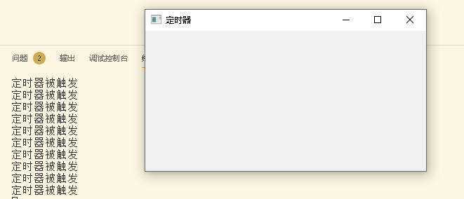

定时器事件的方法是 QObject 类自带的，但是由于我们不可能去修改库的类，所以使用了继承的方式来创建一个新的类，接着，我们按自己的需求重写了这个事件。这里还使用了 `obj.startTimer(1000)` 来开始 obj 这个对象的定时器，其参数为 1000，即 1000ms。注意到，这里我们没有使用任何创建定时器的 API，所以创建的操作，应该在开始定时器内部自动实现的。

使用默认的定时器类型创建并开始了一个定时器，定时器并不一定一直运行，有时也需要关闭它，关闭定时器的函数为：`killTimer()`，为了能关闭指定的定时器（一个程序可能会拥有非常多个定时器），所以每一个定时器创建的时候都会产生一个定时器的 `id`，并通过 `startTimer()` 来返回，以下程序设计了一个 lable 控件，它显示的文本由“8”开始递减到“0”停止：

```python
from xinet import QtWidgets, QtGui, QtCore, Signal
from xinet.run_qt import run

#1. 继承QLabel类


class MyLabel(QtWidgets.QLabel):
    def __init__(self, *args, **kwargs):
        super().__init__(*args, **kwargs)
        #2. 设置标签的基本属性
        self.setText('10')
        self.move(115, 55)
        self.setStyleSheet('font-size: 30px;')
        self.setText('8')
        #3. 开始定时器，并记录 id
        self.timer_id = self.startTimer(1000)
    #4. 重写定时器事件

    def timerEvent(self, evt):
        #5.获取当前秒数，
        cur_sec = int(self.text())  # 将文本转为整型，否则无法正确计算
        cur_sec -= 1
        self.setText(str(cur_sec))  # 将整型转为字符串，否则无法正确显示

        #当秒数为0时候，停止定时器
        if cur_sec == 0:
            self.killTimer(self.timer_id)


class MainWindow(QtWidgets.QWidget):
    def __init__(self, *args, **kw):
        super().__init__(*args, **kw)
        self.initUI()

    def initUI(self):
        self.setWindowTitle('定时器')
        self.resize(400, 200)
        lab = MyLabel(self)


if __name__ == '__main__':
    run(MainWindow)
```

## 5 设置鼠标（光标）样式

通常我们的鼠标在不同的状态下会显示不同的形状，来提示用户当前的状态，如忙碌，拖拽，禁止，改变窗体大小等。当然，严格来说，鼠标是硬件，而我们屏幕上看到的随着鼠标的移动而移动的图像称为光标（Cursor），在 Qt 中，我们可以很方便的设置一个控件的光标样式，也就是当鼠标移动到这个控件上时，显示的图像。

### 5.1 光标的设置

光标的设置只需要使用 `setCurror()` 即可，以下示例了如何设置光标的样式：

```python
from xinet import QtWidgets, QtGui, QtCore, Signal
from xinet.run_qt import run


class MainWindow(QtWidgets.QWidget):
    def __init__(self, *args, **kw):
        super().__init__(*args, **kw)
        self.resize(400, 300)
        self.move(300, 300)
        self.setWindowTitle("Cursor")
        self.initUI()

    def initUI(self):
        # 创建2个子控件
        w1 = QtWidgets.QWidget(self)
        w1.move(148, 150)
        w1.resize(100, 100)
        w1.setStyleSheet('background-color:red;')

        w2 = QtWidgets.QWidget(self)
        w2.move(250, 150)
        w2.resize(100, 100)
        w2.setStyleSheet('background-color:blue;')

        # 定义鼠标的样式
        w1.setCursor(QtCore.Qt.WaitCursor)  # 设置光标为：等待
        w2.setCursor(QtCore.Qt.SizeAllCursor)  # 设置光标为：移动


if __name__ == '__main__':
    run(MainWindow)
```

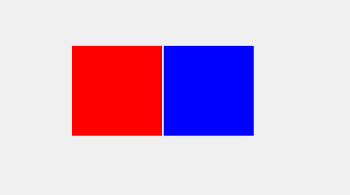

在 Qt 相关的文档里面，已经给用户列好表格，给出光标的样式，以及一般的用途，具体见：[`PySide2.QtCore.Qt.CursorShape`](https://doc.qt.io/qtforpython/PySide2/QtCore/Qt.html#PySide2.QtCore.PySide2.QtCore.Qt.CursorShape "Permalink to this definition")。

### 5.2 自定义光标

在游戏界面，通常不会使用我们系统的鼠标，Qt 也可以自定义光标样式，首先需要准备一个或者是系列图标，这里预先准备了一个简约的光标：


简单的定义一个光标需要以下三步：

1. 创建一个图形对象
2. 将图形对象传入鼠标对象
3. 使用`setCursor()`方法设置对象

```python
from xinet import QtWidgets, QtGui, QtCore, Signal
from xinet.run_qt import run


class MainWindow(QtWidgets.QWidget):
    def __init__(self, *args, **kw):
        super().__init__(*args, **kw)
        self.resize(400, 300)
        self.move(300, 300)
        self.setWindowTitle("Cursor")
        self.initUI()

    def initUI(self):
        #1. 创建光标的图像，参数为光标的相对位置（本文将光标存在工程目录的Cursor_png文件夹下）
        pixmap = QtGui.QPixmap('Cursor_png/01.png')
        #2. 将光标对象传入鼠标对象中
        cursor = QtGui.QCursor(pixmap)
        #3. 设置控件的光标
        self.setCursor(cursor)


if __name__ == '__main__':
    run(MainWindow)
```

效果：

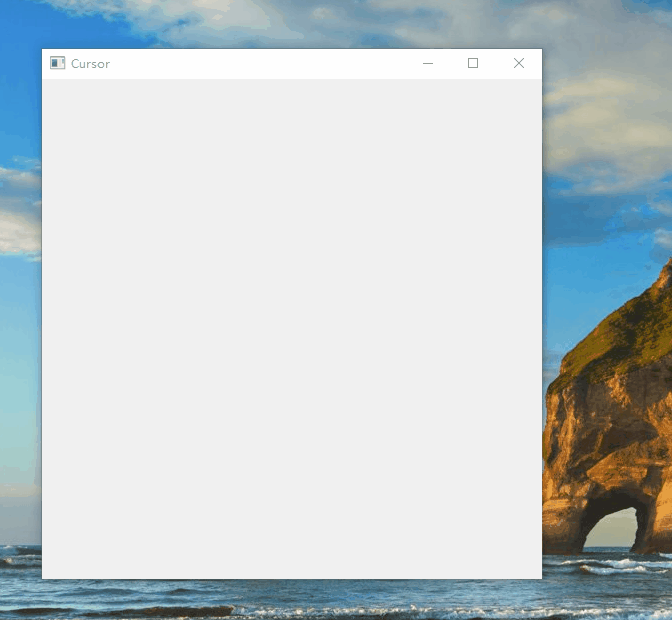

### 5.3 调整光标

上图我们导入了一个光标，但是它显然太大了，我们需要通过程序将其设置小一些，另外，非常大的光标让我们注意到一个问题：如果此时有一个按钮，那么这个光标的哪个位置放在按钮上面，才可以单击按钮？是光标的头部还是光标的尾部，还是光标的任意一个地方？这同样可以通过程序来设置，以下是改进后的程序：

```python
from xinet import QtWidgets, QtGui, QtCore, Signal
from xinet.run_qt import run


class MainWindow(QtWidgets.QWidget):
    def __init__(self, *args, **kw):
        super().__init__(*args, **kw)
        self.resize(400, 300)
        self.move(300, 300)
        self.setWindowTitle("Cursor")
        self.initUI()

    def initUI(self):
        #1. 创建光标的图像，参数为光标的相对位置
        #pixmap = QtGui.QPixmap('Cursor_png/01.png')
        #2. 创建一个新的图像，为原素材缩小到15*20大小
        new_pixmap = pixmap.scaled(15, 20)
        #3. 将新光标对象传入鼠标对象中，并将鼠标热点设为左上角
        cursor = QtGui.QCursor(new_pixmap, 0, 0)
        #4. 设置控件的光标
        self.setCursor(cursor)


if __name__ == '__main__':
    run(MainWindow)
```

效果：

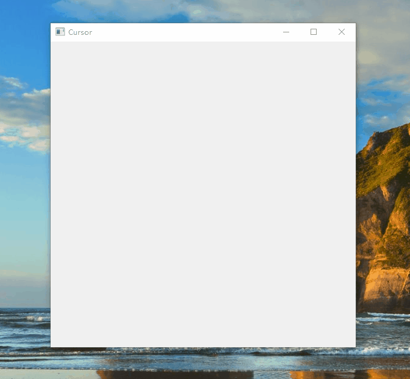

程序使用 `new_pixmap = pixmap.scaled(15,20)` 来生成一个新的对象，这是因为 scaled 将重新修改大小后的图像作为一个新对象返回，而不是修改原对象本身。所以我们创建一个 `new_pixmap` 对象存储这个返回的对象。其中，第一个参数为宽度，第二个参数为高度。

程序还定义了鼠标的热点，即有效的像素为`(0,0)`,通过 `QCursor(new_pixmap,0,0)` 的第3，4个参数来设置，如果你不太了解这个概念，可以自行修改这2参数，然后去尝试点击最小化或者其他控件，来感受一下这2个参数的作用。

### 5.6 其他光标 API

这里在继续介绍光标的其他常用的接口函数：

- 恢复鼠标样式：`unsetCursor()`
- 获取鼠标坐标：`cursor.pos()`
- 设置鼠标位置：`setPos(200,200)`
- 鼠标跟踪（获取鼠标的 x, y 值）：`mouseMoveEvent()`

鼠标跟踪指的是获取当前鼠标的位置，可以是相对屏幕的位置，也可以是相对当前控件的位置，它是通过 `mouseMoveEvent()` 来获取的，当开启鼠标跟踪以后（`setMouseTracking(True)`）程序会一直记录鼠标的位置，然后作为事件派送给`mouseMoveEvent()`函数。

```python
from xinet import QtWidgets, QtGui, QtCore, Signal
from xinet.run_qt import run


class MainWindow(QtWidgets.QWidget):
    def __init__(self, *args, **kw):
        super().__init__(*args, **kw)
        self.resize(400, 300)
        self.move(300, 300)
        self.setWindowTitle("Cursor")
        self.setMouseTracking(True)  # 启动鼠标跟踪

    def mouseMoveEvent(self, QMouseEvent):
        # 重定义鼠标事件
        print("当前鼠标坐标:", QMouseEvent.pos())


if __name__ == '__main__':
    run(MainWindow)
```

效果：

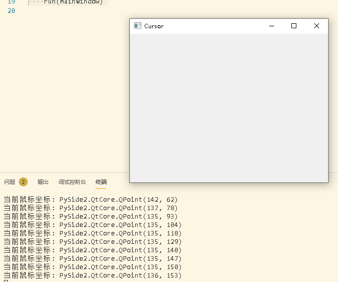

可以看到，当鼠标在窗体中移动的时候，控制台源源不断的打印出鼠标的坐标。

## 6 窗口标志位

在 Qt 中，对于没有父控件的控件，会自动添加标题栏，我们称之为“窗口”。如果想要改变窗口的样式，需要设定窗口标志（flags）来实现。

### 6.1 设置窗口标志的方法

我们可以通过以下方法来设置窗口标志：

- 创建对象时候，直接设置`flags`的值
- 通过函数`setWindowFlag()`设置
- 通过函数`setWindowFlags()`设置，与`setWindowFlag()`的区别是可以同时设置多个标志位

```python
from xinet import QtWidgets, QtGui, QtCore, Signal

QWidget = QtWidgets.QWidget
Qt = QtCore.Qt

app = QtWidgets.QApplication([])

#0.创建一个默认窗口
w0 = QWidget()
w0.move(100, 100)
w0.show()

#1.创建一个无法调整大小的窗口
w1 = QWidget()
w1.setWindowFlag(Qt.MSWindowsFixedSizeDialogHint)
w1.move(200, 200)
w1.show()

#2. 创建一个隐藏边框的窗口
w2 = QWidget()
w2.setWindowFlag(Qt.FramelessWindowHint)
w2.move(300, 300)
w2.show()

#3. 创建一个隐藏标题栏的窗口，并置顶
w3 = QWidget()
w3.setWindowFlags(Qt.CustomizeWindowHint | Qt.WindowStaysOnTopHint)
w3.move(400, 400)
w3.show()

app.exec_()
```

效果：

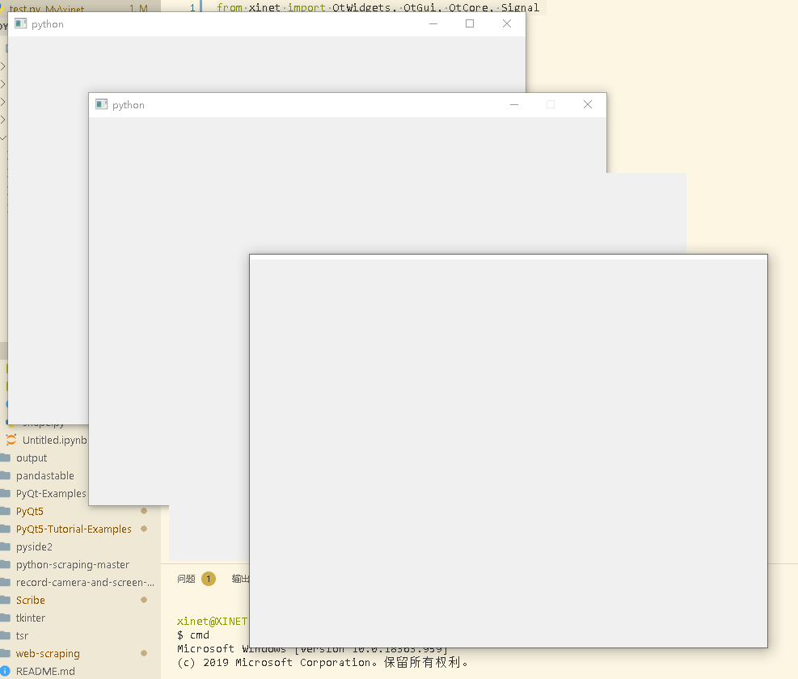

- 第一个窗口：最普通的窗口，可以最大化，最小化，可以移动，可以关闭，也可以设置大小
- 第二个窗口：禁止用户改变大小的窗口，可以看到最大化按键变成灰色，也无法通过拖拽边缘来改变大小
- 第三个窗口：没有标题栏，无法移动，改变大小等
- 第四个窗口：隐藏标题栏并且置顶，可以改变大小，但是无法移动

可以发现，`setWindowFlags()`函数是通过或符号“`|`”来分隔多个窗口标志的，测试过程中发现，不少参数在`setWindowFlags()`中有效，但是在`setWindowFlag()`是无效的，所以这类建议使用`setWindowFlags()`来设置窗口标志位。

关于更多的窗口标志位，可以查看 Qt 官方文档：[`PySide2.QtCore.Qt.WindowType`](https://doc.qt.io/qtforpython/PySide2/QtCore/Qt.html#PySide2.QtCore.PySide2.QtCore.Qt.WindowType "Permalink to this definition")。

## 7 控件状态

### 7.1 控件使能状态

控件使能状态表明了这个控件是否是可用的，比如一个按钮，通常使用灰色来表示为不可点击。在 Qt 中，可以通过`setEnabled()`函数来设置控件的使能状态，以下代码绘制了一个无法被点击的按钮：

```python
from xinet import QtWidgets
from xinet.run_qt import run


class MainWindow(QtWidgets.QWidget):
    def __init__(self, *args, **kw):
        super().__init__(*args, **kw)
        self.resize(200, 200)
        #创建一个按钮，父控件为为:w 显示文本为: 无效按钮
        btn = QtWidgets.QPushButton("无效按钮", self)
        # 设置按钮为无效状态
        btn.setEnabled(False)


if __name__ == '__main__':
    run(MainWindow)
```

效果：

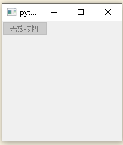

### 7.2 控件可视化

可以通过`setVisible()`来设置一个控件是否可视，以下代码创建一个按键，但是设置为不可视：

```python
from xinet import QtWidgets
from xinet.run_qt import run


class MainWindow(QtWidgets.QWidget):
    def __init__(self, *args, **kw):
        super().__init__(*args, **kw)
        self.resize(200, 200)
        #创建一个按钮，父控件为为:w 显示文本为: 无效按钮
        btn = QtWidgets.QPushButton("无效按钮", self)
        # 设置按钮为无效状态
        btn.setEnabled(False)
        # 设置按钮不可见
        btn.setVisible(False)


if __name__ == '__main__':
    run(MainWindow)
```

### 7.3 控件的信息提示

一些控件当我们光标停留在上面的时候，会显示一个小框来提示，可以通过`setToolTip()`来设置。

```python
from xinet import QtWidgets
from xinet.run_qt import run


class MainWindow(QtWidgets.QWidget):
    def __init__(self, *args, **kw):
        super().__init__(*args, **kw)
        self.resize(200, 200)
        #创建一个按钮，父控件为为:w 显示文本为: 无效按钮
        btn = QtWidgets.QPushButton("按钮", self)
        btn.setToolTip("这是一个按钮")  # 当光标停留在这个控件上，显示一个文本


if __name__ == '__main__':
    run(MainWindow)
```

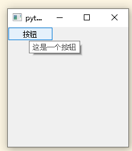

## 8 

- [pyQt5 学习笔记（11）QAbstractButton 虚拟按钮控件](https://blog.csdn.net/qq_17351161/article/details/102866699)
- [pyQt5 学习笔记（12）QPushButton 按钮控件](https://blog.csdn.net/qq_17351161/article/details/102907200)
- [pyQt5 学习笔记（13）QCommandLinkButton 命令连接按钮控件](https://blog.csdn.net/qq_17351161/article/details/102916676)
- [pyQt5 学习笔记（14）QToolButton 工具按钮控件](https://blog.csdn.net/qq_17351161/article/details/102917153)
- [pyQt5 学习笔记（15）QRadioButton 单选按钮控件](https://blog.csdn.net/qq_17351161/article/details/102924597)
- [pyQt5 学习笔记（16）QButtonGroup 按键分组](https://blog.csdn.net/qq_17351161/article/details/102927832)
- [pyQt5 学习笔记（17）QCheckBox 复选框](https://blog.csdn.net/qq_17351161/article/details/102945965)
- [pyQt5 学习笔记（18）QLineEdit 单行文本输入](https://blog.csdn.net/qq_17351161/article/details/102954815)
- [pyQt5 学习笔记（19）QFrame 边框设置](https://blog.csdn.net/qq_17351161/article/details/102987451)
- [pyQt5 学习笔记（20）QAbstractScrollArea 滚动区域](https://blog.csdn.net/qq_17351161/article/details/102988882)
- [pyQt5 学习笔记（21）QTextEdit 富文本框](https://blog.csdn.net/qq_17351161/article/details/102990826)
